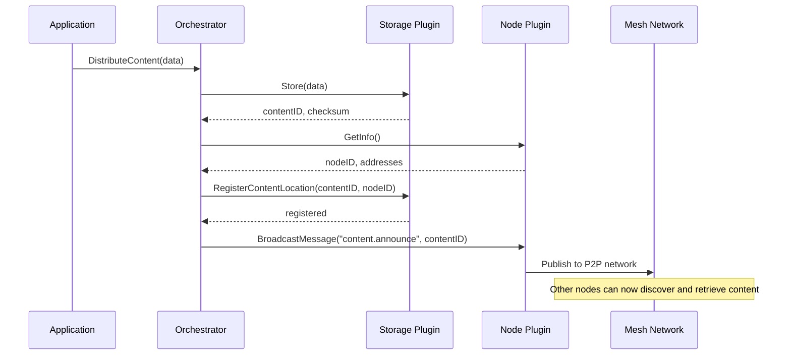

# Plugin Communication Architecture

## How Plugins Communicate

Plugins in Blackhole Foundation communicate through the **mesh network**, not directly. This provides:
- Location transparency (plugins can run anywhere)
- Automatic discovery
- Load balancing
- Security and access control

## Communication Patterns

### 1. Direct Plugin-to-Plugin Communication

```
Storage Plugin A ──[mesh]──> Node Plugin B
                    │
                    └── gRPC call through mesh
```

Example:
```go
// Storage plugin wants to check network status before replication
nodeClient := mesh.ConnectToPlugin("node", "network-status")
status, err := nodeClient.GetNetworkStatus(ctx, &GetNetworkStatusRequest{})
```

### 2. Orchestrated Communication (Application Code)

```
Application (YOUR CODE)
    │
    ├── ContentDistributor (YOUR orchestration layer)
    │       ├──[mesh]──> Storage Plugin
    │       └──[mesh]──> Node Plugin
    │
    └── Results combined and returned
```

**IMPORTANT**: Orchestration is NOT provided by the framework!

Example (this is YOUR application code, not framework code):
```go
// YOU write this orchestrator for YOUR application
type ContentDistributor struct {
    // YOUR application logic
}

// YOUR application uses YOUR orchestrator
distributor := YourApp.NewContentDistributor(mesh)
err := distributor.DistributeContent(ctx, "file.dat", data)
```

### 3. Event-Driven Communication

```
Node Plugin ──[publishes event]──> Mesh Event Bus
                                        │
    Storage Plugin <──[subscribes]──────┘
```

Example:
```go
// Storage plugin subscribes to peer events
eventStream := mesh.Subscribe("node.peer.connected")
for event := range eventStream {
    // React to new peer connections
    // Maybe replicate content to new peer
}
```

## Why Not Direct Communication?

1. **Location Independence**: Plugins can move between nodes without code changes
2. **Security**: Mesh enforces access control and encryption
3. **Monitoring**: All communication can be observed and measured
4. **Resilience**: Automatic failover and circuit breaking
5. **Scaling**: Load balancing across multiple plugin instances

## Plugin Types and Their Interactions

### Node Plugin
- **Provides**: P2P networking, peer discovery, network health
- **Consumes**: Storage locations, content announcements
- **Events**: Peer connected/disconnected, network status changes

### Storage Plugin  
- **Provides**: Content storage, retrieval, replication
- **Consumes**: Peer information, network topology
- **Events**: Content stored/deleted, replication complete

### Analytics Plugin
- **Provides**: Data processing, insights, metrics
- **Consumes**: Storage data, network metrics
- **Events**: Analysis complete, anomaly detected

### Identity Plugin
- **Provides**: Authentication, authorization, key management
- **Consumes**: Network peer IDs, storage permissions
- **Events**: Identity verified, permission granted/denied

## Best Practices

1. **Use Orchestration for Complex Workflows**
   - Don't make plugins overly aware of each other
   - Let orchestrators handle multi-plugin coordination

2. **Design for Async Communication**
   - Use events for loose coupling
   - Don't assume synchronous responses

3. **Handle Plugin Unavailability**
   - Plugins may be updating or offline
   - Design with graceful degradation

4. **Keep Plugin Interfaces Focused**
   - Each plugin should do one thing well
   - Avoid plugin sprawl

## Example: Content Distribution Flow



This architecture ensures plugins remain:
- **Independently deployable**
- **Loosely coupled**
- **Highly cohesive**
- **Network transparent**