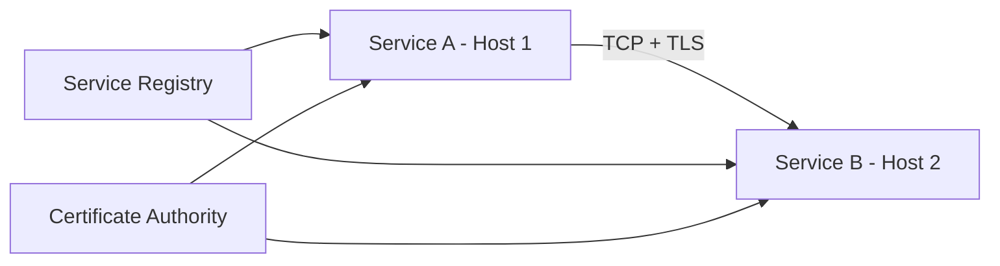

# RPC Communication Architecture

## Overview

The Blackhole platform uses gRPC as the primary Remote Procedure Call (RPC) framework for all inter-process communication between service subprocesses. Each service runs as an independent OS process, communicating with other services through well-defined RPC interfaces.

## Architecture Principles

1. **Protocol Uniformity**: All services communicate via gRPC
2. **Transport Flexibility**: Unix sockets locally, TCP for remote
3. **Schema-First Design**: Protocol buffers define all interfaces
4. **Backward Compatibility**: Versioned APIs for smooth upgrades
5. **Performance Optimization**: Streaming, batching, and connection pooling
6. **Security First**: mTLS, authentication, and authorization
7. **Process Isolation**: True OS-level isolation between services

## Communication Patterns

### Local Communication

Services on the same host communicate via Unix domain sockets:
- High performance, low latency
- Automatic service discovery via filesystem
- No network overhead
- Secure by default (file permissions)

```mermaid
graph TD
    A[Orchestrator] --> B[Unix Socket]
    B --> C[Identity Service]
    B --> D[Storage Service]
    B --> E[Ledger Service]
    
    F[Socket Directory] --> B
    F --> G[/var/run/blackhole/identity.sock]
    F --> H[/var/run/blackhole/storage.sock]
    F --> I[/var/run/blackhole/ledger.sock]
```

### Remote Communication

For distributed deployments, services use TCP with TLS:
- Mutual TLS (mTLS) for authentication
- Optional for multi-host deployments
- Same gRPC interfaces as local communication
- Certificate-based security



## Service Discovery

### Process Discovery

Services discover each other through the filesystem with PID tracking:

```go
type ProcessDiscovery struct {
    socketDir   string  // /var/run/blackhole/
    services    map[string]ServiceInfo
    mu          sync.RWMutex
}

type ServiceInfo struct {
    Name       string
    UnixSocket string
    TCPPort    int
    PID        int
    Health     HealthStatus
}

func (d *ProcessDiscovery) DiscoverService(name string) (string, error) {
    d.mu.RLock()
    defer d.mu.RUnlock()
    
    // Check if service is registered
    if info, exists := d.services[name]; exists && info.Health == HealthyStatus {
        // Prefer Unix socket for local communication
        if info.UnixSocket != "" {
            return "unix://" + info.UnixSocket, nil
        }
        // Fallback to TCP
        return fmt.Sprintf("localhost:%d", info.TCPPort), nil
    }
    
    // Try filesystem discovery
    socketPath := filepath.Join(d.socketDir, name+".sock")
    if _, err := os.Stat(socketPath); err == nil {
        return "unix://" + socketPath, nil
    }
    
    return "", ErrServiceNotFound
}
```

### Dynamic Service Registry

Dynamic service discovery with filesystem monitoring:

```go
type ServiceRegistry struct {
    mu       sync.RWMutex
    services map[string]*ServiceEndpoint
    health   HealthChecker
    watcher  *fsnotify.Watcher
}

type ServiceEndpoint struct {
    Name        string
    SocketPath  string
    State       ServiceState
    LastCheck   time.Time
    Metadata    map[string]string
}

func (r *ServiceRegistry) watchSocketDirectory() error {
    return r.watcher.Add("/var/run/blackhole")
}

func (r *ServiceRegistry) handleFileEvents() {
    for {
        select {
        case event := <-r.watcher.Events:
            if strings.HasSuffix(event.Name, ".sock") {
                service := strings.TrimSuffix(filepath.Base(event.Name), ".sock")
                
                switch event.Op {
                case fsnotify.Create:
                    r.registerService(service, event.Name)
                case fsnotify.Remove:
                    r.unregisterService(service)
                }
            }
        case err := <-r.watcher.Errors:
            log.Printf("Watcher error: %v", err)
        }
    }
}
```

## gRPC Service Definitions

### Proto File Structure

Each service defines its API in a `.proto` file:

```protobuf
syntax = "proto3";

package blackhole.identity.v1;
option go_package = "github.com/blackhole/api/identity/v1;identityv1";

import "google/protobuf/timestamp.proto";
import "google/api/annotations.proto";

// Identity service manages DIDs and authentication
service IdentityService {
  // Create a new DID
  rpc CreateDID(CreateDIDRequest) returns (CreateDIDResponse) {
    option (google.api.http) = {
      post: "/v1/identity/dids"
      body: "*"
    };
  }
  
  // Stream DID events
  rpc StreamDIDEvents(StreamDIDEventsRequest) returns (stream DIDEvent);
  
  // Batch operations for efficiency
  rpc BatchCreateDIDs(BatchCreateDIDsRequest) returns (BatchCreateDIDsResponse);
  
  // Health check
  rpc Check(HealthCheckRequest) returns (HealthCheckResponse);
}

message CreateDIDRequest {
  string method = 1;
  map<string, string> properties = 2;
  EncryptionConfig encryption = 3;
}

message CreateDIDResponse {
  string did = 1;
  google.protobuf.Timestamp created_at = 2;
  string resolver_endpoint = 3;
}

message DIDEvent {
  string did = 1;
  EventType type = 2;
  google.protobuf.Timestamp timestamp = 3;
  oneof payload {
    DIDCreated created = 4;
    DIDUpdated updated = 5;
    DIDDeleted deleted = 6;
  }
}

enum EventType {
  EVENT_TYPE_UNSPECIFIED = 0;
  EVENT_TYPE_CREATED = 1;
  EVENT_TYPE_UPDATED = 2;
  EVENT_TYPE_DELETED = 3;
}
```

### Service Implementation

Services implement the generated interface:

```go
// internal/services/identity/server.go

type identityServer struct {
    identityv1.UnimplementedIdentityServiceServer
    
    store      Store
    resolver   Resolver
    eventBus   EventBus
    metrics    *Metrics
    logger     *zap.Logger
}

func NewIdentityServer(config Config) (*identityServer, error) {
    return &identityServer{
        store:    NewStore(config.Database),
        resolver: NewResolver(config.Network),
        eventBus: NewEventBus(config.Events),
        metrics:  NewMetrics(),
        logger:   zap.NewNop(),
    }, nil
}

func (s *identityServer) CreateDID(
    ctx context.Context,
    req *identityv1.CreateDIDRequest,
) (*identityv1.CreateDIDResponse, error) {
    // Extract metadata
    md, _ := metadata.FromIncomingContext(ctx)
    
    // Validate request
    if err := validateCreateDIDRequest(req); err != nil {
        return nil, status.Errorf(codes.InvalidArgument, "invalid request: %v", err)
    }
    
    // Create DID
    did, err := s.store.CreateDID(ctx, req)
    if err != nil {
        s.logger.Error("failed to create DID", zap.Error(err))
        return nil, status.Errorf(codes.Internal, "failed to create DID")
    }
    
    // Emit event
    s.eventBus.Emit(&DIDCreatedEvent{
        DID:       did.ID,
        Timestamp: time.Now(),
    })
    
    // Update metrics
    s.metrics.didsCreated.Inc()
    
    return &identityv1.CreateDIDResponse{
        Did:             did.ID,
        CreatedAt:       timestamppb.New(did.CreatedAt),
        ResolverEndpoint: s.resolver.Endpoint(did.ID),
    }, nil
}
```

## Connection Management

### Advanced Connection Pool

Efficient connection pooling with lifecycle management:

```go
// internal/mesh/client/pool.go

type ConnectionPool struct {
    mu          sync.RWMutex
    connections map[string]*grpc.ClientConn
    config      PoolConfig
    dialer      Dialer
}

type PoolConfig struct {
    MaxConns        int
    MaxIdleConns    int
    IdleTimeout     time.Duration
    KeepAlive       time.Duration
    ConnectTimeout  time.Duration
}

func (p *ConnectionPool) GetConnection(service string) (*grpc.ClientConn, error) {
    p.mu.RLock()
    conn, exists := p.connections[service]
    p.mu.RUnlock()
    
    if exists && conn.GetState() == connectivity.Ready {
        return conn, nil
    }
    
    p.mu.Lock()
    defer p.mu.Unlock()
    
    // Double-check after acquiring write lock
    conn, exists = p.connections[service]
    if exists && conn.GetState() == connectivity.Ready {
        return conn, nil
    }
    
    // Create new connection
    conn, err := p.createConnection(service)
    if err != nil {
        return nil, fmt.Errorf("create connection: %w", err)
    }
    
    p.connections[service] = conn
    return conn, nil
}

func (p *ConnectionPool) createConnection(service string) (*grpc.ClientConn, error) {
    socketPath := fmt.Sprintf("/var/run/blackhole/%s.sock", service)
    
    opts := []grpc.DialOption{
        grpc.WithTransportCredentials(insecure.NewCredentials()),
        grpc.WithContextDialer(func(ctx context.Context, addr string) (net.Conn, error) {
            d := net.Dialer{Timeout: p.config.ConnectTimeout}
            return d.DialContext(ctx, "unix", addr)
        }),
        grpc.WithKeepaliveParams(keepalive.ClientParameters{
            Time:                p.config.KeepAlive,
            Timeout:             p.config.ConnectTimeout,
            PermitWithoutStream: true,
        }),
        grpc.WithDefaultCallOptions(
            grpc.MaxCallRecvMsgSize(50 * 1024 * 1024),
            grpc.MaxCallSendMsgSize(50 * 1024 * 1024),
        ),
    }
    
    return grpc.Dial(socketPath, opts...)
}
```

### Service Client Wrapper

Simplified client creation with automatic discovery:

```go
type ServiceClient struct {
    discovery   *ProcessDiscovery
    connections map[string]*grpc.ClientConn
    mu          sync.RWMutex
}

func (c *ServiceClient) GetIdentityClient(ctx context.Context) (pb.IdentityClient, error) {
    conn, err := c.getConnection("identity")
    if err != nil {
        return nil, err
    }
    
    return pb.NewIdentityClient(conn), nil
}

func (c *ServiceClient) getConnection(service string) (*grpc.ClientConn, error) {
    c.mu.RLock()
    conn, exists := c.connections[service]
    c.mu.RUnlock()
    
    if exists && conn.GetState() == connectivity.Ready {
        return conn, nil
    }
    
    // Discover service endpoint
    endpoint, err := c.discovery.DiscoverService(service)
    if err != nil {
        return nil, fmt.Errorf("discover service: %w", err)
    }
    
    // Create connection
    conn, err = c.createConnection(endpoint)
    if err != nil {
        return nil, fmt.Errorf("create connection: %w", err)
    }
    
    c.mu.Lock()
    c.connections[service] = conn
    c.mu.Unlock()
    
    return conn, nil
}
```

## Communication Patterns

### Request-Response

Standard unary RPC calls:

```go
func (c *IdentityClient) CreateDID(ctx context.Context, method string) (*DID, error) {
    req := &identityv1.CreateDIDRequest{
        Method: method,
    }
    
    resp, err := c.client.CreateDID(ctx, req)
    if err != nil {
        return nil, fmt.Errorf("create DID: %w", err)
    }
    
    return &DID{
        ID:        resp.Did,
        CreatedAt: resp.CreatedAt.AsTime(),
    }, nil
}
```

### Streaming

Server-side streaming for real-time updates:

```go
func (c *IdentityClient) StreamDIDEvents(ctx context.Context) (<-chan *DIDEvent, error) {
    stream, err := c.client.StreamDIDEvents(ctx, &identityv1.StreamDIDEventsRequest{})
    if err != nil {
        return nil, fmt.Errorf("stream events: %w", err)
    }
    
    events := make(chan *DIDEvent)
    
    go func() {
        defer close(events)
        
        for {
            event, err := stream.Recv()
            if err == io.EOF {
                return
            }
            if err != nil {
                log.Printf("Stream error: %v", err)
                return
            }
            
            events <- &DIDEvent{
                DID:       event.Did,
                Type:      event.Type,
                Timestamp: event.Timestamp.AsTime(),
            }
        }
    }()
    
    return events, nil
}
```

### Event Streaming

Pub/sub pattern for event distribution:

```go
// Event streaming service
service EventStream {
    rpc Subscribe(SubscribeRequest) returns (stream Event);
    rpc Publish(Event) returns (PublishResponse);
}

// Server implementation
type EventStreamServer struct {
    subscribers map[string][]chan *pb.Event
    mu          sync.RWMutex
}

func (s *EventStreamServer) Subscribe(req *pb.SubscribeRequest, stream pb.EventStream_SubscribeServer) error {
    // Create event channel
    eventChan := make(chan *pb.Event, 100)
    
    // Register subscriber
    s.mu.Lock()
    s.subscribers[req.EventType] = append(s.subscribers[req.EventType], eventChan)
    s.mu.Unlock()
    
    // Clean up on exit
    defer func() {
        s.mu.Lock()
        // Remove subscriber
        subs := s.subscribers[req.EventType]
        for i, ch := range subs {
            if ch == eventChan {
                s.subscribers[req.EventType] = append(subs[:i], subs[i+1:]...)
                break
            }
        }
        s.mu.Unlock()
        close(eventChan)
    }()
    
    // Stream events
    for event := range eventChan {
        if err := stream.Send(event); err != nil {
            return err
        }
    }
    
    return nil
}

func (s *EventStreamServer) Publish(ctx context.Context, event *pb.Event) (*pb.PublishResponse, error) {
    s.mu.RLock()
    subscribers := s.subscribers[event.Type]
    s.mu.RUnlock()
    
    // Broadcast to subscribers
    for _, ch := range subscribers {
        select {
        case ch <- event:
        default:
            // Channel full, drop event
        }
    }
    
    return &pb.PublishResponse{Success: true}, nil
}
```

### Batch Operations

Efficient batch processing:

```go
func (c *IdentityClient) BatchCreateDIDs(ctx context.Context, requests []*CreateDIDRequest) ([]*DID, error) {
    batchReq := &identityv1.BatchCreateDIDsRequest{
        Requests: make([]*identityv1.CreateDIDRequest, len(requests)),
    }
    
    for i, req := range requests {
        batchReq.Requests[i] = &identityv1.CreateDIDRequest{
            Method:     req.Method,
            Properties: req.Properties,
        }
    }
    
    resp, err := c.client.BatchCreateDIDs(ctx, batchReq)
    if err != nil {
        return nil, fmt.Errorf("batch create: %w", err)
    }
    
    dids := make([]*DID, len(resp.Dids))
    for i, did := range resp.Dids {
        dids[i] = &DID{
            ID:        did.Did,
            CreatedAt: did.CreatedAt.AsTime(),
        }
    }
    
    return dids, nil
}
```

## Health Checking

### Comprehensive Health Checks

Each service implements health checking with streaming support:

```go
type HealthServer struct {
    service string
    status  grpc_health_v1.HealthCheckResponse_ServingStatus
    mu      sync.RWMutex
}

func (s *HealthServer) Check(ctx context.Context, req *grpc_health_v1.HealthCheckRequest) (*grpc_health_v1.HealthCheckResponse, error) {
    s.mu.RLock()
    defer s.mu.RUnlock()
    
    if req.Service != "" && req.Service != s.service {
        return &grpc_health_v1.HealthCheckResponse{
            Status: grpc_health_v1.HealthCheckResponse_SERVICE_UNKNOWN,
        }, nil
    }
    
    return &grpc_health_v1.HealthCheckResponse{
        Status: s.status,
    }, nil
}

func (s *HealthServer) Watch(req *grpc_health_v1.HealthCheckRequest, stream grpc_health_v1.Health_WatchServer) error {
    // Initial status
    s.mu.RLock()
    status := s.status
    s.mu.RUnlock()
    
    if err := stream.Send(&grpc_health_v1.HealthCheckResponse{
        Status: status,
    }); err != nil {
        return err
    }
    
    // Watch for changes
    ticker := time.NewTicker(5 * time.Second)
    defer ticker.Stop()
    
    for {
        select {
        case <-ticker.C:
            s.mu.RLock()
            newStatus := s.status
            s.mu.RUnlock()
            
            if newStatus != status {
                status = newStatus
                if err := stream.Send(&grpc_health_v1.HealthCheckResponse{
                    Status: status,
                }); err != nil {
                    return err
                }
            }
        case <-stream.Context().Done():
            return stream.Context().Err()
        }
    }
}
```

### Health Monitoring

The orchestrator monitors service health:

```go
func (o *Orchestrator) MonitorServiceHealth(ctx context.Context, service string) {
    ticker := time.NewTicker(10 * time.Second)
    defer ticker.Stop()
    
    for {
        select {
        case <-ticker.C:
            if err := o.checkServiceHealth(service); err != nil {
                log.Printf("Health check failed for %s: %v", service, err)
                o.handleUnhealthyService(service)
            }
        case <-ctx.Done():
            return
        }
    }
}

func (o *Orchestrator) checkServiceHealth(service string) error {
    conn, err := o.getServiceConnection(service)
    if err != nil {
        return err
    }
    
    client := grpc_health_v1.NewHealthClient(conn)
    ctx, cancel := context.WithTimeout(context.Background(), 5*time.Second)
    defer cancel()
    
    resp, err := client.Check(ctx, &grpc_health_v1.HealthCheckRequest{
        Service: service,
    })
    if err != nil {
        return err
    }
    
    if resp.Status != grpc_health_v1.HealthCheckResponse_SERVING {
        return fmt.Errorf("service not serving: %s", resp.Status)
    }
    
    return nil
}
```

## Error Handling

### Status Code Mapping

Proper use of gRPC status codes:

```go
// internal/services/errors.go

func toGRPCError(err error) error {
    switch {
    case errors.Is(err, ErrNotFound):
        return status.Error(codes.NotFound, err.Error())
    case errors.Is(err, ErrAlreadyExists):
        return status.Error(codes.AlreadyExists, err.Error())
    case errors.Is(err, ErrInvalidArgument):
        return status.Error(codes.InvalidArgument, err.Error())
    case errors.Is(err, ErrPermissionDenied):
        return status.Error(codes.PermissionDenied, err.Error())
    case errors.Is(err, ErrUnauthenticated):
        return status.Error(codes.Unauthenticated, err.Error())
    case errors.Is(err, ErrResourceExhausted):
        return status.Error(codes.ResourceExhausted, err.Error())
    case errors.Is(err, ErrUnavailable):
        return status.Error(codes.Unavailable, err.Error())
    default:
        return status.Error(codes.Internal, "internal error")
    }
}
```

### Retry Logic

Automatic retry with exponential backoff:

```go
// internal/mesh/retry/retry.go

type RetryConfig struct {
    MaxAttempts     int
    InitialBackoff  time.Duration
    MaxBackoff      time.Duration
    BackoffMultiplier float64
    RetryableErrors []codes.Code
}

func WithRetry(config RetryConfig) grpc.UnaryClientInterceptor {
    return func(
        ctx context.Context,
        method string,
        req, reply interface{},
        cc *grpc.ClientConn,
        invoker grpc.UnaryInvoker,
        opts ...grpc.CallOption,
    ) error {
        var lastErr error
        backoff := config.InitialBackoff
        
        for attempt := 0; attempt < config.MaxAttempts; attempt++ {
            if attempt > 0 {
                time.Sleep(backoff)
                backoff = time.Duration(float64(backoff) * config.BackoffMultiplier)
                if backoff > config.MaxBackoff {
                    backoff = config.MaxBackoff
                }
            }
            
            err := invoker(ctx, method, req, reply, cc, opts...)
            if err == nil {
                return nil
            }
            
            lastErr = err
            
            st, ok := status.FromError(err)
            if !ok {
                continue
            }
            
            // Check if error is retryable
            retryable := false
            for _, code := range config.RetryableErrors {
                if st.Code() == code {
                    retryable = true
                    break
                }
            }
            
            if !retryable {
                return err
            }
        }
        
        return lastErr
    }
}
```

### Circuit Breaker

Protect services from cascading failures:

```go
type CircuitBreaker struct {
    service      string
    state        atomic.Value // "closed", "open", "half-open"
    failures     atomic.Int32
    successes    atomic.Int32
    lastFailTime atomic.Value
    config       CircuitConfig
}

type CircuitConfig struct {
    FailureThreshold int
    SuccessThreshold int
    Timeout          time.Duration
    HalfOpenTimeout  time.Duration
}

func (cb *CircuitBreaker) Call(fn func() error) error {
    state := cb.state.Load().(string)
    
    // Check if circuit is open
    if state == "open" {
        lastFail := cb.lastFailTime.Load().(time.Time)
        if time.Since(lastFail) > cb.config.HalfOpenTimeout {
            cb.state.Store("half-open")
            cb.successes.Store(0)
        } else {
            return ErrCircuitOpen
        }
    }
    
    // Execute function
    err := fn()
    
    if err != nil {
        cb.recordFailure()
        if cb.failures.Load() >= int32(cb.config.FailureThreshold) {
            cb.state.Store("open")
            cb.lastFailTime.Store(time.Now())
        }
        return err
    }
    
    cb.recordSuccess()
    if state == "half-open" && cb.successes.Load() >= int32(cb.config.SuccessThreshold) {
        cb.state.Store("closed")
        cb.failures.Store(0)
    }
    
    return nil
}
```

## Security

### mTLS Configuration

Mutual TLS for service-to-service authentication:

```go
// internal/mesh/security/tls.go

type TLSConfig struct {
    CertFile   string
    KeyFile    string
    CAFile     string
    ServerName string
}

func LoadTLSCredentials(config TLSConfig) (credentials.TransportCredentials, error) {
    // Load server certificate and key
    cert, err := tls.LoadX509KeyPair(config.CertFile, config.KeyFile)
    if err != nil {
        return nil, fmt.Errorf("load certificate: %w", err)
    }
    
    // Load CA certificate
    caCert, err := os.ReadFile(config.CAFile)
    if err != nil {
        return nil, fmt.Errorf("read CA certificate: %w", err)
    }
    
    certPool := x509.NewCertPool()
    if !certPool.AppendCertsFromPEM(caCert) {
        return nil, fmt.Errorf("failed to add CA certificate")
    }
    
    tlsConfig := &tls.Config{
        Certificates: []tls.Certificate{cert},
        ClientAuth:   tls.RequireAndVerifyClientCert,
        ClientCAs:    certPool,
        RootCAs:      certPool,
        ServerName:   config.ServerName,
    }
    
    return credentials.NewTLS(tlsConfig), nil
}
```

### Authentication Interceptor

Service authentication via interceptors:

```go
// internal/mesh/auth/interceptor.go

type AuthInterceptor struct {
    verifier TokenVerifier
    roles    RoleManager
}

func (a *AuthInterceptor) Unary() grpc.UnaryServerInterceptor {
    return func(
        ctx context.Context,
        req interface{},
        info *grpc.UnaryServerInfo,
        handler grpc.UnaryHandler,
    ) (interface{}, error) {
        // Skip auth for health checks
        if strings.HasSuffix(info.FullMethod, "/Check") {
            return handler(ctx, req)
        }
        
        // Extract token from metadata
        md, ok := metadata.FromIncomingContext(ctx)
        if !ok {
            return nil, status.Error(codes.Unauthenticated, "missing metadata")
        }
        
        tokens := md.Get("authorization")
        if len(tokens) == 0 {
            return nil, status.Error(codes.Unauthenticated, "missing token")
        }
        
        // Verify token
        claims, err := a.verifier.Verify(tokens[0])
        if err != nil {
            return nil, status.Error(codes.Unauthenticated, "invalid token")
        }
        
        // Check permissions
        method := info.FullMethod
        if !a.roles.HasPermission(claims.Role, method) {
            return nil, status.Error(codes.PermissionDenied, "insufficient permissions")
        }
        
        // Add claims to context
        ctx = context.WithValue(ctx, "claims", claims)
        
        return handler(ctx, req)
    }
}
```

## Performance Optimization

### Message Compression

Enable compression for large payloads:

```go
// internal/mesh/compression/compression.go

func WithCompression() grpc.DialOption {
    return grpc.WithDefaultCallOptions(
        grpc.UseCompressor(gzip.Name),
    )
}

func EnableServerCompression() grpc.ServerOption {
    return grpc.RPCCompressor(grpc.NewGZIPCompressor())
}

// Usage in client
conn, err := grpc.Dial(
    address,
    grpc.WithDefaultCallOptions(
        grpc.UseCompressor(gzip.Name),
    ),
)

// Usage in server
server := grpc.NewServer(
    grpc.RPCCompressor(grpc.NewGZIPCompressor()),
    grpc.RPCDecompressor(grpc.NewGZIPDecompressor()),
)
```

### Streaming Optimization

Efficient streaming for large data transfers:

```go
// internal/services/storage/streaming.go

func (s *storageServer) UploadFile(stream storagev1.StorageService_UploadFileServer) error {
    var fileID string
    var chunks [][]byte
    var totalSize int64
    
    for {
        chunk, err := stream.Recv()
        if err == io.EOF {
            // Process complete file
            if err := s.processFile(fileID, chunks, totalSize); err != nil {
                return status.Errorf(codes.Internal, "process file: %v", err)
            }
            
            return stream.SendAndClose(&storagev1.UploadFileResponse{
                FileId: fileID,
                Size:   totalSize,
            })
        }
        
        if err != nil {
            return status.Errorf(codes.Internal, "receive chunk: %v", err)
        }
        
        if fileID == "" {
            fileID = chunk.FileId
        }
        
        chunks = append(chunks, chunk.Data)
        totalSize += int64(len(chunk.Data))
        
        // Stream to storage in batches
        if len(chunks) >= 100 {
            if err := s.streamToStorage(fileID, chunks); err != nil {
                return status.Errorf(codes.Internal, "stream to storage: %v", err)
            }
            chunks = chunks[:0]
        }
    }
}
```

### Request Batching

Batch multiple requests for efficiency:

```go
type Batcher struct {
    batch    []Request
    timer    *time.Timer
    maxSize  int
    maxWait  time.Duration
    process  func([]Request) error
    mu       sync.Mutex
}

func (b *Batcher) Add(req Request) error {
    b.mu.Lock()
    defer b.mu.Unlock()
    
    b.batch = append(b.batch, req)
    
    // Process if batch is full
    if len(b.batch) >= b.maxSize {
        return b.processBatch()
    }
    
    // Start timer for first item
    if len(b.batch) == 1 {
        b.timer = time.AfterFunc(b.maxWait, func() {
            b.mu.Lock()
            defer b.mu.Unlock()
            b.processBatch()
        })
    }
    
    return nil
}

func (b *Batcher) processBatch() error {
    if len(b.batch) == 0 {
        return nil
    }
    
    // Stop timer
    if b.timer != nil {
        b.timer.Stop()
    }
    
    // Process batch
    batch := b.batch
    b.batch = nil
    
    return b.process(batch)
}
```

## Monitoring and Observability

### Metrics Collection

Prometheus metrics for RPC monitoring:

```go
// internal/mesh/metrics/metrics.go

var (
    rpcDuration = promauto.NewHistogramVec(prometheus.HistogramOpts{
        Name:    "blackhole_rpc_duration_seconds",
        Help:    "RPC latency distributions",
        Buckets: prometheus.DefBuckets,
    }, []string{"service", "method", "status"})
    
    rpcCounter = promauto.NewCounterVec(prometheus.CounterOpts{
        Name: "blackhole_rpc_total",
        Help: "Total number of RPCs",
    }, []string{"service", "method", "status"})
    
    rpcInFlight = promauto.NewGaugeVec(prometheus.GaugeOpts{
        Name: "blackhole_rpc_in_flight",
        Help: "Number of RPCs in flight",
    }, []string{"service", "method"})
)

func MetricsInterceptor() grpc.UnaryServerInterceptor {
    return func(
        ctx context.Context,
        req interface{},
        info *grpc.UnaryServerInfo,
        handler grpc.UnaryHandler,
    ) (interface{}, error) {
        service, method := parseMethod(info.FullMethod)
        
        rpcInFlight.WithLabelValues(service, method).Inc()
        defer rpcInFlight.WithLabelValues(service, method).Dec()
        
        start := time.Now()
        resp, err := handler(ctx, req)
        duration := time.Since(start).Seconds()
        
        status := "success"
        if err != nil {
            status = getStatusCode(err)
        }
        
        rpcDuration.WithLabelValues(service, method, status).Observe(duration)
        rpcCounter.WithLabelValues(service, method, status).Inc()
        
        return resp, err
    }
}
```

### Distributed Tracing

OpenTelemetry integration for tracing:

```go
// internal/mesh/tracing/tracing.go

func InitTracing(serviceName string) (func(), error) {
    exporter, err := otlptrace.New(
        context.Background(),
        otlptracegrpc.NewClient(
            otlptracegrpc.WithEndpoint("localhost:4317"),
            otlptracegrpc.WithInsecure(),
        ),
    )
    if err != nil {
        return nil, fmt.Errorf("create exporter: %w", err)
    }
    
    tp := sdktrace.NewTracerProvider(
        sdktrace.WithBatcher(exporter),
        sdktrace.WithResource(resource.NewWithAttributes(
            semconv.SchemaURL,
            semconv.ServiceNameKey.String(serviceName),
        )),
        sdktrace.WithSampler(sdktrace.AlwaysSample()),
    )
    
    otel.SetTracerProvider(tp)
    otel.SetTextMapPropagator(propagation.NewCompositeTextMapPropagator(
        propagation.TraceContext{},
        propagation.Baggage{},
    ))
    
    return func() {
        ctx, cancel := context.WithTimeout(context.Background(), 5*time.Second)
        defer cancel()
        tp.Shutdown(ctx)
    }, nil
}

// Client-side tracing
func TracingDialOption() grpc.DialOption {
    return grpc.WithStatsHandler(otelgrpc.NewClientHandler())
}

// Server-side tracing
func TracingServerOption() grpc.ServerOption {
    return grpc.StatsHandler(otelgrpc.NewServerHandler())
}
```

### Logging

Structured logging for RPC calls:

```go
// internal/mesh/logging/interceptor.go

func LoggingInterceptor(logger *zap.Logger) grpc.UnaryServerInterceptor {
    return func(
        ctx context.Context,
        req interface{},
        info *grpc.UnaryServerInfo,
        handler grpc.UnaryHandler,
    ) (interface{}, error) {
        start := time.Now()
        
        // Extract request ID from metadata
        md, _ := metadata.FromIncomingContext(ctx)
        requestID := md.Get("x-request-id")
        if len(requestID) == 0 {
            requestID = []string{uuid.New().String()}
        }
        
        // Log request
        logger.Info("RPC request",
            zap.String("method", info.FullMethod),
            zap.String("request_id", requestID[0]),
            zap.Any("request", req),
        )
        
        // Handle request
        resp, err := handler(ctx, req)
        
        // Log response
        if err != nil {
            logger.Error("RPC error",
                zap.String("method", info.FullMethod),
                zap.String("request_id", requestID[0]),
                zap.Duration("duration", time.Since(start)),
                zap.Error(err),
            )
        } else {
            logger.Info("RPC response",
                zap.String("method", info.FullMethod),
                zap.String("request_id", requestID[0]),
                zap.Duration("duration", time.Since(start)),
                zap.Any("response", resp),
            )
        }
        
        return resp, err
    }
}
```

## Service Mesh Integration

Complete service mesh pattern:

```go
// internal/mesh/mesh.go

type ServiceMesh struct {
    registry    *ServiceRegistry
    pool        *ConnectionPool
    interceptors []grpc.UnaryServerInterceptor
    dialOptions  []grpc.DialOption
}

func (m *ServiceMesh) RegisterService(name string, server interface{}) error {
    // Create gRPC server
    grpcServer := grpc.NewServer(m.serverOptions()...)
    
    // Register service implementation
    switch name {
    case "identity":
        identityv1.RegisterIdentityServiceServer(grpcServer, server.(identityv1.IdentityServiceServer))
    case "storage":
        storagev1.RegisterStorageServiceServer(grpcServer, server.(storagev1.StorageServiceServer))
    // ... other services
    }
    
    // Start listening
    listener, err := m.createListener(name)
    if err != nil {
        return fmt.Errorf("create listener: %w", err)
    }
    
    // Register with service registry
    if err := m.registry.Register(name, listener.Addr().String()); err != nil {
        return fmt.Errorf("register service: %w", err)
    }
    
    // Start serving
    go grpcServer.Serve(listener)
    
    return nil
}

func (m *ServiceMesh) GetClient(service string) (*grpc.ClientConn, error) {
    return m.pool.GetConnection(service)
}
```

## API Evolution and Compatibility

### Versioning Strategy

Backward compatible API evolution:

```protobuf
// Backward compatible changes
message UserV2 {
  string id = 1;
  string name = 2;
  string email = 3;
  string phone = 4;  // New field - backward compatible
  
  // Deprecated field
  string old_field = 5 [deprecated = true];
}

// Breaking changes require new version
service UserServiceV2 {
  // New method signature
  rpc GetUser(GetUserRequestV2) returns (UserV2);
  
  // Maintain old method for compatibility
  rpc GetUserV1(GetUserRequest) returns (User);
}
```

### Rolling Updates

Version-aware service registry:

```go
// internal/mesh/versioning/versioning.go

type VersionedServiceRegistry struct {
    services map[string]map[string]*ServiceEndpoint // service -> version -> endpoint
    mu       sync.RWMutex
}

func (r *VersionedServiceRegistry) GetService(name, version string) (*ServiceEndpoint, error) {
    r.mu.RLock()
    defer r.mu.RUnlock()
    
    versions, exists := r.services[name]
    if !exists {
        return nil, fmt.Errorf("service not found: %s", name)
    }
    
    // Try exact version match
    if endpoint, ok := versions[version]; ok {
        return endpoint, nil
    }
    
    // Fall back to latest compatible version
    return r.findCompatibleVersion(versions, version)
}
```

## Best Practices

### Service Design

1. **Interface-First Development**: Design proto files before implementation
2. **Versioning**: Use semantic versioning for APIs (v1, v2)
3. **Backward Compatibility**: Never remove or change existing fields
4. **Field Deprecation**: Mark deprecated fields, don't remove
5. **Error Messages**: Provide clear, actionable error messages
6. **Request Validation**: Validate inputs at service boundary

### Subprocess Architecture

1. **Unix Sockets**: Prefer for local inter-process communication
2. **Process Isolation**: Leverage OS-level process isolation
3. **PID Tracking**: Monitor service processes by PID
4. **Health Checks**: Implement comprehensive health monitoring
5. **Service Discovery**: Use filesystem-based discovery for simplicity
6. **Resource Limits**: Set process-level CPU, memory limits

### Performance Guidelines

1. **Connection Pooling**: Reuse connections across requests
2. **Streaming**: Use for large data transfers
3. **Batching**: Group multiple operations when possible
4. **Compression**: Enable for large payloads
5. **Timeouts**: Set appropriate timeouts for all calls
6. **Circuit Breaking**: Implement circuit breakers for resilience

### Security Requirements

1. **Authentication**: Require auth for all service calls
2. **Authorization**: Implement fine-grained permissions
3. **Encryption**: Use TLS for all network communication
4. **Input Validation**: Sanitize all inputs
5. **Rate Limiting**: Implement rate limits per service
6. **Audit Logging**: Log all security-relevant events

### Operational Excellence

1. **Health Checks**: Implement comprehensive health endpoints
2. **Metrics**: Collect latency, throughput, and error metrics
3. **Tracing**: Enable distributed tracing for all calls
4. **Logging**: Use structured logging with correlation IDs
5. **Monitoring**: Set up alerts for error rates and latency
6. **Documentation**: Keep proto files well-documented

## Conclusion

The RPC communication architecture provides a robust foundation for inter-process communication via gRPC in Blackhole's subprocess architecture. By combining:

- **High Performance**: Unix sockets for local IPC
- **Security**: mTLS for remote communication  
- **Reliability**: Health checks, retries, and circuit breakers
- **Observability**: Metrics and distributed tracing
- **Simplicity**: Clean gRPC interfaces
- **Process Isolation**: True OS-level isolation between services

This architecture enables efficient, secure communication between Blackhole service processes while maintaining the simplicity and reliability of the subprocess model.