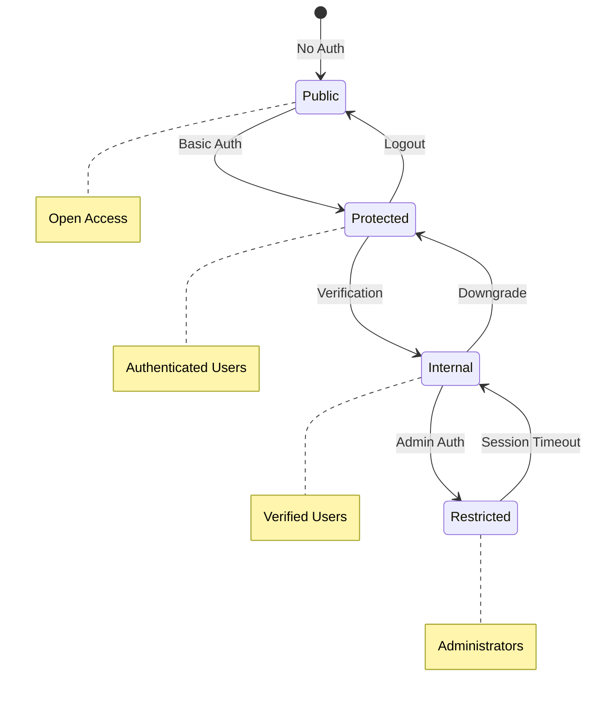

# Security Zones Architecture

## Overview

Security zones provide a clear, hierarchical access control model within the Blackhole platform. Each zone has specific permissions, requirements, and use cases, ensuring proper isolation and access control while maintaining simplicity.

## Zone Hierarchy

```mermaid
graph TD
    subgraph Public Zone
        PubAPI[Public APIs]
        PubContent[Public Content]
        Auth[Authentication Endpoints]
    end
    
    subgraph Protected Zone
        UserOps[User Operations]
        BasicContent[Basic Content Access]
        WalletOps[Wallet Operations]
    end
    
    subgraph Internal Zone
        CoreServices[Core Services]
        VerifiedOps[Verified Operations]
        PremiumFeatures[Premium Features]
    end
    
    subgraph Restricted Zone
        AdminOps[Admin Operations]
        SystemConfig[System Configuration]
        SensitiveData[Sensitive Data]
    end
    
    Public Zone --> Protected Zone
    Protected Zone --> Internal Zone
    Internal Zone --> Restricted Zone
    
    style Public Zone fill:#90EE90
    style Protected Zone fill:#FFD700
    style Internal Zone fill:#FFA500
    style Restricted Zone fill:#FF6347
```

## Zone Definitions

### 1. Public Zone

**Purpose**: Unrestricted access for public operations

**Characteristics**:
- No authentication required
- Rate-limited to prevent abuse
- Read-only operations primarily
- Public data access only

**Allowed Operations**:
```go
var PublicZonePermissions = []Permission{
    {Action: "read", Resource: "public_content", Scope: "all"},
    {Action: "read", Resource: "public_metadata", Scope: "all"},
    {Action: "authenticate", Resource: "auth", Scope: "self"},
    {Action: "register", Resource: "identity", Scope: "self"},
}
```

**Use Cases**:
- Viewing public content
- Authentication endpoints
- Registration processes
- Public API documentation

### 2. Protected Zone

**Purpose**: Basic authenticated user operations

**Requirements**:
- Valid authentication (DID, API key, or session)
- Basic identity verification
- Standard rate limits apply

**Allowed Operations**:
```go
var ProtectedZonePermissions = []Permission{
    // Content operations
    {Action: "read", Resource: "content", Scope: "all"},
    {Action: "write", Resource: "content", Scope: "own"},
    {Action: "delete", Resource: "content", Scope: "own"},
    
    // Identity operations
    {Action: "read", Resource: "identity", Scope: "own"},
    {Action: "update", Resource: "identity", Scope: "own"},
    
    // Wallet operations
    {Action: "read", Resource: "wallet", Scope: "own"},
    {Action: "transfer", Resource: "wallet", Scope: "own"},
}
```

**Use Cases**:
- User content management
- Profile updates
- Basic wallet operations
- Standard API access

### 3. Internal Zone

**Purpose**: Verified user operations and core services

**Requirements**:
- Enhanced verification (KYC or ZK proofs)
- Valid credentials or proofs
- Service-level authentication

**Allowed Operations**:
```go
var InternalZonePermissions = []Permission{
    // Enhanced content operations
    {Action: "*", Resource: "content", Scope: "own"},
    {Action: "moderate", Resource: "content", Scope: "group"},
    
    // Ledger operations
    {Action: "read", Resource: "ledger", Scope: "all"},
    {Action: "write", Resource: "ledger", Scope: "own"},
    
    // Service operations
    {Action: "execute", Resource: "service", Scope: "authorized"},
    {Action: "monitor", Resource: "metrics", Scope: "own"},
}
```

**Use Cases**:
- Premium features
- Content moderation
- Service-to-service communication
- Advanced trading operations

### 4. Restricted Zone

**Purpose**: Administrative and system operations

**Requirements**:
- Multi-factor authentication
- Administrative credentials
- Audit logging for all operations
- Time-based access windows

**Allowed Operations**:
```go
var RestrictedZonePermissions = []Permission{
    // Full system access
    {Action: "*", Resource: "*", Scope: "*"},
    
    // Specific admin operations
    {Action: "configure", Resource: "system", Scope: "all"},
    {Action: "audit", Resource: "logs", Scope: "all"},
    {Action: "manage", Resource: "users", Scope: "all"},
}
```

**Use Cases**:
- System configuration
- User management
- Security audits
- Emergency operations

## Zone Assignment Logic

```go
func (s *SecurityManager) AssignZone(ctx context.Context, auth Authentication) (SecurityZone, error) {
    // Default to public zone
    zone := PublicZone
    
    // Check authentication level
    if auth == nil {
        return PublicZone, nil
    }
    
    // Basic authentication = Protected zone
    if auth.IsAuthenticated() {
        zone = ProtectedZone
    }
    
    // Verified users = Internal zone
    if auth.IsVerified() || auth.HasKYC() {
        zone = InternalZone
    }
    
    // Admin users = Restricted zone
    if auth.IsAdmin() && auth.HasMFA() {
        zone = RestrictedZone
    }
    
    // Zero-knowledge proof based assignment
    if auth.HasZKProof() {
        zone = s.assignZoneFromZKProof(auth.GetZKClaims())
    }
    
    return zone, nil
}
```

## Zero-Knowledge Zone Assignment

```go
func (s *SecurityManager) assignZoneFromZKProof(claims []ZKClaim) SecurityZone {
    highestZone := ProtectedZone
    
    for _, claim := range claims {
        switch claim.Type {
        case ProofOfKYC:
            if claim.Verified {
                highestZone = max(highestZone, InternalZone)
            }
            
        case ProofOfBalance:
            if claim.Value >= 1000000 { // High value
                highestZone = max(highestZone, InternalZone)
            }
            
        case ProofOfCredential:
            if claim.CredentialType == "admin" {
                highestZone = RestrictedZone
            }
        }
    }
    
    return highestZone
}
```

## Zone Transitions



## Zone-Based Rate Limiting

```go
type ZoneRateLimits struct {
    Zone            SecurityZone
    RequestsPerMin  int
    BurstSize       int
    ConcurrentReqs  int
}

var RateLimits = map[SecurityZone]ZoneRateLimits{
    PublicZone: {
        RequestsPerMin: 60,
        BurstSize:      10,
        ConcurrentReqs: 5,
    },
    ProtectedZone: {
        RequestsPerMin: 300,
        BurstSize:      50,
        ConcurrentReqs: 20,
    },
    InternalZone: {
        RequestsPerMin: 1000,
        BurstSize:      100,
        ConcurrentReqs: 50,
    },
    RestrictedZone: {
        RequestsPerMin: -1, // Unlimited
        BurstSize:      -1,
        ConcurrentReqs: -1,
    },
}
```

## Resource Access Matrix

| Resource | Public | Protected | Internal | Restricted |
|----------|--------|-----------|----------|------------|
| Public Content | ✓ Read | ✓ Read | ✓ All | ✓ All |
| User Content | ✗ | ✓ Own | ✓ All | ✓ All |
| Identity | ✓ Register | ✓ Own | ✓ Read | ✓ All |
| Wallet | ✗ | ✓ Own | ✓ Own | ✓ All |
| Ledger | ✗ | ✓ Read | ✓ Read/Write | ✓ All |
| System Config | ✗ | ✗ | ✗ | ✓ All |
| Audit Logs | ✗ | ✗ | ✓ Own | ✓ All |

## Zone Security Requirements

### Public Zone
- No special requirements
- Rate limiting enforced
- IP-based blocking for abuse

### Protected Zone
- Valid authentication token
- Session management
- Basic activity logging

### Internal Zone
- Enhanced verification (KYC/ZK proof)
- Secure connection required
- Detailed audit logging
- Anomaly detection

### Restricted Zone
- Multi-factor authentication
- Time-based access
- Full audit trail
- Administrative approval
- Secure workstation requirement

## Zone Monitoring

```go
type ZoneMetrics struct {
    Zone              SecurityZone
    ActiveSessions    int
    RequestsPerMinute float64
    ErrorRate         float64
    AverageLatency    time.Duration
    SecurityEvents    int
}

func (s *SecurityManager) MonitorZones() map[SecurityZone]ZoneMetrics {
    metrics := make(map[SecurityZone]ZoneMetrics)
    
    for _, zone := range []SecurityZone{PublicZone, ProtectedZone, InternalZone, RestrictedZone} {
        metrics[zone] = ZoneMetrics{
            Zone:              zone,
            ActiveSessions:    s.getActiveSessions(zone),
            RequestsPerMinute: s.getRequestRate(zone),
            ErrorRate:         s.getErrorRate(zone),
            AverageLatency:    s.getAverageLatency(zone),
            SecurityEvents:    s.getSecurityEvents(zone),
        }
    }
    
    return metrics
}
```

## Configuration Example

```yaml
security_zones:
  public:
    enabled: true
    rate_limit:
      requests_per_minute: 60
      burst_size: 10
    allowed_endpoints:
      - /api/public/*
      - /auth/login
      - /auth/register
      
  protected:
    enabled: true
    auth_required: true
    rate_limit:
      requests_per_minute: 300
      burst_size: 50
    session_timeout: 3600
    
  internal:
    enabled: true
    verification_required: true
    allowed_verifications:
      - kyc
      - zk_proof
    enhanced_logging: true
    
  restricted:
    enabled: true
    mfa_required: true
    admin_only: true
    access_window:
      start: "09:00"
      end: "18:00"
      timezone: "UTC"
    audit_all: true
```

## Zone Migration

Users can transition between zones based on their authentication level:

```go
func (s *SecurityManager) UpgradeZone(ctx context.Context, proof VerificationProof) error {
    secCtx := GetSecurityContext(ctx)
    currentZone := secCtx.Zone
    
    // Determine new zone based on proof
    newZone := s.calculateZoneFromProof(proof)
    
    if newZone <= currentZone {
        return ErrNoUpgradeNeeded
    }
    
    // Update security context
    secCtx.Zone = newZone
    secCtx.Permissions = s.getZonePermissions(newZone)
    
    // Audit zone transition
    s.auditZoneTransition(secCtx.DID, currentZone, newZone)
    
    return nil
}
```

## Best Practices

1. **Principle of Least Privilege**: Users start in the most restrictive appropriate zone
2. **Zone Isolation**: Operations in one zone don't affect others
3. **Clear Boundaries**: Well-defined permissions per zone
4. **Audit Everything**: Especially in higher zones
5. **Time-Based Access**: Restricted zone access during business hours only
6. **Regular Reviews**: Periodic review of zone assignments
7. **Graceful Degradation**: Fallback to lower zones on verification failure