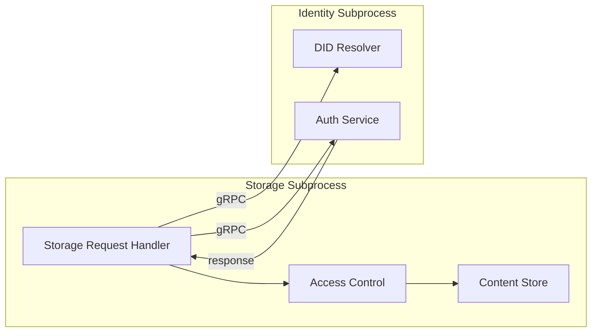

# Blackhole Storage Architecture

This document outlines the architecture and design of the decentralized storage system within the Blackhole platform, running as an isolated subprocess.

## Introduction

The Blackhole Storage Service runs as a dedicated subprocess, implementing a decentralized content storage system using IPFS as the primary storage layer, with DID-based authentication and access control. As a subprocess, it communicates with other services via gRPC while maintaining process-level isolation for I/O-intensive operations. This design enables users to maintain sovereignty over their data while still allowing for selective sharing and interoperability. The architecture prioritizes privacy, security, process isolation, and user control.

## Subprocess Architecture

The Storage Service runs as an isolated subprocess with dedicated resources for I/O-intensive operations:

```mermaid
graph TD
    subgraph Orchestrator
        Orch[Process Manager]
        SD[Service Discovery]
        Mon[Monitor]
    end
    
    subgraph Storage Subprocess
        gRPC[gRPC Server :9003]
        IPFS[IPFS Client]
        ContentMgr[Content Manager]
        EncryptSvc[Encryption Service]
        PinMgr[Pinning Manager]
    end
    
    subgraph Identity Subprocess
        IDgRPC[gRPC Server :9001]
        DID[DID System]
    end
    
    Orch -->|spawn| Storage Subprocess
    SD -->|register| gRPC
    Mon -->|health check| gRPC
    
    Storage Subprocess -->|gRPC :9001| Identity Subprocess
    Storage Subprocess -->|HTTP| IPFS Network
```

### Service Entry Point

```go
// cmd/blackhole/service/storage/main.go
package main

import (
    "context"
    "flag"
    "log"
    "net"
    "os"
    "os/signal"
    "syscall"
    
    "github.com/blackhole/internal/services/storage"
    "github.com/blackhole/pkg/api/storage/v1"
    "google.golang.org/grpc"
)

var (
    port       = flag.Int("port", 9003, "gRPC port")
    unixSocket = flag.String("unix-socket", "/tmp/blackhole-storage.sock", "Unix socket path")
    config     = flag.String("config", "", "Configuration file path")
)

func main() {
    flag.Parse()
    
    // Initialize service
    cfg, err := storage.LoadConfig(*config)
    if err != nil {
        log.Fatalf("Failed to load config: %v", err)
    }
    
    service, err := storage.New(cfg)
    if err != nil {
        log.Fatalf("Failed to create service: %v", err)
    }
    
    // Create gRPC server with large message sizes for file transfers
    grpcServer := grpc.NewServer(
        grpc.MaxRecvMsgSize(100 * 1024 * 1024), // 100MB
        grpc.MaxSendMsgSize(100 * 1024 * 1024),
    )
    
    // Register service
    storagev1.RegisterStorageServiceServer(grpcServer, service)
    
    // Listen on Unix socket for local communication
    unixListener, err := net.Listen("unix", *unixSocket)
    if err != nil {
        log.Fatalf("Failed to listen on unix socket: %v", err)
    }
    defer os.Remove(*unixSocket)
    
    // Listen on TCP for remote communication
    tcpListener, err := net.Listen("tcp", fmt.Sprintf(":%d", *port))
    if err != nil {
        log.Fatalf("Failed to listen on TCP: %v", err)
    }
    
    // Handle shutdown gracefully
    ctx, cancel := context.WithCancel(context.Background())
    defer cancel()
    
    sigChan := make(chan os.Signal, 1)
    signal.Notify(sigChan, syscall.SIGTERM, syscall.SIGINT)
    
    go func() {
        <-sigChan
        log.Println("Shutting down storage service...")
        grpcServer.GracefulStop()
        cancel()
    }()
    
    // Start serving
    go func() {
        log.Printf("Storage service listening on Unix socket: %s", *unixSocket)
        if err := grpcServer.Serve(unixListener); err != nil {
            log.Fatalf("Failed to serve Unix socket: %v", err)
        }
    }()
    
    log.Printf("Storage service listening on TCP port: %d", *port)
    if err := grpcServer.Serve(tcpListener); err != nil {
        log.Fatalf("Failed to serve TCP: %v", err)
    }
}
```

## Core Components with Resource Management

The Storage Service runs with OS-level resource controls optimized for I/O operations:

### Process Resource Configuration

```go
// Storage service resource limits
type StorageServiceConfig struct {
    ProcessLimits ProcessResourceLimits {
        CPUQuota    "100%"         // 1 CPU core max (I/O bound)
        MemoryLimit "2GB"          // 2GB memory limit
        IOWeight    200            // High IO priority
        Nice        10             // Lower CPU priority
    }
    
    // gRPC clients
    IdentityClient *grpc.ClientConn
}

// I/O resource monitoring
func (s *StorageService) MonitorIOHealth(ctx context.Context) {
    ticker := time.NewTicker(10 * time.Second)
    defer ticker.Stop()
    
    for {
        select {
        case <-ticker.C:
            stats := s.getProcessIOStats()
            if stats.ReadBytesPerSec > s.config.MaxReadRate {
                log.Warnf("Storage service read rate high: %d MB/s", 
                    stats.ReadBytesPerSec/1024/1024)
            }
            
        case <-ctx.Done():
            return
        }
    }
}
```

### 1. IPFS Content Storage with Process Isolation

- **Content Addressing**: All content is stored on IPFS with unique Content Identifiers (CIDs)
- **Immutability**: Content is immutable and verifiable through cryptographic hashing
- **Process Isolation**: I/O operations don't affect other services
- **Resource Limits**: OS-enforced I/O rate limiting
- **Burst Handling**: Buffered I/O for large file operations

### 2. DID-Based Access Control

- **Identity Integration**: All content operations tied to user's DID
- **Ownership Verification**: Content ownership proven through DID signatures
- **Permission Management**: Access permissions managed through DIDs

### 3. End-to-End Encryption

- **Content Encryption**: All user content is encrypted before storage
- **Key Management**: Encryption keys derived from DID key material
- **Multi-recipient Encryption**: Content can be encrypted for multiple DIDs

### 4. Content Organization

- **DID-based Namespaces**: Content organized in directories related to DIDs
- **Content Metadata**: Structured metadata for discovery and management
- **Versioning**: Support for content versioning and updates

### 5. Pinning Management

- **Content Persistence**: Ensures availability of content on the IPFS network
- **Priority Pinning**: Critical content receives additional replication
- **Garbage Collection**: Removes unpinned content to conserve resources

## Architecture Diagram

```
┌────────────────────────────────────────────────────────────────────────┐
│                                                                        │
│                        Blackhole Applications                          │
│                                                                        │
└───────────────────────────────────┬────────────────────────────────────┘
                                    │
                                    ▼
┌────────────────────────────────────────────────────────────────────────┐
│                                                                        │
│                         Storage Service API                           │
│                                                                        │
└──────┬─────────────┬─────────────┬────────────────┬────────────────────┘
       │             │             │                │
       ▼             ▼             ▼                ▼
┌─────────────┐ ┌─────────┐ ┌─────────────┐ ┌─────────────────┐
│             │ │         │ │             │ │                 │
│ Content     │ │ DID     │ │ Encryption  │ │ Organization    │
│ Store       │ │ Auth    │ │ Service     │ │ Manager         │
│             │ │         │ │             │ │                 │
└──────┬──────┘ └────┬────┘ └──────┬──────┘ └────────┬────────┘
       │             │             │                 │
       │             │             │                 │
       ▼             ▼             ▼                 ▼
┌────────────────────────────────────────────────────────────────────────┐
│                                                                        │
│                      Integration Layer                                │
│                                                                        │
│  ┌─────────────┐   ┌─────────────┐    ┌─────────────┐   ┌───────────┐  │
│  │             │   │             │    │             │   │           │  │
│  │ IPFS        │   │ Identity    │    │ Content     │   │ Indexer   │  │
│  │ Client      │   │ System      │    │ Processor   │   │ Client    │  │
│  │             │   │             │    │             │   │           │  │
│  └──────┬──────┘   └──────┬──────┘    └──────┬──────┘   └─────┬─────┘  │
│         │                 │                  │                │        │
└─────────┼─────────────────┼──────────────────┼────────────────┼────────┘
          │                 │                  │                │
          ▼                 ▼                  ▼                ▼
┌────────────┐     ┌────────────────┐   ┌─────────────┐  ┌─────────────┐
│            │     │                │   │             │  │             │
│ IPFS       │     │ DID System     │   │ Content     │  │ Search      │
│ Network    │     │                │   │ Registry    │  │ Index       │
│            │     │                │   │             │  │             │
└────────────┘     └────────────────┘   └─────────────┘  └─────────────┘
```

## Key Workflows

### 1. Content Storage

1. User authenticates using their DID
2. Application prepares content and metadata
3. Content is encrypted using keys derived from DID
4. Encrypted content is stored on IPFS
5. Content metadata with ownership proof is stored
6. Content is pinned to ensure availability

### 2. Content Retrieval

1. User requests content by reference or query
2. Storage service verifies user has access permissions
3. Encrypted content is retrieved from IPFS
4. Content is decrypted using appropriate keys
5. Decrypted content is presented to user

### 3. Content Sharing

1. Owner selects content to share and recipient DIDs
2. Storage service verifies ownership
3. Content is re-encrypted for recipient DIDs
4. Sharing metadata is updated
5. Recipients receive notification of shared content

### 4. Content Updates

1. User requests to update existing content
2. Storage service verifies ownership
3. New content version is created and encrypted
4. Version metadata is updated to link versions
5. Previous version remains available if needed

## Integration with DID System

The storage system integrates with the DID system via gRPC across subprocess boundaries:

### 1. Authentication Layer



### gRPC Integration Example

```go
type StorageService struct {
    identityClient identityv1.IdentityServiceClient
    ipfsClient     ipfs.Client
    contentStore   ContentStore
}

func (s *StorageService) AuthenticateRequest(ctx context.Context, req ContentRequest) error {
    // Call Identity service via gRPC
    authResp, err := s.identityClient.AuthenticateDID(ctx, &identityv1.DIDAuthRequest{
        Did:       req.UserDID,
        Challenge: req.Challenge,
        Signature: req.Signature,
    })
    
    if err != nil {
        return fmt.Errorf("identity service auth failed: %w", err)
    }
    
    // Verify permissions
    if !authResp.HasPermission(req.RequiredPermission) {
        return ErrUnauthorized
    }
    
    return nil
}
```

Each content request is validated against the DID system to verify:
- Identity of the requester through DID authentication
- Authorization to access the requested content
- Integrity of the content through signed proofs

### 2. Content Ownership

Content ownership is established and verified through:
- Signed ownership declarations linking content CIDs to DIDs
- Provenance tracking through update history
- Verifiable timestamps for creation and modifications

### 3. Access Control

Access control is enforced through:
- DID-based permission records
- Cryptographic access control using DID key material
- Delegation capabilities for temporary access

## Content Storage Organization

The IPFS storage is organized using a structured directory approach:

```
ipfs://<root-cid>/
├── by-did/
│   ├── did:blackhole:user1/  # User's DID identifier
│   │   ├── public/           # Public content (may still be encrypted)
│   │   │   ├── posts/        # Public posts
│   │   │   │   ├── <content-id>/
│   │   │   │   │   ├── content.bin    # Encrypted content
│   │   │   │   │   ├── metadata.json  # Content metadata
│   │   │   │   │   └── versions/      # Previous versions
│   │   │   │   └── <content-id>/
│   │   │   └── media/        # Public media
│   │   │       ├── <content-id>/
│   │   │       └── <content-id>/
│   │   ├── private/          # Private content (always encrypted)
│   │   │   ├── notes/        # Private notes
│   │   │   └── settings/     # User settings
│   │   └── shared/           # Content shared with others
│   │       └── <content-id>/ # Shared content directory
│   └── did:blackhole:user2/  # Another user's content
├── by-collection/            # Content organized by collections
│   ├── <collection-id>/      # Collection directory
│   │   ├── metadata.json     # Collection metadata
│   │   └── items/            # Collection items
│   │       ├── <item-1>/     # Item directory
│   │       └── <item-2>/     # Item directory
│   └── ...
└── access-control/           # Access control records
    ├── <content-id>/         # Access control for content
    │   ├── owner.json        # Owner information
    │   └── permissions/      # Permission records
    │       ├── <did-1>.json  # Permissions for DID 1
    │       └── <did-2>.json  # Permissions for DID 2
    └── <content-id>/         # Another content item
```

## Detailed Implementation Plan

### Phase 1: Core Storage Infrastructure (Weeks 1-2)

#### Week 1: IPFS Integration
- Set up IPFS client and connection management
- Implement basic content storage and retrieval
- Create content addressing and resolution
- Build pinning mechanisms

#### Week 2: DID Integration
- Implement DID authentication for storage
- Create content ownership verification
- Build basic content metadata handling
- Develop simple access control

### Phase 2: Content Management (Weeks 3-4)

#### Week 3: Content Organization
- Implement directory structure
- Create collection management
- Build content type handling
- Develop metadata indexing

#### Week 4: Content Operations
- Implement content versioning
- Create content update mechanisms
- Build content deletion (unpinning)
- Develop batch operations

### Phase 3: Security Layer (Weeks 5-6)

#### Week 5: Encryption
- Implement content encryption/decryption
- Create key derivation from DIDs
- Build key management
- Develop multi-recipient encryption

#### Week 6: Access Control
- Implement granular permission system
- Create permission verification
- Build delegation mechanisms
- Develop access audit logging

### Phase 4: Advanced Features (Weeks 7-8)

#### Week 7: Content Processing
- Implement content type detection
- Create thumbnail generation
- Build metadata extraction
- Develop content validation

#### Week 8: Integration Features
- Implement events and notifications
- Create search integration
- Build analytics hooks
- Develop backup mechanisms

## Content Types and Handling

The storage system supports various content types with specialized handling:

### 1. Media Content
- **Images**: Automatic thumbnail generation, EXIF cleaning
- **Video**: Transcoding, thumbnail extraction, streaming optimization
- **Audio**: Format conversion, waveform generation, streaming optimization

### 2. Document Content
- **Text**: Indexing, preview generation
- **Structured Documents**: Schema validation, rendering optimization
- **PDFs**: Text extraction, preview generation

### 3. Collection Content
- **Playlists**: Ordered content collections
- **Albums**: Media grouping with metadata
- **Series**: Sequenced content with navigation

### 4. Specialized Content
- **Encrypted Messages**: End-to-end encrypted communication
- **Credentials**: Verifiable credentials with proof validation
- **Metadata**: Pure metadata records for indexing

## Package Structure

The storage functionality follows the platform's architectural division between node implementation and client-side components:

```
@blackhole/node/services/storage/   # P2P storage infrastructure
├── ipfs/                           # IPFS integration
│   ├── client.ts                   # IPFS client
│   ├── pinning.ts                  # Content pinning service
│   ├── gateway.ts                  # IPFS gateway integration
│   └── dag.ts                      # IPFS DAG operations
├── content/                        # Content handling
│   ├── store.ts                    # Content storage operations
│   ├── retrieve.ts                 # Content retrieval
│   ├── update.ts                   # Content updates
│   ├── delete.ts                   # Content deletion
│   └── metadata.ts                 # Metadata handling
├── security/                       # Security layer
│   ├── encryption.ts               # Content encryption
│   ├── keys.ts                     # Key management
│   ├── access.ts                   # Access control
│   └── verification.ts             # Signature verification
├── organization/                   # Content organization
│   ├── directory.ts                # Directory structure
│   ├── collections.ts              # Collection management
│   ├── versions.ts                 # Version management
│   └── search.ts                   # Search integration
├── processing/                     # Content processing
│   ├── detection.ts                # Content type detection
│   ├── preview.ts                  # Preview generation
│   ├── transform.ts                # Content transformation
│   └── validation.ts               # Content validation
└── index.ts                        # Service exports

@blackhole/client-sdk/services/storage/  # Service provider tools
├── client.ts                            # Storage client API
├── upload.ts                            # Upload orchestration
├── download.ts                          # Download management
├── metadata.ts                          # Metadata handling
└── index.ts                             # Service exports

@blackhole/shared/types/storage/         # Shared storage types
├── content.ts                           # Content type definitions
├── metadata.ts                          # Metadata type definitions
├── permissions.ts                       # Storage permission types
└── index.ts                             # Type exports
```

The DID integration is handled through the identity system:

```
@blackhole/node/services/identity/   # Handles DID integration
└── ...

@blackhole/client-sdk/services/identity/  # Client-side DID integration
└── ...
```

## Resource Management

The Storage Service subprocess has dedicated resources optimized for I/O operations:

### 1. Process-Level Resource Control
```go
type StorageService struct {
    ipfsClient     *IPFSClient
    encryption     *EncryptionService
    resourceMon    *ProcessResourceMonitor
}

// Upload with subprocess resource monitoring
func (s *StorageService) Upload(ctx context.Context, content []byte) (*ContentID, error) {
    // Monitor resource usage
    startMem := s.resourceMon.GetMemoryUsage()
    defer func() {
        deltaMem := s.resourceMon.GetMemoryUsage() - startMem
        s.resourceMon.ReportOperation("upload", OperationStats{
            MemoryDelta: deltaMem,
            BytesProcessed: int64(len(content)),
        })
    }()
    
    // Use streaming for large files to respect memory limits
    if len(content) > 100*1024*1024 { // 100MB
        return s.uploadStreaming(ctx, content)
    }
    
    // Perform upload operations
    encrypted, err := s.encryption.Encrypt(content)
    if err != nil {
        return nil, err
    }
    
    return s.ipfsClient.Add(ctx, encrypted)
}

// Streaming upload for large files
func (s *StorageService) uploadStreaming(ctx context.Context, content []byte) (*ContentID, error) {
    reader := bytes.NewReader(content)
    encryptedReader := s.encryption.StreamEncrypt(reader)
    
    return s.ipfsClient.AddReader(ctx, encryptedReader)
}
```

### 2. I/O Resource Management
```go
// OS-level I/O controls
type IOResourceConfig struct {
    MaxReadRate    int64 // bytes per second
    MaxWriteRate   int64 // bytes per second
    BufferSize     int   // I/O buffer size
    Priority       int   // I/O scheduling priority
}

func ApplyIOLimits(pid int, config IOResourceConfig) error {
    // Apply cgroup I/O limits
    cgroupPath := fmt.Sprintf("/sys/fs/cgroup/blkio/blackhole/storage")
    
    // Set read bandwidth limit
    readLimit := fmt.Sprintf("8:0 %d", config.MaxReadRate)
    if err := os.WriteFile(filepath.Join(cgroupPath, "blkio.throttle.read_bps_device"), 
        []byte(readLimit), 0644); err != nil {
        return err
    }
    
    // Set write bandwidth limit
    writeLimit := fmt.Sprintf("8:0 %d", config.MaxWriteRate)
    if err := os.WriteFile(filepath.Join(cgroupPath, "blkio.throttle.write_bps_device"), 
        []byte(writeLimit), 0644); err != nil {
        return err
    }
    
    return nil
}
```

### 3. Resource Configuration
```yaml
storage_service:
  # Service configuration
  service:
    name: "storage"
    port: 9003
    unix_socket: "/tmp/blackhole-storage.sock"
    
  # Process limits
  process:
    cpu_limit: "100%"          # 1 CPU core (I/O bound)
    memory_limit: "2GB"        # 2GB memory limit
    restart_policy: "always"
    io_weight: 200             # High I/O priority
    
  # I/O limits
  io_limits:
    max_read_rate: 100MB/s     # Read bandwidth limit
    max_write_rate: 50MB/s     # Write bandwidth limit
    buffer_size: 64KB          # I/O buffer size
    
  # Operation limits
  operations:
    max_file_size: 1GB         # Maximum single file size
    streaming_threshold: 100MB # Use streaming for larger files
        cpu_allocation: 0.1
      download:
        memory_factor: 1.5    # 1.5x for decryption
        cpu_allocation: 0.05
```

## Security Considerations

### 1. Encryption Security

- Strong authenticated encryption for all content
- Perfect forward secrecy through unique content keys
- Key rotation support without re-encryption

### 2. Access Control

- Cryptographic access control through DIDs
- Permission verification for all operations
- Prevention of unauthorized access even with IPFS CIDs

### 3. Content Integrity

- Content addressing ensures integrity verification
- Signed content ensures authenticity
- Version control prevents unauthorized modifications

### 4. Metadata Privacy

- Minimal public metadata to prevent information leakage
- Encrypted metadata for sensitive information
- Separation of identity and content metadata where appropriate

### 5. Availability

- Content pinning ensures availability
- Redundant storage across multiple IPFS nodes
- Optional replication strategies for critical content

## Benefits of This Architecture

1. **Privacy**: End-to-end encryption ensures only authorized users can access content
2. **Process Isolation**: I/O-intensive operations don't impact other services
3. **Resource Control**: OS-level limits prevent resource exhaustion
4. **Sovereignty**: Users maintain complete control of their data through DIDs
5. **Fault Tolerance**: Storage crashes don't bring down other services
6. **Scalability**: Can adjust resources independently based on storage load
7. **Performance**: Dedicated I/O priority for storage operations
8. **Monitoring**: Process-level metrics for detailed performance analysis
9. **Resilience**: No single point of failure in the storage system
10. **Clean APIs**: gRPC interfaces enforce clear service boundaries

## Future Directions

1. **Filecoin Integration**: Long-term persistent storage via Filecoin
2. **Content Lifecycle**: Automated content archiving and expiration
3. **Encrypted Search**: Privacy-preserving search over encrypted data
4. **Thin Clients**: Lightweight clients with selective content sync
5. **Collaborative Editing**: Multi-user real-time collaboration

---

This storage architecture forms the foundation of Blackhole's content layer, enabling secure, private, and user-controlled data storage that works seamlessly with the identity system.