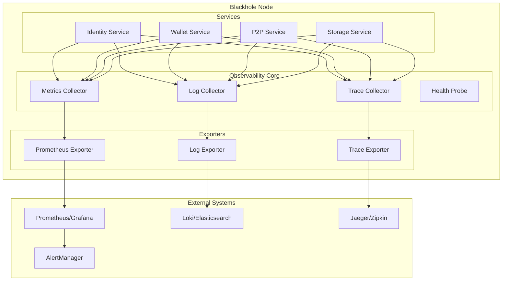
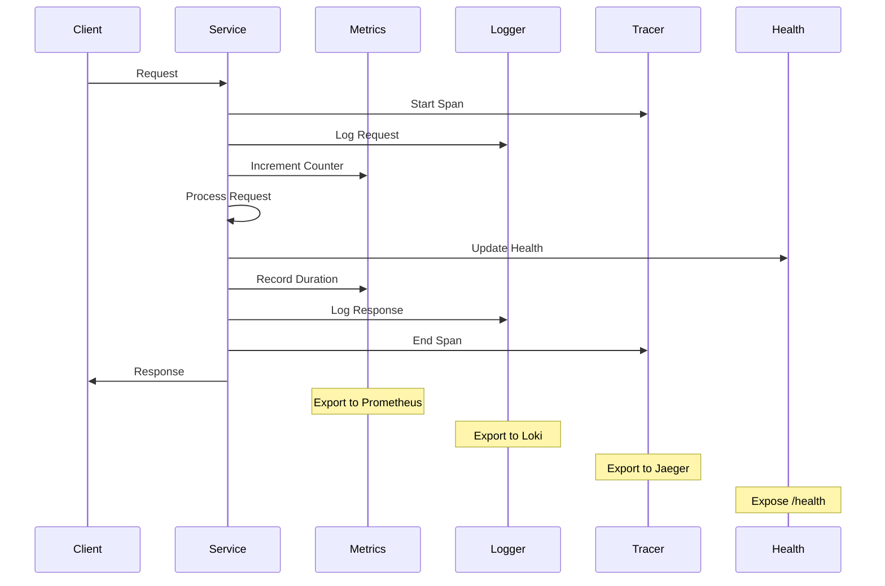

# Monitoring and Logging Strategies

## Overview

The Blackhole platform implements comprehensive monitoring and logging strategies that provide visibility into system behavior while maintaining operational simplicity. This document outlines our approach to observability, metrics collection, log aggregation, and alerting within the single-binary architecture.

## Architecture

### Observability Stack



## Metrics Strategy

### Metric Types

```go
type MetricRegistry struct {
    counters   map[string]prometheus.Counter
    gauges     map[string]prometheus.Gauge
    histograms map[string]prometheus.Histogram
    summaries  map[string]prometheus.Summary
}

// Standard metrics for all services
type ServiceMetrics struct {
    // Request metrics
    RequestTotal       prometheus.Counter
    RequestDuration    prometheus.Histogram
    RequestErrors      prometheus.Counter
    
    // Resource metrics
    MemoryUsage        prometheus.Gauge
    GoroutineCount     prometheus.Gauge
    CPUUsage           prometheus.Gauge
    
    // Business metrics
    ActiveConnections  prometheus.Gauge
    QueueDepth         prometheus.Gauge
    
    // Circuit breaker metrics
    CircuitBreakerState prometheus.Gauge
    CircuitBreakerTrips prometheus.Counter
}
```

### RED Method Implementation

Focus on Rate, Errors, and Duration:

```go
// Automatic RED metrics for all service methods
func (m *MetricsMiddleware) Instrument(service string) Middleware {
    return func(next Handler) Handler {
        return func(ctx context.Context, req Request) (Response, error) {
            timer := prometheus.NewTimer(m.duration.WithLabelValues(
                service,
                req.Method,
            ))
            
            m.requests.WithLabelValues(service, req.Method).Inc()
            
            resp, err := next(ctx, req)
            
            timer.ObserveDuration()
            
            if err != nil {
                m.errors.WithLabelValues(
                    service,
                    req.Method,
                    errorType(err),
                ).Inc()
            }
            
            return resp, err
        }
    }
}
```

### Service-Specific Metrics

```go
// Identity service metrics
type IdentityMetrics struct {
    ServiceMetrics
    
    // Authentication metrics
    AuthAttempts      prometheus.Counter
    AuthSuccesses     prometheus.Counter
    AuthFailures      prometheus.Counter
    TokensIssued      prometheus.Counter
    TokensRevoked     prometheus.Counter
    
    // DID metrics
    DIDsCreated       prometheus.Counter
    DIDsResolved      prometheus.Counter
    DIDsUpdated       prometheus.Counter
    
    // Performance metrics
    AuthLatency       prometheus.Histogram
    DIDResolutionTime prometheus.Histogram
}

// P2P service metrics
type P2PMetrics struct {
    ServiceMetrics
    
    // Network metrics
    PeersConnected    prometheus.Gauge
    PeersDiscovered   prometheus.Counter
    BytesSent         prometheus.Counter
    BytesReceived     prometheus.Counter
    
    // Protocol metrics
    MessagesReceived  map[string]prometheus.Counter
    MessagesSent      map[string]prometheus.Counter
    ProtocolErrors    map[string]prometheus.Counter
    
    // Performance metrics
    ConnectionLatency prometheus.Histogram
    MessageLatency    prometheus.Histogram
}
```

### Cardinality Management

```go
// Prevent metric explosion with bounded labels
type CardinalityLimiter struct {
    maxLabels int
    seen      map[string]int
    mutex     sync.Mutex
}

func (c *CardinalityLimiter) AllowLabel(name, value string) bool {
    c.mutex.Lock()
    defer c.mutex.Unlock()
    
    key := name + ":" + value
    if _, exists := c.seen[key]; exists {
        return true
    }
    
    if len(c.seen) >= c.maxLabels {
        return false
    }
    
    c.seen[key] = 1
    return true
}

// Use with metrics
func (m *Metrics) RecordRequest(service, method, status string) {
    if m.limiter.AllowLabel("method", method) {
        m.requests.WithLabelValues(service, method, status).Inc()
    } else {
        m.requests.WithLabelValues(service, "other", status).Inc()
    }
}
```

## Logging Strategy

### Structured Logging

```go
// Consistent log structure across all services
type Logger interface {
    Debug(msg string, fields ...Field)
    Info(msg string, fields ...Field)
    Warn(msg string, fields ...Field)
    Error(msg string, fields ...Field)
    Fatal(msg string, fields ...Field)
    
    With(fields ...Field) Logger
}

type Field struct {
    Key   string
    Value interface{}
}

// Service-aware logger
type ServiceLogger struct {
    logger  Logger
    service string
    version string
}

func (l *ServiceLogger) Info(msg string, fields ...Field) {
    // Add service context to all logs
    fields = append(fields,
        Field{"service", l.service},
        Field{"version", l.version},
        Field{"timestamp", time.Now().UTC()},
        Field{"node_id", l.nodeID},
    )
    
    l.logger.Info(msg, fields...)
}
```

### Log Levels and Categories

```go
// Define log categories for filtering
const (
    CategoryAuth       = "auth"
    CategoryNetwork    = "network"
    CategoryStorage    = "storage"
    CategoryConsensus  = "consensus"
    CategoryAPI        = "api"
    CategorySystem     = "system"
)

// Contextual logging
func (s *IdentityService) Authenticate(ctx context.Context, req *AuthRequest) (*AuthResponse, error) {
    logger := s.logger.With(
        Field{"method", "authenticate"},
        Field{"user", req.Username},
        Field{"category", CategoryAuth},
        Field{"trace_id", GetTraceID(ctx)},
    )
    
    logger.Debug("Starting authentication")
    
    // Validate request
    if err := s.validateAuthRequest(req); err != nil {
        logger.Warn("Invalid auth request", Field{"error", err})
        return nil, err
    }
    
    // Perform authentication
    user, err := s.db.GetUser(req.Username)
    if err != nil {
        logger.Error("Failed to get user", Field{"error", err})
        return nil, err
    }
    
    logger.Info("Authentication successful")
    return &AuthResponse{Token: token}, nil
}
```

### Log Sampling

```go
// Reduce log volume while maintaining visibility
type LogSampler struct {
    baseRate    float64
    errorRate   float64
    rng         *rand.Rand
    counters    map[string]*atomic.Int64
}

func (s *LogSampler) ShouldLog(level LogLevel, key string) bool {
    rate := s.baseRate
    if level >= LogLevelError {
        rate = s.errorRate
    }
    
    // Always log first N occurrences
    counter := s.getCounter(key)
    count := counter.Add(1)
    if count <= 100 {
        return true
    }
    
    // Sample based on rate
    return s.rng.Float64() < rate
}

// Usage
func (s *Service) HandleRequest(ctx context.Context, req Request) error {
    key := fmt.Sprintf("%s:%s", s.name, req.Method)
    
    if s.sampler.ShouldLog(LogLevelInfo, key) {
        s.logger.Info("Handling request",
            Field{"method", req.Method},
            Field{"sampled", true},
        )
    }
    
    // Always log errors
    if err := s.process(req); err != nil {
        s.logger.Error("Request failed",
            Field{"method", req.Method},
            Field{"error", err},
        )
        return err
    }
}
```

### Log Aggregation

```go
// Centralized log collection within the node
type LogCollector struct {
    buffer     *ring.Buffer
    writers    []LogWriter
    filters    []LogFilter
    enrichers  []LogEnricher
}

type LogEntry struct {
    Timestamp time.Time
    Level     LogLevel
    Service   string
    Message   string
    Fields    map[string]interface{}
    TraceID   string
    SpanID    string
}

func (c *LogCollector) Collect(entry LogEntry) {
    // Enrich log entry
    for _, enricher := range c.enrichers {
        entry = enricher.Enrich(entry)
    }
    
    // Apply filters
    for _, filter := range c.filters {
        if !filter.Accept(entry) {
            return
        }
    }
    
    // Buffer for batch writing
    c.buffer.Write(entry)
    
    // Async write to destinations
    if c.buffer.Size() >= c.batchSize {
        batch := c.buffer.Drain()
        go c.writeBatch(batch)
    }
}
```

## Distributed Tracing

### Trace Implementation

```go
// Trace context propagation
type TraceContext struct {
    TraceID  string
    SpanID   string
    ParentID string
    Flags    byte
    Baggage  map[string]string
}

// Service instrumentation
func (s *Service) InstrumentMethod(method string) MethodWrapper {
    return func(ctx context.Context, req Request) (Response, error) {
        // Extract or create trace context
        traceCtx := ExtractTraceContext(ctx)
        if traceCtx.TraceID == "" {
            traceCtx = NewTraceContext()
        }
        
        // Create new span
        span := s.tracer.StartSpan(
            method,
            ChildOf(traceCtx.SpanID),
            WithTraceID(traceCtx.TraceID),
        )
        defer span.Finish()
        
        // Add span to context
        ctx = ContextWithSpan(ctx, span)
        
        // Record operation details
        span.SetTag("service", s.name)
        span.SetTag("method", method)
        
        // Execute method
        resp, err := s.method(ctx, req)
        
        // Record result
        if err != nil {
            span.SetTag("error", true)
            span.LogError(err)
        }
        
        return resp, err
    }
}
```

### Cross-Service Tracing

```go
// Trace propagation between services
type TracePropagator struct {
    tracer Tracer
}

func (p *TracePropagator) Inject(ctx context.Context, carrier map[string]string) {
    span := SpanFromContext(ctx)
    if span == nil {
        return
    }
    
    traceCtx := span.Context()
    carrier["trace-id"] = traceCtx.TraceID
    carrier["span-id"] = traceCtx.SpanID
    carrier["parent-id"] = span.SpanID
    carrier["flags"] = fmt.Sprintf("%d", traceCtx.Flags)
}

func (p *TracePropagator) Extract(carrier map[string]string) TraceContext {
    return TraceContext{
        TraceID:  carrier["trace-id"],
        SpanID:   GenerateSpanID(),
        ParentID: carrier["span-id"],
        Flags:    parseFlags(carrier["flags"]),
    }
}
```

## Health Monitoring

### Health Check System

```go
// Comprehensive health checking
type HealthChecker struct {
    checks   map[string]HealthCheck
    interval time.Duration
    timeout  time.Duration
}

type HealthCheck interface {
    Name() string
    Check(ctx context.Context) HealthResult
}

type HealthResult struct {
    Status    HealthStatus // healthy, degraded, unhealthy
    Message   string
    Details   map[string]interface{}
    Timestamp time.Time
}

// Service health implementation
type ServiceHealth struct {
    service Service
    probes  []Probe
}

func (h *ServiceHealth) Check(ctx context.Context) HealthResult {
    ctx, cancel := context.WithTimeout(ctx, h.timeout)
    defer cancel()
    
    results := make([]ProbeResult, len(h.probes))
    
    // Run probes in parallel
    var wg sync.WaitGroup
    for i, probe := range h.probes {
        wg.Add(1)
        go func(idx int, p Probe) {
            defer wg.Done()
            results[idx] = p.Check(ctx)
        }(i, probe)
    }
    
    wg.Wait()
    
    // Aggregate results
    return h.aggregateResults(results)
}
```

### Probe Types

```go
// Different types of health probes
type LivenessProbe struct {
    service Service
}

func (p *LivenessProbe) Check(ctx context.Context) ProbeResult {
    // Simple check if service is running
    if p.service.IsRunning() {
        return ProbeResult{Success: true}
    }
    return ProbeResult{Success: false, Error: "service not running"}
}

type ReadinessProbe struct {
    service      Service
    dependencies []string
}

func (p *ReadinessProbe) Check(ctx context.Context) ProbeResult {
    // Check if service is ready to accept requests
    if !p.service.IsReady() {
        return ProbeResult{Success: false, Error: "service not ready"}
    }
    
    // Check dependencies
    for _, dep := range p.dependencies {
        if !p.isDependencyHealthy(dep) {
            return ProbeResult{
                Success: false,
                Error:   fmt.Sprintf("dependency %s unhealthy", dep),
            }
        }
    }
    
    return ProbeResult{Success: true}
}

type PerformanceProbe struct {
    service   Service
    threshold time.Duration
}

func (p *PerformanceProbe) Check(ctx context.Context) ProbeResult {
    start := time.Now()
    
    // Perform test operation
    if err := p.service.Ping(ctx); err != nil {
        return ProbeResult{Success: false, Error: err.Error()}
    }
    
    duration := time.Since(start)
    if duration > p.threshold {
        return ProbeResult{
            Success: false,
            Error:   fmt.Sprintf("response time %v exceeds threshold %v", duration, p.threshold),
        }
    }
    
    return ProbeResult{Success: true, Latency: duration}
}
```

## Alerting Strategy

### Alert Rules

```go
// Alert rule definitions
type AlertRule struct {
    Name        string
    Expression  string
    Duration    time.Duration
    Severity    AlertSeverity
    Labels      map[string]string
    Annotations map[string]string
}

var DefaultAlertRules = []AlertRule{
    {
        Name:       "HighErrorRate",
        Expression: `rate(request_errors_total[5m]) > 0.05`,
        Duration:   time.Minute,
        Severity:   SeverityWarning,
        Annotations: map[string]string{
            "summary":     "High error rate detected",
            "description": "Error rate is above 5% for 1 minute",
        },
    },
    {
        Name:       "ServiceDown",
        Expression: `up == 0`,
        Duration:   30 * time.Second,
        Severity:   SeverityCritical,
        Annotations: map[string]string{
            "summary":     "Service is down",
            "description": "Service {{ $labels.service }} is not responding",
        },
    },
    {
        Name:       "HighMemoryUsage",
        Expression: `memory_usage_bytes / memory_limit_bytes > 0.8`,
        Duration:   5 * time.Minute,
        Severity:   SeverityWarning,
        Annotations: map[string]string{
            "summary":     "High memory usage",
            "description": "Memory usage is above 80% for 5 minutes",
        },
    },
}
```

### Alert Management

```go
// Alert manager integration
type AlertManager struct {
    rules     []AlertRule
    notifiers []Notifier
    state     map[string]*AlertState
    evaluator *AlertEvaluator
}

type AlertState struct {
    Rule      AlertRule
    Active    bool
    StartTime time.Time
    Value     float64
    Labels    map[string]string
}

func (m *AlertManager) Evaluate() {
    for _, rule := range m.rules {
        result := m.evaluator.Evaluate(rule)
        
        state := m.state[rule.Name]
        if state == nil {
            state = &AlertState{Rule: rule}
            m.state[rule.Name] = state
        }
        
        if result.Value > 0 {
            if !state.Active {
                state.Active = true
                state.StartTime = time.Now()
                state.Value = result.Value
                
                if time.Since(state.StartTime) >= rule.Duration {
                    m.fireAlert(state)
                }
            }
        } else {
            if state.Active {
                state.Active = false
                m.resolveAlert(state)
            }
        }
    }
}
```

## Dashboard Configuration

### Grafana Dashboards

```json
{
  "dashboard": {
    "title": "Blackhole Node Overview",
    "panels": [
      {
        "title": "Request Rate",
        "targets": [
          {
            "expr": "sum(rate(request_total[5m])) by (service)"
          }
        ]
      },
      {
        "title": "Error Rate",
        "targets": [
          {
            "expr": "sum(rate(request_errors_total[5m])) by (service, error_type)"
          }
        ]
      },
      {
        "title": "Response Time",
        "targets": [
          {
            "expr": "histogram_quantile(0.95, rate(request_duration_seconds_bucket[5m]))"
          }
        ]
      },
      {
        "title": "Service Health",
        "targets": [
          {
            "expr": "health_status"
          }
        ]
      }
    ]
  }
}
```

### Service-Specific Dashboards

```go
// Dashboard generator for services
type DashboardGenerator struct {
    services []Service
}

func (g *DashboardGenerator) GenerateDashboard(service Service) Dashboard {
    return Dashboard{
        Title: fmt.Sprintf("%s Service Dashboard", service.Name()),
        Panels: []Panel{
            // Standard panels
            g.createRequestRatePanel(service),
            g.createErrorRatePanel(service),
            g.createLatencyPanel(service),
            g.createHealthPanel(service),
            
            // Service-specific panels
            ...g.createCustomPanels(service),
        },
    }
}
```

## Best Practices

### Metric Guidelines

1. **Use Standard Naming**
   ```
   service_request_total
   service_request_duration_seconds
   service_request_errors_total
   ```

2. **Limit Cardinality**
   - Avoid high-cardinality labels
   - Use bounded label values
   - Aggregate where possible

3. **Consistent Labels**
   - service: Service name
   - method: Operation name
   - status: Success/failure
   - error_type: Error classification

### Logging Guidelines

1. **Structured Logging**
   - Always use structured fields
   - Include trace context
   - Add service metadata

2. **Log Levels**
   - ERROR: Actionable errors
   - WARN: Potential issues
   - INFO: Important events
   - DEBUG: Detailed debugging

3. **Sensitive Data**
   - Never log passwords
   - Mask sensitive fields
   - Audit log access

### Monitoring Guidelines

1. **Golden Signals**
   - Latency
   - Traffic
   - Errors
   - Saturation

2. **SLI/SLO Definition**
   - Define service level indicators
   - Set realistic objectives
   - Monitor compliance

3. **Alert Quality**
   - Actionable alerts only
   - Clear runbooks
   - Proper severity levels

## Implementation Example

```go
// Complete monitoring setup for a service
func SetupServiceMonitoring(service Service) *MonitoringStack {
    // Create metrics
    metrics := NewServiceMetrics(service.Name())
    
    // Create logger
    logger := NewServiceLogger(service.Name())
    
    // Create tracer  
    tracer := NewServiceTracer(service.Name())
    
    // Create health checker
    health := NewServiceHealth(service, []Probe{
        NewLivenessProbe(service),
        NewReadinessProbe(service),
        NewPerformanceProbe(service),
    })
    
    // Wire everything together
    stack := &MonitoringStack{
        Metrics: metrics,
        Logger:  logger,
        Tracer:  tracer,
        Health:  health,
    }
    
    // Add middleware
    service.Use(
        stack.MetricsMiddleware(),
        stack.LoggingMiddleware(),
        stack.TracingMiddleware(),
    )
    
    return stack
}
```

## Monitoring Architecture Flow



## Conclusion

The monitoring and logging strategy provides comprehensive observability while maintaining simplicity for operators. Key features:

- Unified metrics across all services
- Structured logging with sampling
- Distributed tracing support
- Comprehensive health checks
- Flexible alerting rules
- Rich dashboards

This approach ensures operators can:
- Monitor system health at a glance
- Quickly troubleshoot issues
- Maintain SLOs
- Optimize performance
- Plan capacity

The strategy scales from single-node deployments to large distributed systems without changing the fundamental approach.