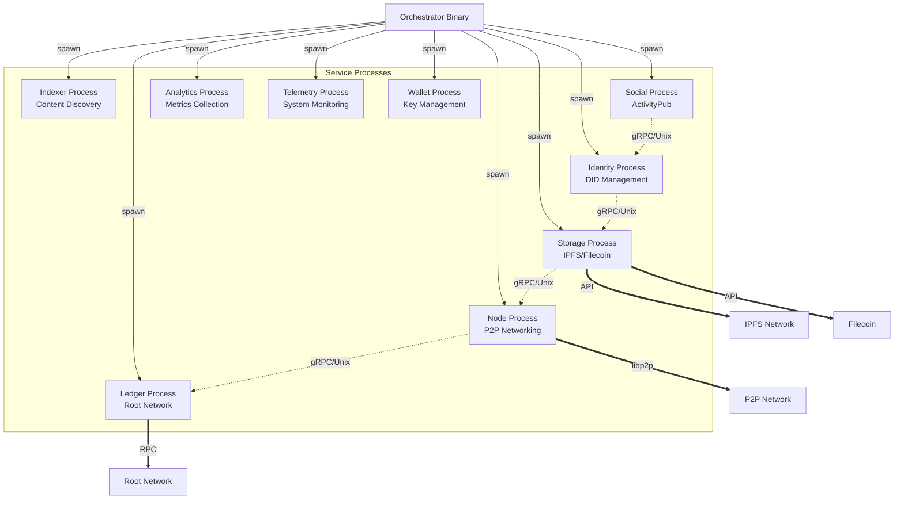

# Blackhole Platform Architecture

## Overview

The Blackhole platform is a distributed content sharing system implemented as a subprocess architecture where services run as independent OS processes orchestrated by a single binary. This architecture provides operational simplicity while maintaining true service isolation through process boundaries and RPC communication.

Each Blackhole node participates in a P2P network, with the Node service managing peer-to-peer communication while other services handle specific domain functionality.

## Architecture Principles

1. **Subprocess Isolation**: Services run as separate OS processes for true fault isolation
2. **Single Binary Distribution**: One executable that spawns and manages service processes  
3. **RPC Communication**: All inter-process communication via gRPC via gRPC
4. **Process-Level Security**: OS-level security boundaries between services
5. **P2P Networking**: Each node participates in a decentralized network
6. **Self-Sovereign Identity**: Users control their identity and data
7. **Decentralized Storage**: Content distributed across the P2P network
8. **Blockchain Integration**: Content ownership and transactions via Root Network

## Core Architecture

### Process Orchestrator

The main binary acts as an orchestrator managing service subprocesses:

- **Process Spawning**: Launches services as separate OS processes
- **Lifecycle Management**: Controls service startup, shutdown, and restart
- **Health Monitoring**: Process health checks and automatic recovery
- **Resource Control**: OS-level CPU, memory, and I/O limits
- **Configuration**: Distributes configuration to service processes

[Details: [Subprocess Architecture](./core/subprocess_architecture.md)]

### Service Architecture

The platform consists of nine core services, each running as an independent process:



[Details: [Process Management](./core/process_management.md)]

### Inter-Process Communication

All services communicate through gRPC over:

- **Unix Sockets**: High-performance local communication (default)
- **TCP/TLS**: Secure communication for distributed deployments
- **Service Discovery**: Automatic local service discovery
- **Health Checks**: Built-in health monitoring for all services
- **Circuit Breakers**: Fault tolerance and graceful degradation

[Details: [RPC Communication](./core/rpc_communication.md)]

## Service Overview

### Identity Service
- Manages Decentralized Identifiers (DIDs)
- Issues and verifies credentials
- Handles authentication and authorization
- Integrates zero-knowledge proofs

### Storage Service
- Interfaces with IPFS for content addressing
- Manages Filecoin for persistent storage
- Implements Reed-Solomon encoding
- Handles content chunking and retrieval

### Node Service
- Manages P2P networking using libp2p
- Handles peer discovery and routing
- Maintains network connections
- Implements NAT traversal

### Ledger Service
- Interfaces with Root Network blockchain
- Records content ownership and transactions
- Manages tokenomics and rewards
- Handles smart contract interactions

### Indexer Service
- Provides content discovery
- Maintains search indices
- Integrates with SubQuery
- Handles metadata management

### Social Service
- Implements ActivityPub protocol
- Manages user interactions
- Handles content distribution
- Supports federated social features

### Analytics Service
- Collects platform metrics
- Provides usage analytics
- Generates reports
- Respects user privacy

### Telemetry Service
- Monitors system health
- Collects performance metrics
- Provides alerting
- Handles log aggregation

### Wallet Service
- Manages user keys
- Supports hardware wallets
- Handles transaction signing
- Provides backup/recovery

## Resource Management

### Process Isolation

Each service runs with dedicated resources:

```yaml
services:
  identity:
    resources:
      cpu: 200%      # 2 CPU cores
      memory: 1GB    # Memory limit
      io_weight: 500 # Medium I/O priority
      
  storage:
    resources:
      cpu: 100%      # 1 CPU core
      memory: 2GB    # Higher memory for caching
      io_weight: 900 # High I/O priority
      
  node:
    resources:
      cpu: 150%      # 1.5 CPU cores
      memory: 1GB    # Memory limit
      io_weight: 700 # High I/O priority
```

[Details: [Resource Isolation](./core/resource_isolation.md)]

### Resource Enforcement

OS-level enforcement using:
- **CPU**: Cgroups v2 CPU quotas
- **Memory**: Memory cgroups with limits
- **I/O**: Block I/O weight prioritization
- **Network**: Network namespace isolation
- **Files**: File descriptor limits

## Security Architecture

### Process Security

Each service process has independent security boundaries:

1. **Process Isolation**: OS-level process separation
2. **Capability Restrictions**: Minimal required permissions
3. **File System Isolation**: Restricted directory access
4. **Network Policies**: Service-specific rules

### Communication Security

- **Local**: Unix socket permissions
- **Remote**: mTLS for TCP connections
- **Authentication**: Service-to-service auth
- **Authorization**: Request-level permissions

[Details: [Process Security](./security/process_security.md)]

## Deployment Patterns

### Single Host Deployment

All services on one machine:
```bash
blackhole start --all
```

### Multi-Host Deployment

Services distributed across hosts:
```bash
# Host 1: Core services
blackhole start --services=identity,ledger,node

# Host 2: Storage and processing
blackhole start --services=storage,indexer,analytics
```

### Container Deployment

Using Docker or Kubernetes:
```yaml
apiVersion: apps/v1
kind: Deployment
metadata:
  name: blackhole
spec:
  template:
    spec:
      containers:
      - name: blackhole
        image: blackhole:latest
        command: ["blackhole", "start", "--all"]
        securityContext:
          capabilities:
            add: ["SYS_RESOURCE"]
```

[Details: [Deployment Patterns](./core/deployment_patterns.md)]

## Performance Considerations

### Process Overhead
- Memory isolation per process
- IPC latency vs function calls
- Resource allocation overhead

### Optimization Strategies
- Connection pooling for gRPC
- Efficient serialization
- Request batching
- Resource pre-allocation

### Monitoring
- Process-level metrics
- gRPC performance tracking
- Resource utilization monitoring
- Health check optimization

## Development Guidelines

### Adding a New Service

1. Define service interface (proto)
2. Implement service logic
3. Create process entry point
4. Add to orchestrator
5. Configure resources
6. Add health checks

[Details: [Adding Services Guide](../guides/development/adding_services.md)]

### Testing Subprocesses

- Unit tests for service logic
- Integration tests with real processes
- Resource limit testing
- Fault injection testing

[Details: [Testing Guide](../guides/development/testing_subprocesses.md)]

## Migration from Monolith

The subprocess architecture provides a clear migration path:

1. Extract service interfaces
2. Implement gRPC servers
3. Update client code
4. Add process management
5. Configure resources
6. Test isolation

## Benefits

1. **True Isolation**: Process crashes don't cascade
2. **Resource Control**: OS-level limits and monitoring
3. **Simple Deployment**: Single binary distribution
4. **Easy Debugging**: Process-level investigation
5. **Gradual Updates**: Service-by-service updates
6. **Security**: Process-level boundaries

## Trade-offs

1. **Memory Usage**: Each process has overhead
2. **IPC Latency**: Network calls vs function calls
3. **Complexity**: Process management layer
4. **Resource Limits**: Fixed allocations

## Future Enhancements

1. **Dynamic Scaling**: Multiple instances per service
2. **Hot Reload**: Configuration without restart
3. **Service Mesh**: Optional advanced routing
4. **Distributed Tracing**: Cross-process tracking
5. **Auto-scaling**: Resource-based scaling

## Conclusion

The Blackhole subprocess architecture provides the perfect balance between operational simplicity and true service isolation. By running services as independent OS processes managed by a single orchestrator binary, we achieve robust fault isolation while maintaining the ease of single-binary deployment. This architecture positions Blackhole for both simple deployments and complex, distributed operations.