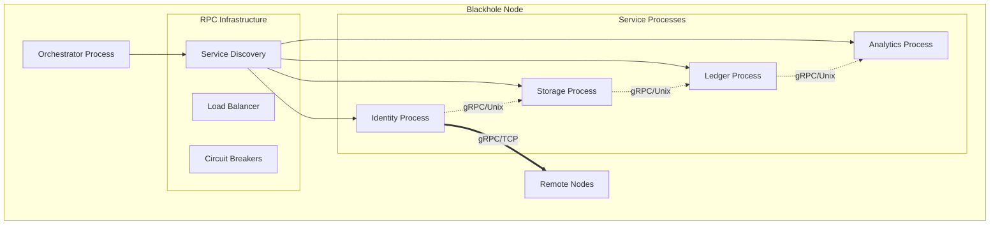

# RPC-Based Service Communication Architecture

## Overview

The Blackhole platform implements RPC-based communication between service subprocesses, providing true process isolation and fault tolerance while maintaining the simplicity of single binary deployment. All services communicate via gRPC, supporting both local (Unix socket) and remote (TCP) connections seamlessly.

## Core Concepts

### Service Definition

Each service runs as a separate subprocess exposing gRPC interfaces:

```go
// Service subprocess interface
type ServiceProcess struct {
    Name       string
    Binary     string         // Same binary, different args
    Process    *exec.Cmd
    Port       int            // TCP port for network RPC
    UnixSocket string         // Unix socket for local RPC
    gRPCServer *grpc.Server
}

// Service gRPC definition (example: Identity service)
service Identity {
    rpc Authenticate(AuthRequest) returns (AuthResponse);
    rpc ResolveDID(ResolveDIDRequest) returns (DIDDocument);
    rpc Health(HealthRequest) returns (HealthResponse);
}

// Health check standardized across all services  
message HealthResponse {
    string status = 1;    // "healthy", "degraded", "unhealthy"
    string message = 2;
    int64 uptime_seconds = 3;
    map<string, double> metrics = 4;
}
```

### Service Discovery

Service discovery enables locating services locally or remotely:

```go
type ServiceDiscovery struct {
    localServices  map[string]*LocalService
    remoteServices map[string][]*RemoteService
    mu            sync.RWMutex
}

type LocalService struct {
    Name       string
    UnixSocket string
    Port       int
    PID        int
    Health     HealthStatus
}

type RemoteService struct {
    NodeID     string
    Name       string
    Address    string  // host:port
    Health     HealthStatus
    LastSeen   time.Time
}

func (d *ServiceDiscovery) GetService(name string) (ServiceLocation, error) {
    d.mu.RLock()
    defer d.mu.RUnlock()
    
    // Prefer local services (Unix socket)
    if local, exists := d.localServices[name]; exists && local.Health.IsHealthy() {
        return ServiceLocation{
            Type:    "local",
            Address: "unix://" + local.UnixSocket,
        }, nil
    }
    
    // Fallback to remote services (TCP)
    if remotes, exists := d.remoteServices[name]; exists {
        // Load balance across healthy remotes
        for _, remote := range remotes {
            if remote.Health.IsHealthy() {
                return ServiceLocation{
                    Type:    "remote",
                    Address: remote.Address,
                }, nil
            }
        }
    }
    
    return ServiceLocation{}, ErrServiceNotFound
}
```

## RPC Communication Architecture

### Process Architecture



### gRPC Client Implementation

Services communicate through generated gRPC clients:

```go
// Service client wrapper
type RPCClient struct {
    discovery  *ServiceDiscovery
    clients    map[string]*grpc.ClientConn
    mu         sync.RWMutex
}

// Get or create gRPC client for service
func (c *RPCClient) GetClient(service string) (pb.ServiceClient, error) {
    c.mu.RLock()
    conn, exists := c.clients[service]
    c.mu.RUnlock()
    
    if !exists || conn.GetState() != connectivity.Ready {
        location, err := c.discovery.GetService(service)
        if err != nil {
            return nil, err
        }
        
        // Create connection with appropriate options
        var dialOpts []grpc.DialOption
        if location.Type == "local" {
            dialOpts = append(dialOpts, 
                grpc.WithInsecure(),
                grpc.WithTimeout(5*time.Second),
            )
        } else {
            dialOpts = append(dialOpts,
                grpc.WithTransportCredentials(credentials.NewTLS(tlsConfig)),
                grpc.WithTimeout(10*time.Second),
            )
        }
        
        conn, err = grpc.Dial(location.Address, dialOpts...)
        if err != nil {
            return nil, err
        }
        
        c.mu.Lock()
        c.clients[service] = conn
        c.mu.Unlock()
    }
    
    // Return typed client based on service
    switch service {
    case "identity":
        return pb.NewIdentityClient(conn), nil
    case "storage":
        return pb.NewStorageClient(conn), nil
    case "ledger":
        return pb.NewLedgerClient(conn), nil
    default:
        return nil, fmt.Errorf("unknown service: %s", service)
    }
}

// Example usage in another service
func (s *StorageService) AuthenticateUser(ctx context.Context, token string) (*User, error) {
    client, err := s.rpcClient.GetClient("identity")
    if err != nil {
        return nil, err
    }
    
    identityClient := client.(pb.IdentityClient)
    resp, err := identityClient.ValidateToken(ctx, &pb.ValidateTokenRequest{
        Token: token,
    })
    if err != nil {
        return nil, fmt.Errorf("auth failed: %w", err)
    }
    
    return &User{
        ID:   resp.UserId,
        DID:  resp.Did,
        Role: resp.Role,
    }, nil
}
```

### Event Streaming with gRPC

Services can stream events using gRPC streaming:

```go
// Event streaming service definition
service EventStream {
    rpc PublishEvent(Event) returns (PublishResponse);
    rpc Subscribe(SubscribeRequest) returns (stream Event);
}

message Event {
    string id = 1;
    string type = 2;
    string source = 3;
    int64 timestamp = 4;
    google.protobuf.Any data = 5;
    string trace_id = 6;
}

// Server-side streaming implementation
type EventStreamService struct {
    streams map[string][]chan *pb.Event
    mu      sync.RWMutex
}

func (s *EventStreamService) Subscribe(req *pb.SubscribeRequest, stream pb.EventStream_SubscribeServer) error {
    // Create event channel for this subscriber
    eventChan := make(chan *pb.Event, 100)
    
    s.mu.Lock()
    s.streams[req.EventType] = append(s.streams[req.EventType], eventChan)
    s.mu.Unlock()
    
    // Stream events to client
    for event := range eventChan {
        if err := stream.Send(event); err != nil {
            return err
        }
    }
    
    return nil
}

func (s *EventStreamService) PublishEvent(ctx context.Context, event *pb.Event) (*pb.PublishResponse, error) {
    s.mu.RLock()
    subscribers := s.streams[event.Type]
    s.mu.RUnlock()
    
    // Broadcast to all subscribers
    for _, ch := range subscribers {
        select {
        case ch <- event:
        default:
            // Channel full, drop event or buffer
        }
    }
    
    return &pb.PublishResponse{Success: true}, nil
}

// Client-side event subscription
func (c *AnalyticsService) SubscribeToEvents(ctx context.Context) error {
    stream, err := c.eventClient.Subscribe(ctx, &pb.SubscribeRequest{
        EventType: "did.created",
    })
    if err != nil {
        return err
    }
    
    go func() {
        for {
            event, err := stream.Recv()
            if err == io.EOF {
                return
            }
            if err != nil {
                log.Printf("stream error: %v", err)
                return
            }
            
            // Process event
            c.handleEvent(event)
        }
    }()
    
    return nil
}
```

## Fault Tolerance

### Circuit Breaker for RPC Calls

Circuit breakers protect services from cascading failures:

```go
// Circuit breaker wrapper for gRPC clients
type CircuitBreaker struct {
    service      string
    state        atomic.Value // "closed", "open", "half-open"
    failures     atomic.Int32
    successes    atomic.Int32
    lastFailTime atomic.Value
    config       CircuitConfig
}

type CircuitConfig struct {
    FailureThreshold int
    SuccessThreshold int
    Timeout          time.Duration
    HalfOpenTimeout  time.Duration
}

// Wrapped gRPC client with circuit breaker
type ResilientClient struct {
    client  pb.ServiceClient
    breaker *CircuitBreaker
}

func (r *ResilientClient) Call(ctx context.Context, method string, req, resp interface{}) error {
    return r.breaker.Execute(func() error {
        // Use reflection or type switch for actual gRPC calls
        switch method {
        case "Authenticate":
            authResp, err := r.client.(pb.IdentityClient).Authenticate(ctx, req.(*pb.AuthRequest))
            if err != nil {
                return err
            }
            *resp.(*pb.AuthResponse) = *authResp
            return nil
        default:
            return fmt.Errorf("unknown method: %s", method)
        }
    })
}

func (cb *CircuitBreaker) Execute(fn func() error) error {
    state := cb.state.Load().(string)
    
    switch state {
    case "open":
        if time.Since(cb.lastFailTime.Load().(time.Time)) > cb.config.HalfOpenTimeout {
            cb.state.Store("half-open")
            cb.successes.Store(0)
        } else {
            return ErrCircuitOpen
        }
    }
    
    err := fn()
    
    if err != nil {
        cb.recordFailure()
        if cb.failures.Load() >= int32(cb.config.FailureThreshold) {
            cb.state.Store("open")
            cb.lastFailTime.Store(time.Now())
        }
        return err
    }
    
    cb.recordSuccess()
    if state == "half-open" && cb.successes.Load() >= int32(cb.config.SuccessThreshold) {
        cb.state.Store("closed")
        cb.failures.Store(0)
    }
    
    return nil
}
```

### Retry Logic for gRPC

Automatic retry with exponential backoff for gRPC calls:

```go
// gRPC interceptor for automatic retries
func RetryInterceptor(config RetryConfig) grpc.UnaryClientInterceptor {
    return func(ctx context.Context, method string, req, reply interface{}, 
        cc *grpc.ClientConn, invoker grpc.UnaryInvoker, opts ...grpc.CallOption) error {
        
        var lastErr error
        for attempt := 0; attempt < config.MaxAttempts; attempt++ {
            err := invoker(ctx, method, req, reply, cc, opts...)
            if err == nil {
                return nil
            }
            
            lastErr = err
            
            // Check if retryable
            if !isRetryableGRPCError(err) {
                return err
            }
            
            // Don't retry if context is cancelled
            if ctx.Err() != nil {
                return ctx.Err()
            }
            
            // Calculate backoff with jitter
            delay := time.Duration(float64(config.InitialDelay) * 
                math.Pow(config.Multiplier, float64(attempt)))
            if delay > config.MaxDelay {
                delay = config.MaxDelay
            }
            
            // Add jitter
            jitter := time.Duration(rand.Float64() * float64(delay) * config.JitterFactor)
            delay += jitter
            
            select {
            case <-ctx.Done():
                return ctx.Err()
            case <-time.After(delay):
                continue
            }
        }
        
        return fmt.Errorf("max retries exceeded: %w", lastErr)
    }
}

func isRetryableGRPCError(err error) bool {
    st, ok := status.FromError(err)
    if !ok {
        return false
    }
    
    switch st.Code() {
    case codes.Unavailable, codes.ResourceExhausted, codes.Aborted:
        return true
    case codes.DeadlineExceeded:
        return true // Retry if deadline exceeded
    default:
        return false
    }
}

// Client creation with retry interceptor
func createClientWithRetry(address string) (*grpc.ClientConn, error) {
    retryConfig := RetryConfig{
        MaxAttempts:  3,
        InitialDelay: 100 * time.Millisecond,
        MaxDelay:     5 * time.Second,
        Multiplier:   2.0,
        JitterFactor: 0.1,
    }
    
    return grpc.Dial(address,
        grpc.WithUnaryInterceptor(RetryInterceptor(retryConfig)),
        grpc.WithTransportCredentials(credentials.NewTLS(tlsConfig)),
    )
}
```

## Resource Isolation

### Process-Based Isolation

Each service runs as a separate subprocess with OS-level isolation:

```go
// ProcessResourceLimits defines OS-level constraints
type ProcessResourceLimits struct {
    MaxMemory    uint64        // Maximum memory (bytes)
    MaxCPU       float64       // CPU limit (percentage)
    IOPriority   int          // IO scheduling priority
    MaxFileDesc  int          // File descriptor limit
}

// ApplyResourceLimits sets process constraints
func ApplyResourceLimits(cmd *exec.Cmd, limits ProcessResourceLimits) error {
    cmd.SysProcAttr = &syscall.SysProcAttr{
        Setpgid: true,  // Create process group
    }
    
    // Set memory limit
    cmd.Env = append(cmd.Env, 
        fmt.Sprintf("GOMEMLIMIT=%d", limits.MaxMemory))
    
    // Platform-specific resource limits
    return setPlatformLimits(cmd, limits)
}
```

### Unix Resource Control

On Unix systems, we use cgroups and rlimits:

```go
// setPlatformLimits applies Unix-specific limits
func setPlatformLimits(cmd *exec.Cmd, limits ProcessResourceLimits) error {
    // CPU limits via cgroups
    if limits.MaxCPU > 0 {
        cgroupPath := fmt.Sprintf("/sys/fs/cgroup/cpu/blackhole/%s", 
            cmd.Args[1])
        
        if err := os.MkdirAll(cgroupPath, 0755); err != nil {
            return err
        }
        
        // Set CPU quota
        quota := int64(limits.MaxCPU * 100000)
        if err := ioutil.WriteFile(
            filepath.Join(cgroupPath, "cpu.cfs_quota_us"),
            []byte(fmt.Sprintf("%d", quota)),
            0644,
        ); err != nil {
            return err
        }
    }
    
    // Memory and file descriptor limits
    cmd.SysProcAttr.Rlimits = []syscall.Rlimit{
        {
            Type: syscall.RLIMIT_AS,
            Cur:  limits.MaxMemory,
            Max:  limits.MaxMemory,
        },
        {
            Type: syscall.RLIMIT_NOFILE,
            Cur:  uint64(limits.MaxFileDesc),
            Max:  uint64(limits.MaxFileDesc),
        },
    }
    
    return nil
}
```

## Service Lifecycle

### Process Orchestration

The orchestrator manages subprocess lifecycle:

```go
type ProcessOrchestrator struct {
    services    map[string]*ServiceProcess
    supervisor  *ProcessSupervisor
    rpcClients  map[string]*grpc.ClientConn
    discovery   *ServiceDiscovery
    startOrder  []string
    stopOrder   []string
}

func (o *ProcessOrchestrator) StartService(ctx context.Context, name string, config ServiceConfig) error {
    // Prepare subprocess command
    cmd := exec.Command(os.Args[0], "service", "--name", name)
    
    // Apply resource limits
    if err := ApplyResourceLimits(cmd, config.ResourceLimits); err != nil {
        return fmt.Errorf("failed to apply resource limits: %w", err)
    }
    
    // Set environment variables
    cmd.Env = append(os.Environ(),
        fmt.Sprintf("SERVICE_NAME=%s", name),
        fmt.Sprintf("SERVICE_PORT=%d", config.Port),
        fmt.Sprintf("SERVICE_SOCKET=%s", config.UnixSocket),
    )
    
    // Start process
    if err := cmd.Start(); err != nil {
        return fmt.Errorf("failed to start process: %w", err)
    }
    
    // Track process
    proc := &ServiceProcess{
        Name:       name,
        Process:    cmd,
        Port:       config.Port,
        UnixSocket: config.UnixSocket,
        Started:    time.Now(),
    }
    
    o.services[name] = proc
    
    // Wait for service to be healthy
    return o.waitForHealth(ctx, name, 30*time.Second)
}

func (o *ProcessOrchestrator) waitForHealth(ctx context.Context, service string, timeout time.Duration) error {
    deadline := time.Now().Add(timeout)
    
    for time.Now().Before(deadline) {
        select {
        case <-ctx.Done():
            return ctx.Err()
        default:
            // Try to connect via gRPC
            conn, err := grpc.Dial("unix://"+o.services[service].UnixSocket,
                grpc.WithInsecure(),
                grpc.WithTimeout(2*time.Second),
            )
            if err == nil {
                // Check health endpoint
                client := pb.NewHealthClient(conn)
                resp, err := client.Check(ctx, &pb.HealthRequest{
                    Service: service,
                })
                conn.Close()
                
                if err == nil && resp.Status == "healthy" {
                    return nil
                }
            }
            
            time.Sleep(500 * time.Millisecond)
        }
    }
    
    return fmt.Errorf("service %s failed to become healthy", service)
}
```

### Process Supervision

Monitor and restart failed services:

```go
type ProcessSupervisor struct {
    processes  map[string]*SupervisedProcess
    policies   map[string]RestartPolicy
    mu         sync.RWMutex
}

type SupervisedProcess struct {
    *ServiceProcess
    Restarts    int
    LastRestart time.Time
    FailureLog  []ProcessFailure
}

type RestartPolicy struct {
    MaxRestarts     int
    RestartDelay    time.Duration
    BackoffFactor   float64
    MaxBackoff      time.Duration
}

func (s *ProcessSupervisor) Supervise(process *ServiceProcess, policy RestartPolicy) {
    s.mu.Lock()
    supervised := &SupervisedProcess{
        ServiceProcess: process,
        Restarts:       0,
    }
    s.processes[process.Name] = supervised
    s.policies[process.Name] = policy
    s.mu.Unlock()
    
    // Monitor process
    go s.monitor(supervised)
}

func (s *ProcessSupervisor) monitor(proc *SupervisedProcess) {
    // Wait for process to exit
    err := proc.Process.Wait()
    
    s.mu.Lock()
    defer s.mu.Unlock()
    
    // Log failure
    proc.FailureLog = append(proc.FailureLog, ProcessFailure{
        Time:     time.Now(),
        ExitCode: proc.Process.ProcessState.ExitCode(),
        Error:    err,
    })
    
    // Check restart policy
    policy := s.policies[proc.Name]
    if proc.Restarts >= policy.MaxRestarts {
        log.Printf("Service %s exceeded max restarts (%d)", 
            proc.Name, policy.MaxRestarts)
        return
    }
    
    // Calculate backoff
    backoff := policy.RestartDelay
    if proc.Restarts > 0 {
        backoff = time.Duration(float64(backoff) * 
            math.Pow(policy.BackoffFactor, float64(proc.Restarts)))
        if backoff > policy.MaxBackoff {
            backoff = policy.MaxBackoff
        }
    }
    
    // Schedule restart
    time.AfterFunc(backoff, func() {
        if err := s.restartProcess(proc); err != nil {
            log.Printf("Failed to restart %s: %v", proc.Name, err)
        }
    })
}

func (s *ProcessSupervisor) restartProcess(proc *SupervisedProcess) error {
    s.mu.Lock()
    defer s.mu.Unlock()
    
    proc.Restarts++
    proc.LastRestart = time.Now()
    
    // Start new process
    config := s.getServiceConfig(proc.Name)
    return s.orchestrator.StartService(context.Background(), proc.Name, config)
}
```

## Configuration

### Service Configuration

Each subprocess is configured independently:

```go
type ServiceConfig struct {
    // Process configuration
    Name       string `yaml:"name"`
    Port       int    `yaml:"port"`
    UnixSocket string `yaml:"unix_socket"`
    
    // Resource limits
    ResourceLimits ProcessResourceLimits `yaml:"resource_limits"`
    
    // Restart policy  
    RestartPolicy RestartPolicy `yaml:"restart_policy"`
    
    // gRPC settings
    GRPC GRPCConfig `yaml:"grpc"`
    
    // Service-specific config
    Custom map[string]interface{} `yaml:"custom"`
}

type ProcessResourceLimits struct {
    MaxMemory   uint64  `yaml:"max_memory"`   // Bytes
    MaxCPU      float64 `yaml:"max_cpu"`      // Percentage (0.0-1.0)
    IOPriority  int     `yaml:"io_priority"`  // Nice value
    MaxFileDesc int     `yaml:"max_file_desc"`
}

type RestartPolicy struct {
    MaxRestarts   int           `yaml:"max_restarts"`
    RestartDelay  time.Duration `yaml:"restart_delay"`
    BackoffFactor float64       `yaml:"backoff_factor"`
    MaxBackoff    time.Duration `yaml:"max_backoff"`
}

type GRPCConfig struct {
    MaxMessageSize int           `yaml:"max_message_size"`
    Timeout        time.Duration `yaml:"timeout"`
    MaxRetries     int          `yaml:"max_retries"`
    RateLimit      int          `yaml:"rate_limit"`
}
```

### Process Configuration

```yaml
services:
  # Identity service configuration
  identity:
    port: 50001
    unix_socket: /var/run/blackhole/identity.sock
    
    resource_limits:
      max_memory: 1GB
      max_cpu: 0.5
      io_priority: 0
      max_file_desc: 4096
      
    restart_policy:
      max_restarts: 5
      restart_delay: 1s
      backoff_factor: 2.0
      max_backoff: 30s
      
    grpc:
      max_message_size: 10MB
      timeout: 30s
      max_retries: 3
      rate_limit: 1000
      
    custom:
      database_pool_size: 20
      cache_size: 512MB
      
  # Storage service configuration
  storage:
    port: 50002
    unix_socket: /var/run/blackhole/storage.sock
    
    resource_limits:
      max_memory: 4GB
      max_cpu: 1.0
      io_priority: -5  # Higher priority
      max_file_desc: 8192
      
    restart_policy:
      max_restarts: 3
      restart_delay: 5s
      backoff_factor: 1.5
      max_backoff: 60s
      
    grpc:
      max_message_size: 100MB
      timeout: 300s
      max_retries: 5
      rate_limit: 500

# Process supervisor settings
supervisor:
  health_check_interval: 10s
  stale_process_timeout: 60s
  graceful_shutdown_timeout: 30s
  
  # Global resource policies
  resource_policies:
    critical_services:
      - identity
      - ledger
      max_memory_buffer: 20%
      cpu_priority_boost: 10
      
    core_services:
      - storage
      - indexer
      max_memory_buffer: 10%
      cpu_priority_boost: 5
      
    standard_services:
      - analytics
      - telemetry
      max_memory_buffer: 5%
      cpu_priority_boost: 0
```

## Resource Management Integration

### Process Resource Management

The orchestrator integrates with OS-level resource management:

```go
type ProcessResourceManager struct {
    orchestrator *ProcessOrchestrator
    monitor      *ResourceMonitor
    policies     map[string]ResourcePolicy
}

// Monitor and adjust process resources
func (m *ProcessResourceManager) MonitorResources(ctx context.Context) {
    ticker := time.NewTicker(10 * time.Second)
    defer ticker.Stop()
    
    for {
        select {
        case <-ctx.Done():
            return
        case <-ticker.C:
            m.checkAndAdjustResources()
        }
    }
}

func (m *ProcessResourceManager) checkAndAdjustResources() {
    for name, proc := range m.orchestrator.services {
        metrics := m.monitor.GetProcessMetrics(proc.Process.Process.Pid)
        policy := m.policies[name]
        
        // Check memory usage
        if metrics.MemoryUsage > policy.MemoryThreshold {
            log.Printf("Service %s approaching memory limit: %d/%d bytes",
                name, metrics.MemoryUsage, policy.ResourceLimits.MaxMemory)
                
            // Could trigger alerts or scaling decisions
            m.handleMemoryPressure(name, metrics)
        }
        
        // Check CPU usage
        if metrics.CPUPercent > policy.CPUThreshold {
            log.Printf("Service %s high CPU usage: %.2f%%",
                name, metrics.CPUPercent)
                
            // Could adjust CPU priority or quota
            m.handleCPUPressure(name, metrics)
        }
    }
}
```

### Process Resource Metrics

```go
type ProcessMetrics struct {
    PID            int
    MemoryUsage    uint64    // Current memory usage
    MemoryLimit    uint64    // Memory limit
    CPUPercent     float64   // CPU usage percentage
    FileDescs      int       // Open file descriptors
    ThreadCount    int       // Thread count
    GoroutineCount int       // Goroutine count (Go specific)
    LastUpdate     time.Time
}

type ResourceMonitor struct {
    metrics   map[int]*ProcessMetrics
    mu        sync.RWMutex
}

func (m *ResourceMonitor) GetProcessMetrics(pid int) *ProcessMetrics {
    m.mu.RLock()
    metrics, exists := m.metrics[pid]
    m.mu.RUnlock()
    
    if !exists || time.Since(metrics.LastUpdate) > 5*time.Second {
        metrics = m.collectProcessMetrics(pid)
        m.mu.Lock()
        m.metrics[pid] = metrics
        m.mu.Unlock()
    }
    
    return metrics
}

func (m *ResourceMonitor) collectProcessMetrics(pid int) *ProcessMetrics {
    proc, err := process.NewProcess(int32(pid))
    if err != nil {
        return nil
    }
    
    memInfo, _ := proc.MemoryInfo()
    cpuPercent, _ := proc.CPUPercent()
    openFiles, _ := proc.OpenFiles()
    numThreads, _ := proc.NumThreads()
    
    // Get goroutine count from runtime metrics if available
    goroutines := m.getGoroutineCount(pid)
    
    return &ProcessMetrics{
        PID:            pid,
        MemoryUsage:    memInfo.RSS,
        CPUPercent:     cpuPercent,
        FileDescs:      len(openFiles),
        ThreadCount:    int(numThreads),
        GoroutineCount: goroutines,
        LastUpdate:     time.Now(),
    }
}
```

### Dynamic Process Scaling

```go
type ProcessScaler struct {
    orchestrator *ProcessOrchestrator
    monitor      *ResourceMonitor
    policies     map[string]ScalingPolicy
}

type ScalingPolicy struct {
    MinInstances      int
    MaxInstances      int
    CPUScaleThreshold float64
    MemScaleThreshold float64
    ScaleUpCooldown   time.Duration
    ScaleDownCooldown time.Duration
}

func (s *ProcessScaler) EvaluateScaling(ctx context.Context) {
    for service, policy := range s.policies {
        instances := s.orchestrator.GetInstanceCount(service)
        metrics := s.monitor.GetServiceMetrics(service)
        
        // Scale up decision
        if instances < policy.MaxInstances &&
           (metrics.AvgCPU > policy.CPUScaleThreshold ||
            metrics.AvgMemory > policy.MemScaleThreshold) {
            
            if s.canScaleUp(service) {
                log.Printf("Scaling up %s: CPU=%.2f%%, Mem=%.2f%%",
                    service, metrics.AvgCPU, metrics.AvgMemory)
                    
                s.orchestrator.ScaleService(ctx, service, instances+1)
                s.recordScaleEvent(service, "up")
            }
        }
        
        // Scale down decision
        if instances > policy.MinInstances &&
           metrics.AvgCPU < policy.CPUScaleThreshold*0.5 &&
           metrics.AvgMemory < policy.MemScaleThreshold*0.5 {
            
            if s.canScaleDown(service) {
                log.Printf("Scaling down %s: CPU=%.2f%%, Mem=%.2f%%",
                    service, metrics.AvgCPU, metrics.AvgMemory)
                    
                s.orchestrator.ScaleService(ctx, service, instances-1)
                s.recordScaleEvent(service, "down")
            }
        }
    }
}
```

## Monitoring & Observability

### Process-Level Metrics

```go
type ServiceMetrics struct {
    // Process metrics
    ProcessID       int
    Uptime          time.Duration
    RestartCount    int
    LastRestart     time.Time
    
    // gRPC metrics  
    RequestCount    prometheus.Counter
    RequestDuration prometheus.Histogram
    ErrorCount      prometheus.Counter
    ActiveStreams   prometheus.Gauge
    
    // Resource metrics
    MemoryUsage     prometheus.Gauge
    CPUUsage        prometheus.Gauge
    FileDescriptors prometheus.Gauge
    ThreadCount     prometheus.Gauge
    
    // Business metrics
    ServiceSpecific map[string]prometheus.Collector
}

// gRPC interceptor for metrics collection
func MetricsInterceptor(metrics *ServiceMetrics) grpc.UnaryServerInterceptor {
    return func(ctx context.Context, req interface{}, info *grpc.UnaryServerInfo, 
        handler grpc.UnaryHandler) (interface{}, error) {
        
        start := time.Now()
        
        // Record request
        metrics.RequestCount.Inc()
        
        // Execute handler
        resp, err := handler(ctx, req)
        
        // Record response metrics
        duration := time.Since(start)
        metrics.RequestDuration.Observe(duration.Seconds())
        
        if err != nil {
            metrics.ErrorCount.Inc()
        }
        
        return resp, err
    }
}

// Collect process-level metrics
func (m *ServiceMetrics) CollectProcessMetrics(pid int) {
    proc, err := process.NewProcess(int32(pid))
    if err != nil {
        return
    }
    
    // Memory metrics
    memInfo, _ := proc.MemoryInfo()
    m.MemoryUsage.Set(float64(memInfo.RSS))
    
    // CPU metrics
    cpuPercent, _ := proc.CPUPercent()
    m.CPUUsage.Set(cpuPercent)
    
    // File descriptor count
    openFiles, _ := proc.OpenFiles()
    m.FileDescriptors.Set(float64(len(openFiles)))
    
    // Thread count
    numThreads, _ := proc.NumThreads()
    m.ThreadCount.Set(float64(numThreads))
}
```

### Cross-Process Tracing

```go
// Distributed tracing across processes
type ProcessTracer struct {
    tracer opentracing.Tracer
}

// gRPC client interceptor for tracing
func TracingClientInterceptor(tracer opentracing.Tracer) grpc.UnaryClientInterceptor {
    return func(ctx context.Context, method string, req, reply interface{},
        cc *grpc.ClientConn, invoker grpc.UnaryInvoker, opts ...grpc.CallOption) error {
        
        // Extract parent span
        parentSpan := opentracing.SpanFromContext(ctx)
        
        // Create new span
        span := tracer.StartSpan(
            method,
            opentracing.ChildOf(parentSpan.Context()),
            opentracing.Tag{Key: "component", Value: "grpc-client"},
            opentracing.Tag{Key: "grpc.method", Value: method},
        )
        defer span.Finish()
        
        // Inject span context into metadata
        md := metadata.New(nil)
        carrier := &metadataTextMap{md}
        tracer.Inject(span.Context(), opentracing.TextMap, carrier)
        ctx = metadata.NewOutgoingContext(ctx, md)
        
        // Call the service
        err := invoker(ctx, method, req, reply, cc, opts...)
        
        if err != nil {
            span.SetTag("error", true)
            span.LogFields(
                log.String("event", "error"),
                log.String("message", err.Error()),
            )
        }
        
        return err
    }
}

// gRPC server interceptor for tracing
func TracingServerInterceptor(tracer opentracing.Tracer) grpc.UnaryServerInterceptor {
    return func(ctx context.Context, req interface{}, info *grpc.UnaryServerInfo,
        handler grpc.UnaryHandler) (interface{}, error) {
        
        // Extract span context from metadata
        md, _ := metadata.FromIncomingContext(ctx)
        carrier := &metadataTextMap{md}
        spanContext, _ := tracer.Extract(opentracing.TextMap, carrier)
        
        // Create new span
        span := tracer.StartSpan(
            info.FullMethod,
            opentracing.ChildOf(spanContext),
            opentracing.Tag{Key: "component", Value: "grpc-server"},
            opentracing.Tag{Key: "grpc.method", Value: info.FullMethod},
        )
        defer span.Finish()
        
        // Add span to context
        ctx = opentracing.ContextWithSpan(ctx, span)
        
        // Execute handler
        resp, err := handler(ctx, req)
        
        if err != nil {
            span.SetTag("error", true)
            span.LogFields(
                log.String("event", "error"),
                log.String("message", err.Error()),
            )
        }
        
        return resp, err
    }
}
```

### Process Health Monitoring

```go
type ProcessHealthMonitor struct {
    orchestrator *ProcessOrchestrator
    metrics      map[string]*ServiceMetrics
    alerts       *AlertManager
}

func (m *ProcessHealthMonitor) MonitorHealth(ctx context.Context) {
    ticker := time.NewTicker(10 * time.Second)
    defer ticker.Stop()
    
    for {
        select {
        case <-ctx.Done():
            return
        case <-ticker.C:
            m.checkServiceHealth()
        }
    }
}

func (m *ProcessHealthMonitor) checkServiceHealth() {
    for name, proc := range m.orchestrator.services {
        // Check process health
        health := m.checkProcessHealth(proc)
        
        // Update metrics
        metrics := m.metrics[name]
        metrics.Uptime = time.Since(proc.Started)
        
        // Check for issues
        if !health.IsHealthy {
            m.alerts.SendAlert(Alert{
                Service:  name,
                Severity: health.Severity,
                Message:  health.Message,
                Time:     time.Now(),
            })
        }
        
        // Log health status
        log.Printf("Service %s health: %s (uptime: %s, restarts: %d)",
            name, health.Status, metrics.Uptime, metrics.RestartCount)
    }
}

func (m *ProcessHealthMonitor) checkProcessHealth(proc *ServiceProcess) HealthStatus {
    // Check if process is running
    if proc.Process.ProcessState != nil {
        return HealthStatus{
            IsHealthy: false,
            Status:    "down",
            Severity:  "critical",
            Message:   "Process has exited",
        }
    }
    
    // Check gRPC health endpoint
    conn, err := grpc.Dial("unix://"+proc.UnixSocket,
        grpc.WithInsecure(),
        grpc.WithTimeout(5*time.Second),
    )
    if err != nil {
        return HealthStatus{
            IsHealthy: false,
            Status:    "unreachable",
            Severity:  "critical",
            Message:   fmt.Sprintf("Cannot connect to service: %v", err),
        }
    }
    defer conn.Close()
    
    client := pb.NewHealthClient(conn)
    resp, err := client.Check(context.Background(), &pb.HealthRequest{
        Service: proc.Name,
    })
    
    if err != nil {
        return HealthStatus{
            IsHealthy: false,
            Status:    "unhealthy",
            Severity:  "warning",
            Message:   fmt.Sprintf("Health check failed: %v", err),
        }
    }
    
    return HealthStatus{
        IsHealthy: resp.Status == "healthy",
        Status:    resp.Status,
        Message:   resp.Message,
    }
}
```

## Best Practices

### Subprocess Service Design

1. **Process Isolation**: Each service runs in its own process for true fault isolation
2. **Graceful Shutdown**: Handle SIGTERM/SIGINT for clean shutdown
3. **Health Endpoints**: Implement gRPC health check for monitoring
4. **Resource Limits**: Set appropriate OS-level resource constraints
5. **Restart Policies**: Configure restart behavior for resilience

### Process Lifecycle Management

```go
// Service main function with proper signal handling
func main() {
    // Parse service name from args
    serviceName := flag.String("name", "", "Service name")
    flag.Parse()
    
    // Setup signal handling
    sigChan := make(chan os.Signal, 1)
    signal.Notify(sigChan, syscall.SIGINT, syscall.SIGTERM)
    
    // Create service based on name
    var service Service
    switch *serviceName {
    case "identity":
        service = NewIdentityService()
    case "storage":
        service = NewStorageService()
    default:
        log.Fatal("Unknown service: ", *serviceName)
    }
    
    // Start gRPC server
    server := grpc.NewServer(
        grpc.UnaryInterceptor(MetricsInterceptor(metrics)),
        grpc.UnaryInterceptor(TracingServerInterceptor(tracer)),
    )
    
    // Register service
    service.RegisterGRPC(server)
    
    // Register health check
    healthServer := health.NewServer()
    grpc_health_v1.RegisterHealthServer(server, healthServer)
    healthServer.SetServingStatus(*serviceName, grpc_health_v1.HealthCheckResponse_SERVING)
    
    // Listen on Unix socket
    listener, err := net.Listen("unix", os.Getenv("SERVICE_SOCKET"))
    if err != nil {
        log.Fatal("Failed to listen:", err)
    }
    
    // Start server in background
    go func() {
        if err := server.Serve(listener); err != nil {
            log.Fatal("Failed to serve:", err)
        }
    }()
    
    // Wait for shutdown signal
    <-sigChan
    log.Println("Shutting down service...")
    
    // Graceful shutdown
    healthServer.SetServingStatus(*serviceName, grpc_health_v1.HealthCheckResponse_NOT_SERVING)
    server.GracefulStop()
    
    // Cleanup
    service.Shutdown()
    os.Remove(os.Getenv("SERVICE_SOCKET"))
}
```

### Inter-Process Communication

```go
// Robust gRPC client with retries and circuit breaker
func NewServiceClient(serviceName string, discovery *ServiceDiscovery) (ServiceClient, error) {
    // Get service location
    location, err := discovery.GetService(serviceName)
    if err != nil {
        return nil, fmt.Errorf("service not found: %w", err)
    }
    
    // Create connection with interceptors
    conn, err := grpc.Dial(location.Address,
        grpc.WithInsecure(), // Unix sockets don't need TLS
        grpc.WithUnaryInterceptor(RetryInterceptor(retryConfig)),
        grpc.WithUnaryInterceptor(CircuitBreakerInterceptor(breakerConfig)),
        grpc.WithUnaryInterceptor(TracingClientInterceptor(tracer)),
        grpc.WithTimeout(30*time.Second),
    )
    if err != nil {
        return nil, fmt.Errorf("failed to connect: %w", err)
    }
    
    // Create typed client
    switch serviceName {
    case "identity":
        return pb.NewIdentityClient(conn), nil
    case "storage":
        return pb.NewStorageClient(conn), nil
    default:
        return nil, fmt.Errorf("unknown service: %s", serviceName)
    }
}
```

### Process Testing

```go
// Integration tests with real subprocesses
func TestServiceIntegration(t *testing.T) {
    // Start test orchestrator
    orchestrator := NewTestOrchestrator()
    defer orchestrator.Shutdown()
    
    // Start identity service
    err := orchestrator.StartService(context.Background(), "identity", testConfig)
    require.NoError(t, err)
    
    // Wait for service to be healthy
    require.Eventually(t, func() bool {
        return orchestrator.IsHealthy("identity")
    }, 30*time.Second, 1*time.Second)
    
    // Create client
    client, err := orchestrator.GetClient("identity")
    require.NoError(t, err)
    
    // Test service
    resp, err := client.Authenticate(context.Background(), &pb.AuthRequest{
        Username: "test",
        Password: "password",
    })
    
    assert.NoError(t, err)
    assert.NotEmpty(t, resp.Token)
    
    // Verify metrics
    metrics := orchestrator.GetMetrics("identity")
    assert.Greater(t, metrics.RequestCount, int64(0))
}

// Test process failure and recovery
func TestProcessResilience(t *testing.T) {
    orchestrator := NewTestOrchestrator()
    defer orchestrator.Shutdown()
    
    // Start service with restart policy
    policy := RestartPolicy{
        MaxRestarts:   3,
        RestartDelay:  1 * time.Second,
        BackoffFactor: 2.0,
    }
    
    err := orchestrator.StartServiceWithPolicy("storage", testConfig, policy)
    require.NoError(t, err)
    
    // Get process ID
    pid := orchestrator.GetProcessID("storage")
    
    // Kill process
    process.NewProcess(int32(pid)).Kill()
    
    // Verify automatic restart
    require.Eventually(t, func() bool {
        newPID := orchestrator.GetProcessID("storage")
        return newPID != pid && newPID != 0
    }, 10*time.Second, 500*time.Millisecond)
    
    // Verify service is healthy again
    assert.True(t, orchestrator.IsHealthy("storage"))
}
```

## Migration Guide

### From Monolith to Subprocess Architecture

1. **Extract Service as Subprocess**
```go
// Before: Embedded service
type Application struct {
    identityService *IdentityService
    storageService  *StorageService
}

// After: Service runs as subprocess
func main() {
    serviceName := flag.String("name", "", "Service name")
    flag.Parse()
    
    switch *serviceName {
    case "identity":
        runIdentityService()
    case "storage":
        runStorageService()
    default:
        runOrchestrator() // Orchestrator
    }
}
```

2. **Define gRPC Interface**
```proto
// identity.proto
service Identity {
    rpc Authenticate(AuthRequest) returns (AuthResponse);
    rpc ResolveDID(ResolveDIDRequest) returns (DIDDocument);
}

message AuthRequest {
    string username = 1;
    string password = 2;
}

message AuthResponse {
    string token = 1;
    int64 expires_at = 2;
}
```

3. **Update Service Implementation**
```go
// Implement gRPC server
type IdentityServer struct {
    pb.UnimplementedIdentityServer
    service *IdentityService
}

func (s *IdentityServer) Authenticate(ctx context.Context, req *pb.AuthRequest) (*pb.AuthResponse, error) {
    token, err := s.service.Authenticate(ctx, req.Username, req.Password)
    if err != nil {
        return nil, status.Errorf(codes.Unauthenticated, "authentication failed: %v", err)
    }
    
    return &pb.AuthResponse{
        Token:     token.Value,
        ExpiresAt: token.ExpiresAt.Unix(),
    }, nil
}
```

4. **Update Client Code**
```go
// Before: Direct function call
token, err := app.identityService.Authenticate(ctx, username, password)

// After: gRPC client call
client, err := getIdentityClient(ctx)
if err != nil {
    return err
}

resp, err := client.Authenticate(ctx, &pb.AuthRequest{
    Username: username,
    Password: password,
})
if err != nil {
    return err
}

token := resp.Token
```

5. **Add Service Discovery**
```go
// Service registration
func (s *IdentityServer) Register(discovery *ServiceDiscovery) error {
    return discovery.Register("identity", ServiceInfo{
        UnixSocket: os.Getenv("SERVICE_SOCKET"),
        Port:       50001,
        Health:     "healthy",
    })
}

// Client discovery
func getIdentityClient(ctx context.Context) (pb.IdentityClient, error) {
    location, err := discovery.GetService("identity")
    if err != nil {
        return nil, err
    }
    
    conn, err := grpc.DialContext(ctx, location.Address,
        grpc.WithInsecure(),
        grpc.WithBlock(),
    )
    if err != nil {
        return nil, err
    }
    
    return pb.NewIdentityClient(conn), nil
}
```

## Conclusion

The RPC-based subprocess architecture provides the ideal balance between true service isolation and deployment simplicity. By distributing one binary that spawns services as subprocesses, we achieve robust fault tolerance while maintaining the ease of single-binary deployment.

Key benefits of this architecture:

1. **True Isolation**: Process-level separation prevents cascading failures
2. **Simple Deployment**: Single binary distribution with automatic subprocess management
3. **Resource Control**: OS-level resource limits and isolation
4. **Fault Tolerance**: Automatic restart policies and health monitoring
5. **Performance**: Unix socket communication for local services, TCP for remote
6. **Scalability**: Dynamic process scaling based on load
7. **Observability**: Process-level metrics and distributed tracing
8. **Developer Experience**: Standard gRPC interfaces and tooling

This architecture addresses the fundamental tension between operational simplicity and service isolation, providing node operators with a single binary to deploy while maintaining the robustness of a true microservices architecture.

The subprocess model also provides a clear migration path to containerized microservices in the future, as each subprocess can be easily containerized when scaling requirements demand it.