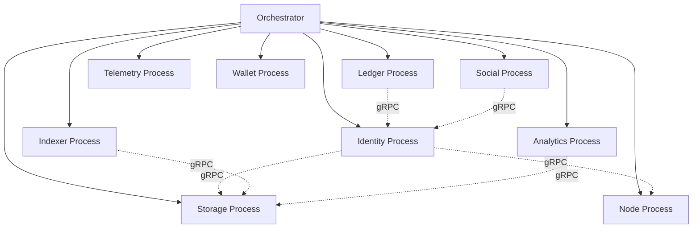
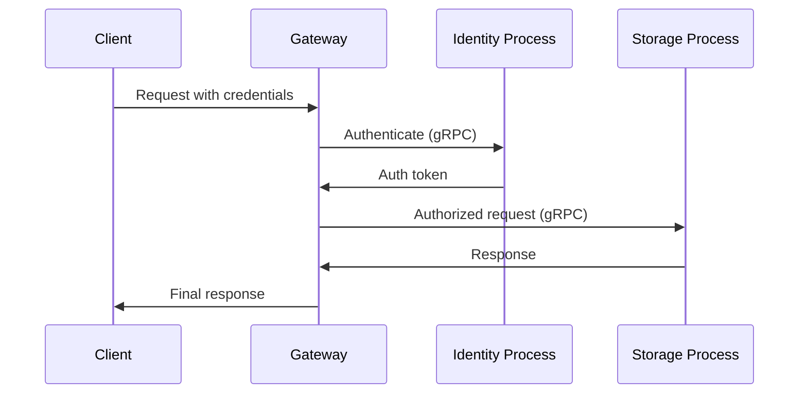
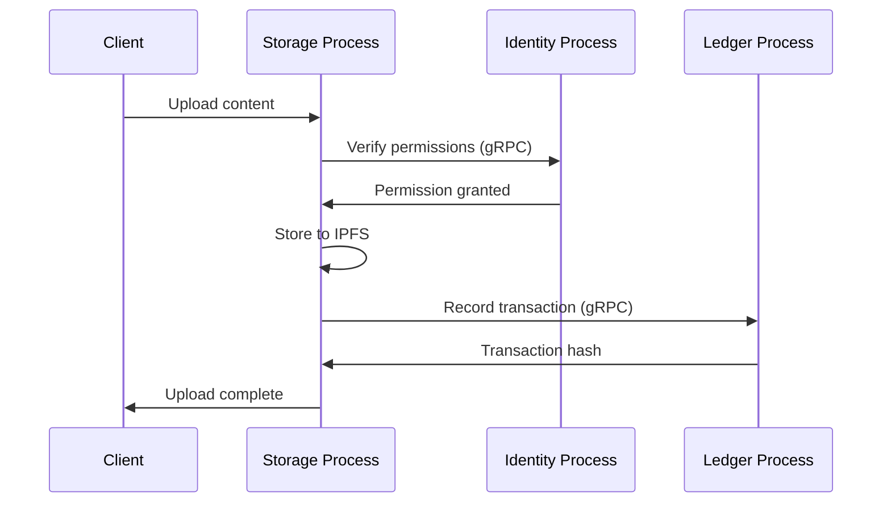

# Service Boundaries and Interactions

This document defines the boundaries between services and their interaction patterns within the Blackhole subprocess architecture, where each service runs as an independent OS process communicating via gRPC.

## Service Boundary Principles

1. **Process Isolation**
   - Each service runs in its own OS process
   - No shared memory between services
   - Communication happens exclusively through gRPC interfaces
   - Security enforced at process and RPC boundaries

2. **Dependency Direction**
   - Dependencies flow from higher-level to lower-level services
   - Core services have minimal dependencies
   - Circular dependencies are prohibited
   - Authentication handled by each service via mTLS

3. **Data Ownership**
   - Each service owns its data domain
   - Services expose data through gRPC APIs only
   - Cross-service data access requires explicit RPC calls
   - Permissions enforced at RPC entry points

## Service Dependency Hierarchy



## Service Definitions

### Identity Service
**Responsibility**: Manages DIDs, authentication, and verifiable credentials  
**Process**: Runs as `blackhole service identity`  
**Dependencies**: None (base service)  
**Exposed APIs**:
- DID management (create, resolve, update)
- Authentication services
- Credential verification
- Zero-knowledge proof verification

### Storage Service
**Responsibility**: Handles IPFS/Filecoin integration and content storage  
**Process**: Runs as `blackhole service storage`  
**Dependencies**: Identity (for access control)  
**Exposed APIs**:
- Content upload/download
- IPFS pinning
- Filecoin deal management
- Content indexing

### Node Service
**Responsibility**: P2P networking and peer management  
**Process**: Runs as `blackhole service node`  
**Dependencies**: Identity (for peer authentication)  
**Exposed APIs**:
- Peer discovery
- Network status
- Bandwidth management
- Protocol negotiation

### Ledger Service
**Responsibility**: Root Network blockchain integration  
**Process**: Runs as `blackhole service ledger`  
**Dependencies**: Identity (for transaction signing)  
**Exposed APIs**:
- Transaction submission
- Balance queries
- Smart contract interaction
- Block monitoring

### Social Service
**Responsibility**: ActivityPub and social features  
**Process**: Runs as `blackhole service social`  
**Dependencies**: Identity, Storage  
**Exposed APIs**:
- Profile management
- Social interactions
- Content federation
- Activity streams

## Inter-Service Communication

### RPC Protocol

All services communicate using gRPC with Protocol Buffers:

```protobuf
// Common service interface
service BaseService {
    rpc Health(HealthRequest) returns (HealthResponse);
    rpc Status(StatusRequest) returns (StatusResponse);
}

// Example: Identity service interface
service Identity {
    rpc ResolveDID(ResolveDIDRequest) returns (DIDDocument);
    rpc Authenticate(AuthRequest) returns (AuthResponse);
    rpc VerifyCredential(VerifyCredentialRequest) returns (VerifyCredentialResponse);
}
```

### Communication Patterns

1. **Request-Response**
   - Synchronous RPC calls between services
   - Timeout enforcement
   - Circuit breakers for fault tolerance

2. **Event Streaming**
   - gRPC streaming for real-time updates
   - Event sourcing for state changes
   - Backpressure handling

3. **Batch Operations**
   - Bulk RPC calls for efficiency
   - Transaction boundaries for consistency

### Security Boundaries

Each service enforces security at multiple levels:

1. **Process Level**
   - OS user/group isolation
   - Resource limits (cgroups)
   - File system permissions

2. **Network Level**
   - mTLS for all RPC connections
   - Service-to-service authentication
   - Rate limiting per service

3. **Application Level**
   - Request validation
   - Permission checks
   - Audit logging

## Service Contracts

### Health Checks

All services implement standard health endpoints:

```go
type HealthStatus struct {
    Service   string
    Status    string // "healthy", "degraded", "unhealthy"
    Version   string
    Uptime    time.Duration
    Metrics   map[string]float64
}
```

### Error Handling

Standardized error codes across services:

```go
const (
    ErrInvalidRequest    = "INVALID_REQUEST"
    ErrUnauthorized      = "UNAUTHORIZED"
    ErrServiceUnavailable = "SERVICE_UNAVAILABLE"
    ErrRateLimited       = "RATE_LIMITED"
    ErrInternal          = "INTERNAL_ERROR"
)
```

### Service Discovery

Services register with the orchestrator for discovery:

```go
type ServiceRegistration struct {
    Name       string
    UnixSocket string
    TCPPort    int
    Version    string
    Capabilities []string
}
```

## Data Flow Examples

### Authentication Flow



### Content Upload Flow



## Service Evolution

### Adding New Services

New services integrate seamlessly:

1. Implement gRPC service interface
2. Register with orchestrator
3. Configure in deployment
4. Update service dependencies
5. Define security policies

### Service Versioning

Services support backward compatibility:

```go
type ServiceVersion struct {
    Major int // Breaking changes
    Minor int // New features
    Patch int // Bug fixes
}

// Multiple versions can coexist
service IdentityV1 { ... }
service IdentityV2 { ... }
```

## Best Practices

1. **Service Design**
   - Keep services focused and cohesive
   - Minimize inter-service dependencies
   - Use async communication where possible
   - Handle partial failures gracefully

2. **API Design**
   - Use Protocol Buffers for type safety
   - Version APIs explicitly
   - Document all RPC methods
   - Include comprehensive error handling

3. **Security**
   - Always use mTLS for RPC
   - Implement request validation
   - Log security events
   - Follow principle of least privilege

4. **Performance**
   - Use connection pooling
   - Implement caching strategies
   - Monitor RPC latencies
   - Optimize protobuf messages

## Monitoring and Observability

Each service exposes metrics for monitoring:

- RPC request rates and latencies
- Error rates by type
- Resource usage (CPU, memory, I/O)
- Business metrics specific to service

Example metrics endpoint:
```
blackhole_identity_requests_total{method="ResolveDID", status="success"} 1234
blackhole_storage_bytes_uploaded_total 567890123
blackhole_ledger_transactions_total{type="content"} 456
```

## Conclusion

The subprocess architecture with clear service boundaries provides:

- **Fault Isolation**: Service crashes don't affect others
- **Security**: Process-level security boundaries
- **Scalability**: Services can be distributed across machines
- **Maintainability**: Clear interfaces and responsibilities
- **Flexibility**: Easy to add or modify services

This design ensures robust operation while keeping complexity manageable.