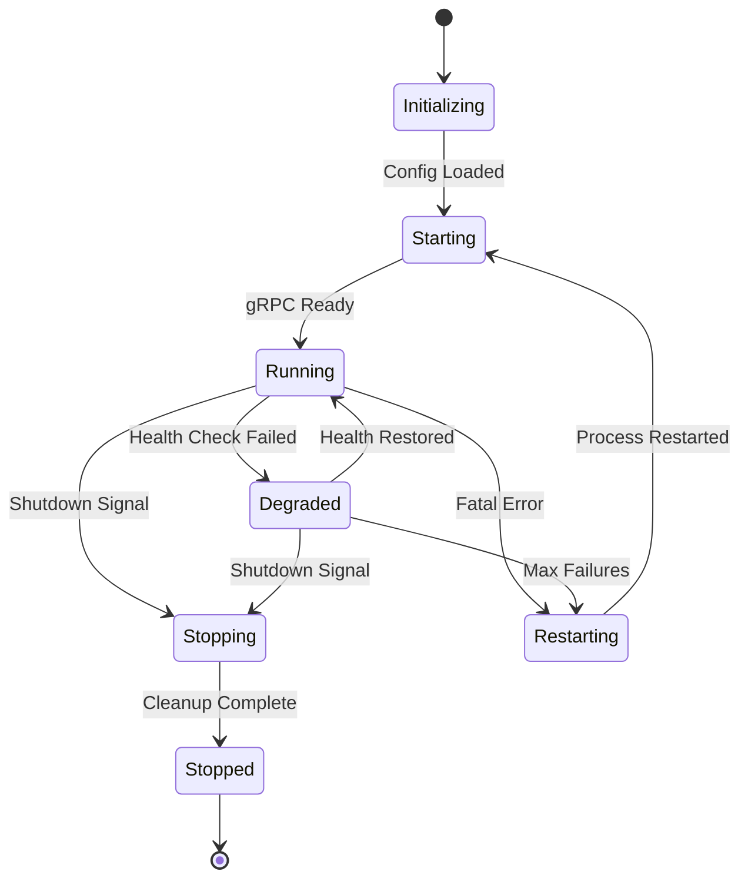
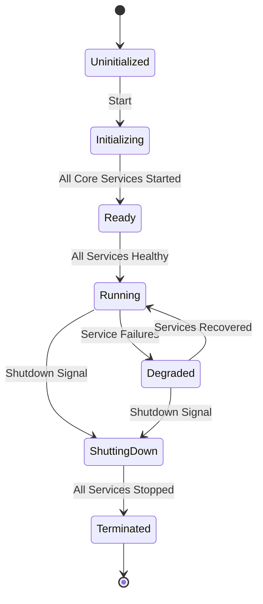

# Service Lifecycle Management

## Overview

Service lifecycle management encompasses the complete journey of Blackhole services from initialization through shutdown. This document covers both the main orchestrator lifecycle and the lifecycles of individual service subprocesses, including startup procedures, health monitoring, graceful shutdown, and restart mechanisms.

## Service States

Services progress through well-defined states during their lifecycle:



### State Definitions

1. **Initializing**: Service process launched, loading configuration
2. **Starting**: Configuration loaded, initializing components and gRPC server
3. **Running**: Service fully operational, handling requests
4. **Degraded**: Service operational but failing health checks
5. **Stopping**: Shutdown initiated, draining connections
6. **Stopped**: Service terminated cleanly
7. **Restarting**: Service being restarted due to failure

## Orchestrator Lifecycle

The main orchestrator manages all service subprocesses:

### Orchestrator States



## Service Startup Procedure

### 1. Process Launch

The orchestrator spawns a new service process:

```go
func (l *Launcher) StartService(name string, config ServiceConfig) (*ServiceProcess, error) {
    // Create command
    cmd := exec.Command(
        l.binaryPath,
        "service",
        name,
        "--config", config.ConfigPath,
        "--socket", config.SocketPath,
    )
    
    // Set environment
    cmd.Env = append(os.Environ(),
        fmt.Sprintf("BLACKHOLE_SERVICE=%s", name),
        fmt.Sprintf("BLACKHOLE_ENV=%s", l.environment),
        fmt.Sprintf("BLACKHOLE_LOG_LEVEL=%s", config.LogLevel),
    )
    
    // Apply resource limits before start
    if err := l.applyResourceLimits(cmd, config.Resources); err != nil {
        return nil, fmt.Errorf("apply limits: %w", err)
    }
    
    // Start the process
    if err := cmd.Start(); err != nil {
        return nil, fmt.Errorf("start process: %w", err)
    }
    
    proc := &ServiceProcess{
        ID:        uuid.New().String(),
        Name:      name,
        Command:   cmd,
        PID:       cmd.Process.Pid,
        StartTime: time.Now(),
        State:     StateInitializing,
    }
    
    // Monitor startup
    go l.monitorStartup(proc)
    
    return proc, nil
}
```

### 2. Configuration Loading

Each service loads its configuration:

```go
func (s *Service) loadConfiguration() error {
    // Load from file or environment
    config, err := config.Load(s.configPath)
    if err != nil {
        return fmt.Errorf("load config: %w", err)
    }
    
    // Validate configuration
    if err := config.Validate(); err != nil {
        return fmt.Errorf("validate config: %w", err)
    }
    
    // Apply to service
    s.config = config
    s.setState(StateStarting)
    
    return nil
}
```

### 3. Component Initialization

Services initialize their components:

```go
func (s *Service) initializeComponents() error {
    // Initialize database connections
    if s.config.Database != nil {
        db, err := database.Connect(s.config.Database)
        if err != nil {
            return fmt.Errorf("connect database: %w", err)
        }
        s.db = db
    }
    
    // Initialize cache
    if s.config.Cache != nil {
        cache, err := cache.New(s.config.Cache)
        if err != nil {
            return fmt.Errorf("create cache: %w", err)
        }
        s.cache = cache
    }
    
    // Initialize gRPC handlers
    s.handlers = handlers.New(s)
    
    return nil
}
```

### 4. gRPC Server Start

Start the gRPC server:

```go
func (s *Service) startGRPCServer() error {
    // Create listener
    listener, err := net.Listen("unix", s.config.SocketPath)
    if err != nil {
        return fmt.Errorf("listen socket: %w", err)
    }
    
    // Create gRPC server
    server := grpc.NewServer(
        grpc.UnaryInterceptor(s.unaryInterceptor),
        grpc.StreamInterceptor(s.streamInterceptor),
    )
    
    // Register service
    s.registerService(server)
    
    // Start serving
    go func() {
        if err := server.Serve(listener); err != nil {
            s.logger.Error("gRPC serve failed", zap.Error(err))
            s.setState(StateRestarting)
        }
    }()
    
    s.grpcServer = server
    s.setState(StateRunning)
    
    return nil
}
```

## Health Monitoring

### Health Check Implementation

```go
type HealthChecker struct {
    service    *Service
    interval   time.Duration
    timeout    time.Duration
    maxFailures int
    failures    int
}

func (h *HealthChecker) Start() {
    ticker := time.NewTicker(h.interval)
    defer ticker.Stop()
    
    for range ticker.C {
        if err := h.checkHealth(); err != nil {
            h.failures++
            if h.failures >= h.maxFailures {
                h.service.setState(StateDegraded)
            }
        } else {
            h.failures = 0
            if h.service.state == StateDegraded {
                h.service.setState(StateRunning)
            }
        }
    }
}

func (h *HealthChecker) checkHealth() error {
    ctx, cancel := context.WithTimeout(context.Background(), h.timeout)
    defer cancel()
    
    // Check gRPC health
    if !h.checkGRPCHealth(ctx) {
        return fmt.Errorf("gRPC unhealthy")
    }
    
    // Check database connection
    if h.service.db != nil {
        if err := h.service.db.Ping(ctx); err != nil {
            return fmt.Errorf("database unhealthy: %w", err)
        }
    }
    
    // Check custom health
    if err := h.service.checkCustomHealth(ctx); err != nil {
        return fmt.Errorf("custom health failed: %w", err)
    }
    
    return nil
}
```

## Graceful Shutdown

### Shutdown Signal Handling

```go
func (s *Service) handleShutdown() {
    sigChan := make(chan os.Signal, 1)
    signal.Notify(sigChan, syscall.SIGTERM, syscall.SIGINT)
    
    sig := <-sigChan
    s.logger.Info("Received shutdown signal", zap.String("signal", sig.String()))
    
    s.setState(StateStopping)
    
    ctx, cancel := context.WithTimeout(context.Background(), 30*time.Second)
    defer cancel()
    
    if err := s.gracefulShutdown(ctx); err != nil {
        s.logger.Error("Graceful shutdown failed", zap.Error(err))
        s.forceShutdown()
    }
}
```

### Graceful Shutdown Steps

```go
func (s *Service) gracefulShutdown(ctx context.Context) error {
    // Stop accepting new requests
    s.grpcServer.GracefulStop()
    
    // Wait for ongoing requests
    done := make(chan struct{})
    go func() {
        s.waitForRequests()
        close(done)
    }()
    
    select {
    case <-done:
        s.logger.Info("All requests completed")
    case <-ctx.Done():
        return fmt.Errorf("shutdown timeout")
    }
    
    // Close connections
    if s.db != nil {
        if err := s.db.Close(); err != nil {
            s.logger.Warn("Failed to close database", zap.Error(err))
        }
    }
    
    // Cleanup resources
    s.cleanup()
    
    s.setState(StateStopped)
    return nil
}
```

## Restart Mechanisms

### Automatic Restart

```go
type RestartPolicy struct {
    MaxRetries     int
    InitialDelay   time.Duration
    MaxDelay       time.Duration
    BackoffFactor  float64
    ResetInterval  time.Duration
}

func (r *RestartManager) handleRestart(proc *ServiceProcess, policy RestartPolicy) {
    retries := 0
    delay := policy.InitialDelay
    
    for retries < policy.MaxRetries {
        // Wait before restart
        time.Sleep(delay)
        
        // Attempt restart
        newProc, err := r.launcher.StartService(proc.Name, proc.Config)
        if err != nil {
            r.logger.Error("Restart failed", 
                zap.String("service", proc.Name),
                zap.Int("attempt", retries+1),
                zap.Error(err))
            
            retries++
            delay = r.calculateBackoff(delay, policy)
            continue
        }
        
        // Monitor new process
        if err := r.waitForHealthy(newProc, 30*time.Second); err != nil {
            r.logger.Error("Service unhealthy after restart",
                zap.String("service", proc.Name),
                zap.Error(err))
            
            retries++
            continue
        }
        
        // Restart successful
        r.logger.Info("Service restarted successfully",
            zap.String("service", proc.Name),
            zap.Int("attempts", retries+1))
        return
    }
    
    // Max retries exceeded
    r.logger.Error("Service restart failed after max retries",
        zap.String("service", proc.Name),
        zap.Int("max_retries", policy.MaxRetries))
    
    r.alertManager.SendAlert(CriticalAlert{
        Service: proc.Name,
        Message: "Service failed to restart",
    })
}
```

## State Transitions

### Valid State Transitions

```go
var validTransitions = map[State][]State{
    StateInitializing: {StateStarting, StateRestarting},
    StateStarting:     {StateRunning, StateRestarting, StateStopping},
    StateRunning:      {StateDegraded, StateStopping, StateRestarting},
    StateDegraded:     {StateRunning, StateStopping, StateRestarting},
    StateStopping:     {StateStopped},
    StateStopped:      {},
    StateRestarting:   {StateStarting},
}

func (s *Service) setState(newState State) error {
    s.mu.Lock()
    defer s.mu.Unlock()
    
    oldState := s.state
    
    // Check if transition is valid
    validStates := validTransitions[oldState]
    isValid := false
    for _, state := range validStates {
        if state == newState {
            isValid = true
            break
        }
    }
    
    if !isValid {
        return fmt.Errorf("invalid state transition: %s -> %s", oldState, newState)
    }
    
    // Update state
    s.state = newState
    s.stateChangeTime = time.Now()
    
    // Emit state change event
    s.eventEmitter.Emit(StateChangeEvent{
        Service:  s.name,
        OldState: oldState,
        NewState: newState,
        Time:     s.stateChangeTime,
    })
    
    s.logger.Info("State changed",
        zap.String("old_state", string(oldState)),
        zap.String("new_state", string(newState)))
    
    return nil
}
```

## Lifecycle Hooks

### Service Lifecycle Hooks

```go
type LifecycleHooks struct {
    PreStart    func() error
    PostStart   func() error
    PreStop     func() error
    PostStop    func() error
    PreRestart  func() error
    PostRestart func() error
}

func (s *Service) executeHook(hook func() error, name string) {
    if hook == nil {
        return
    }
    
    s.logger.Debug("Executing lifecycle hook", zap.String("hook", name))
    
    if err := hook(); err != nil {
        s.logger.Error("Lifecycle hook failed",
            zap.String("hook", name),
            zap.Error(err))
    }
}
```

## Monitoring and Metrics

### Lifecycle Metrics

```go
var (
    serviceStateGauge = prometheus.NewGaugeVec(
        prometheus.GaugeOpts{
            Name: "blackhole_service_state",
            Help: "Current state of the service",
        },
        []string{"service"},
    )
    
    serviceUptimeGauge = prometheus.NewGaugeVec(
        prometheus.GaugeOpts{
            Name: "blackhole_service_uptime_seconds",
            Help: "Service uptime in seconds",
        },
        []string{"service"},
    )
    
    serviceRestartsCounter = prometheus.NewCounterVec(
        prometheus.CounterOpts{
            Name: "blackhole_service_restarts_total",
            Help: "Total number of service restarts",
        },
        []string{"service"},
    )
)

func (s *Service) updateMetrics() {
    // Update state metric
    serviceStateGauge.WithLabelValues(s.name).Set(float64(s.state))
    
    // Update uptime
    if s.state == StateRunning {
        uptime := time.Since(s.startTime).Seconds()
        serviceUptimeGauge.WithLabelValues(s.name).Set(uptime)
    }
}
```

## Configuration

### Lifecycle Configuration

```yaml
lifecycle:
  startup:
    timeout: 60s
    max_retries: 3
    health_check_interval: 5s
    
  shutdown:
    timeout: 30s
    drain_timeout: 20s
    force_kill_timeout: 5s
    
  health_check:
    interval: 10s
    timeout: 5s
    max_failures: 3
    
  restart_policy:
    max_retries: 5
    initial_delay: 1s
    max_delay: 60s
    backoff_factor: 2.0
    reset_interval: 5m
    
  hooks:
    enabled: true
    timeout: 10s
```

## Best Practices

1. **Always handle shutdown signals gracefully**
2. **Implement comprehensive health checks**
3. **Use appropriate timeouts for all operations**
4. **Monitor state transitions and emit events**
5. **Log all lifecycle events for debugging**
6. **Implement proper cleanup in shutdown handlers**
7. **Use exponential backoff for restart attempts**
8. **Set resource limits before starting processes**
9. **Test restart behavior under various failure scenarios**
10. **Document service-specific lifecycle requirements**

## Service-Specific Considerations

Different services may have unique lifecycle requirements:

### Storage Service
- Requires data consistency checks on startup
- Needs extended shutdown timeout for flushing caches
- Must wait for pending writes before shutdown

### Identity Service
- Loads cryptographic keys during initialization
- Requires secure key storage cleanup on shutdown
- May need to revoke active sessions during shutdown

### Ledger Service
- Syncs with blockchain on startup
- Requires graceful disconnect from network peers
- Must complete pending transactions before shutdown

## Conclusion

Proper lifecycle management is critical for subprocess architecture reliability. By following these patterns and implementing comprehensive lifecycle handling, services can achieve high availability and graceful failure recovery.