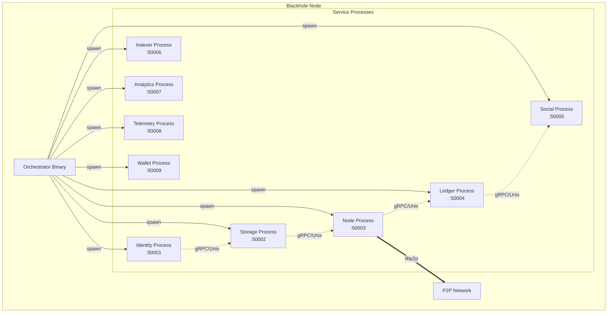

# Subprocess Architecture

## Overview

The Blackhole platform implements a subprocess architecture where services run as independent OS processes, managed by a single binary orchestrator. This design provides true process isolation while maintaining deployment simplicity.

## Architecture Principles

1. **Single Binary Distribution**: One executable that manages all services
2. **Process Isolation**: Each service runs in its own OS process
3. **RPC Communication**: All inter-process communication via gRPC via gRPC
4. **Resource Management**: OS-level CPU, memory, and I/O limits
5. **Fault Tolerance**: Process crashes don't affect other services
6. **Simple Operations**: Easy deployment and management

## Architecture Overview



## Core Components

### Orchestrator Process

The main binary that:
- Spawns service subprocesses
- Manages process lifecycle
- Monitors health and resources
- Handles configuration distribution
- Provides service discovery

### Service Processes

Independent OS processes that:
- Run isolated from each other
- Communicate via gRPC
- Have dedicated resources
- Can crash without affecting others
- Are automatically restarted on failure

## Process Lifecycle

### Startup Sequence

1. Orchestrator reads configuration
2. Spawns services in dependency order:
   ```
   Identity → Storage → Node → Ledger → Social → Others
   ```
3. Waits for health checks
4. Begins normal operations

### Service Spawning

```go
func (o *Orchestrator) SpawnService(name string, config ServiceConfig) error {
    cmd := exec.Command(o.binaryPath, "service", name,
        "--config", config.Path,
        "--socket", config.UnixSocket,
        "--port", config.Port,
    )
    
    // Apply resource limits
    cmd.Env = append(os.Environ(),
        fmt.Sprintf("GOMEMLIMIT=%d", config.MemoryLimit),
    )
    
    // Set process attributes
    cmd.SysProcAttr = &syscall.SysProcAttr{
        Setpgid: true,  // New process group
    }
    
    // Start process
    if err := cmd.Start(); err != nil {
        return fmt.Errorf("failed to start %s: %w", name, err)
    }
    
    // Track process
    o.processes[name] = &ServiceProcess{
        Name:    name,
        Command: cmd,
        PID:     cmd.Process.Pid,
        Started: time.Now(),
    }
    
    // Monitor process
    go o.supervise(name)
    
    return nil
}
```

## Inter-Process Communication

### gRPC Architecture

All services communicate via gRPC:
- **Local**: Unix domain sockets for same-host communication
- **Remote**: TCP with TLS for distributed deployments
- **Discovery**: Automatic service endpoint discovery
- **Health**: Built-in health checking

### Communication Pattern

```go
// Service client example
func (s *StorageService) AuthenticateRequest(ctx context.Context, token string) error {
    // Get identity service client
    client, err := s.getClient("identity")
    if err != nil {
        return fmt.Errorf("get identity client: %w", err)
    }
    
    // Make gRPC call
    resp, err := client.ValidateToken(ctx, &pb.ValidateTokenRequest{
        Token: token,
    })
    if err != nil {
        return fmt.Errorf("validate token: %w", err)
    }
    
    // Use response
    s.user = resp.User
    return nil
}
```

## Resource Management

### Process Isolation

Each service has dedicated resources:

```yaml
identity:
  resources:
    cpu: 200%      # 2 CPU cores
    memory: 1GB    # Memory limit
    io_weight: 500 # Medium I/O priority
    
storage:
  resources:
    cpu: 100%      # 1 CPU core
    memory: 2GB    # Higher memory for caching
    io_weight: 900 # High I/O priority
```

### Resource Enforcement

OS-level enforcement using:
- **CPU**: Cgroups CPU quota
- **Memory**: Cgroups memory limit
- **I/O**: Cgroups I/O weight
- **Files**: rlimits for file descriptors

```go
func applyResourceLimits(cmd *exec.Cmd, limits ResourceLimits) error {
    // CPU limits via cgroups v2
    if limits.CPUPercent > 0 {
        cgroupPath := fmt.Sprintf("/sys/fs/cgroup/blackhole/%s", cmd.Args[2])
        if err := os.MkdirAll(cgroupPath, 0755); err != nil {
            return err
        }
        
        // Write CPU max
        cpuMax := fmt.Sprintf("%d 100000", int(limits.CPUPercent*1000))
        if err := os.WriteFile(
            filepath.Join(cgroupPath, "cpu.max"),
            []byte(cpuMax),
            0644,
        ); err != nil {
            return err
        }
    }
    
    // Memory limits
    if limits.MemoryMB > 0 {
        memMax := fmt.Sprintf("%d", limits.MemoryMB*1024*1024)
        if err := os.WriteFile(
            filepath.Join(cgroupPath, "memory.max"),
            []byte(memMax),
            0644,
        ); err != nil {
            return err
        }
    }
    
    // File descriptor limits
    cmd.SysProcAttr.Rlimits = []syscall.Rlimit{
        {
            Type: syscall.RLIMIT_NOFILE,
            Cur:  uint64(limits.MaxFiles),
            Max:  uint64(limits.MaxFiles),
        },
    }
    
    return nil
}
```

### Service-Specific Configurations

Each service type has specific resource and behavior configurations:

```go
// internal/core/process/services.go

var ServiceConfigs = map[ServiceType]ServiceConfig{
    ServiceTypeIdentity: {
        Resources: ResourceConfig{
            CPUPercent:  200,    // 2 CPU cores
            MemoryMB:    1024,   // 1GB
            IOWeight:    500,    // Medium IO priority
            OpenFiles:   10000,  // High FD limit for connections
        },
        HealthCheck: HealthCheckConfig{
            Endpoint:    "/health",
            Timeout:     5 * time.Second,
            MaxFailures: 3,
        },
        Restart: RestartConfig{
            MaxRestarts: 5,
            Delay:       5 * time.Second,
            Backoff:     2.0,
        },
    },
    ServiceTypeStorage: {
        Resources: ResourceConfig{
            CPUPercent:  100,    // 1 CPU core
            MemoryMB:    2048,   // 2GB
            IOWeight:    900,    // High IO priority
            OpenFiles:   50000,  // Very high FD limit
        },
        HealthCheck: HealthCheckConfig{
            Endpoint:    "/health",
            Timeout:     10 * time.Second,
            MaxFailures: 5,
        },
        Restart: RestartConfig{
            MaxRestarts: 3,
            Delay:       10 * time.Second,
            Backoff:     1.5,
        },
    },
    ServiceTypeNode: {
        Resources: ResourceConfig{
            CPUPercent:  300,    // 3 CPU cores
            MemoryMB:    2048,   // 2GB
            IOWeight:    800,    // High IO priority
            NetworkMbps: 1000,   // High network bandwidth
        },
        HealthCheck: HealthCheckConfig{
            Endpoint:    "/health",
            Timeout:     5 * time.Second,
            MaxFailures: 3,
        },
        Restart: RestartConfig{
            MaxRestarts: 5,
            Delay:       5 * time.Second,
            Backoff:     2.0,
        },
    },
    ServiceTypeLedger: {
        Resources: ResourceConfig{
            CPUPercent:  150,    // 1.5 CPU cores
            MemoryMB:    1024,   // 1GB
            IOWeight:    700,    // High IO priority
            NetworkMbps: 100,    // High network usage
        },
        HealthCheck: HealthCheckConfig{
            Endpoint:    "/health",
            Timeout:     5 * time.Second,
            MaxFailures: 3,
        },
        Restart: RestartConfig{
            MaxRestarts: 5,
            Delay:       5 * time.Second,
            Backoff:     2.0,
        },
    },
    ServiceTypeWallet: {
        Resources: ResourceConfig{
            CPUPercent:  100,    // 1 CPU core
            MemoryMB:    512,    // 512MB
            IOWeight:    600,    // Medium-high IO priority
            OpenFiles:   5000,   // Medium FD limit
        },
        HealthCheck: HealthCheckConfig{
            Endpoint:    "/health",
            Timeout:     5 * time.Second,
            MaxFailures: 3,
        },
        Restart: RestartConfig{
            MaxRestarts: 5,
            Delay:       5 * time.Second,
            Backoff:     2.0,
        },
    },
    // Additional service configurations...
}
```

## Fault Tolerance

### Process Supervision

Automatic process monitoring and restart:

```go
type SupervisorPolicy struct {
    MaxRestarts   int           // Maximum restart attempts
    RestartDelay  time.Duration // Initial restart delay
    BackoffFactor float64       // Exponential backoff
    HealthCheck   time.Duration // Health check interval
}

func (o *Orchestrator) supervise(name string) {
    proc := o.processes[name]
    policy := o.policies[name]
    
    // Wait for process exit
    err := proc.Command.Wait()
    
    // Handle restart
    if proc.RestartCount < policy.MaxRestarts {
        delay := calculateBackoff(proc.RestartCount, policy)
        time.Sleep(delay)
        
        log.Printf("Restarting %s (attempt %d/%d)", 
            name, proc.RestartCount+1, policy.MaxRestarts)
            
        if err := o.SpawnService(name, proc.Config); err != nil {
            log.Printf("Failed to restart %s: %v", name, err)
        }
    } else {
        log.Printf("Service %s exceeded max restarts", name)
    }
}
```

### Health Monitoring

Each service implements health checks:

```proto
service Health {
    rpc Check(HealthCheckRequest) returns (HealthCheckResponse);
    rpc Watch(HealthCheckRequest) returns (stream HealthCheckResponse);
}

message HealthCheckResponse {
    enum ServingStatus {
        UNKNOWN = 0;
        SERVING = 1;
        NOT_SERVING = 2;
    }
    ServingStatus status = 1;
    string message = 2;
}
```

## Benefits

1. **True Isolation**: Process crashes don't cascade
2. **Resource Control**: OS-level resource management
3. **Simple Deployment**: Single binary to distribute
4. **Easy Debugging**: Process-level profiling
5. **Gradual Restart**: Update services independently
6. **Security**: Process-level security boundaries

## Trade-offs

1. **Memory Overhead**: Each process has its own memory space
2. **Communication Latency**: IPC is slower than function calls
3. **Complexity**: Process management adds complexity
4. **Resource Limits**: Fixed resource allocation per service

## Configuration

### Service Configuration

```yaml
orchestrator:
  binary_path: /usr/local/bin/blackhole
  runtime_dir: /var/run/blackhole
  log_dir: /var/log/blackhole
  
services:
  identity:
    enabled: true
    port: 50001
    unix_socket: /var/run/blackhole/identity.sock
    resources:
      cpu: 200%
      memory: 1GB
    restart_policy:
      max_restarts: 5
      delay: 1s
      backoff: 2.0
```

### Environment Variables

Each service process receives:
```bash
BLACKHOLE_SERVICE=identity
BLACKHOLE_CONFIG=/etc/blackhole/config.yaml
BLACKHOLE_DATA_DIR=/var/lib/blackhole/identity
BLACKHOLE_LOG_LEVEL=info
GOMEMLIMIT=1073741824  # 1GB
```

## Deployment Options

### Single Host

All services on one machine:
```bash
blackhole start --all
```

### Multi-Host

Services distributed across hosts:
```bash
# Host 1: Core services
blackhole start --services=identity,ledger

# Host 2: Storage services  
blackhole start --services=storage,indexer

# Host 3: Application services
blackhole start --services=social,analytics
```

### Kubernetes

Container orchestration:
```yaml
apiVersion: apps/v1
kind: Deployment
metadata:
  name: blackhole
spec:
  replicas: 3
  template:
    spec:
      containers:
      - name: blackhole
        image: blackhole:latest
        command: ["blackhole", "start", "--all"]
```

## Monitoring

### Process Metrics

- CPU usage per process
- Memory consumption
- File descriptor usage
- Thread/goroutine count
- Network connections

### Service Metrics

- Request rate and latency
- Error rates
- Resource utilization
- Business metrics

### Health Checks

- Process liveness
- Service readiness
- Dependency health
- Resource availability

## Best Practices

1. **Graceful Shutdown**: Handle signals properly
2. **Health Checks**: Implement comprehensive checks
3. **Resource Limits**: Set appropriate limits
4. **Logging**: Use structured logging
5. **Metrics**: Export process and service metrics
6. **Error Handling**: Fail fast and restart
7. **Configuration**: Use environment variables
8. **Security**: Apply least privilege

## Service Implementation Pattern

Each service follows this pattern:

```go
// cmd/blackhole/service/identity/main.go
func main() {
    // Parse flags
    var (
        configPath = flag.String("config", "", "Service config path")
        socketPath = flag.String("socket", "", "Unix socket path")
        port       = flag.Int("port", 0, "TCP port")
    )
    flag.Parse()
    
    // Load configuration
    cfg, err := LoadConfig(*configPath)
    if err != nil {
        log.Fatalf("load config: %v", err)
    }
    
    // Create service
    service, err := identity.New(cfg)
    if err != nil {
        log.Fatalf("create service: %v", err)
    }
    
    // Create gRPC server
    server := grpc.NewServer(
        grpc.MaxRecvMsgSize(50 * 1024 * 1024),
        grpc.MaxSendMsgSize(50 * 1024 * 1024),
    )
    
    // Register service
    pb.RegisterIdentityServer(server, service)
    grpc_health_v1.RegisterHealthServer(server, service)
    
    // Listen on Unix socket
    listener, err := net.Listen("unix", *socketPath)
    if err != nil {
        log.Fatalf("listen: %v", err)
    }
    
    // Handle shutdown
    sigChan := make(chan os.Signal, 1)
    signal.Notify(sigChan, os.Interrupt, syscall.SIGTERM)
    
    go func() {
        if err := server.Serve(listener); err != nil {
            log.Fatalf("serve: %v", err)
        }
    }()
    
    // Wait for shutdown
    <-sigChan
    log.Println("Shutting down...")
    
    server.GracefulStop()
    service.Shutdown()
}
```

## Future Enhancements

1. **Dynamic Scaling**: Spawn multiple instances per service
2. **Hot Reload**: Update services without restart
3. **Plugin System**: Dynamic service loading
4. **Distributed Tracing**: Cross-process transaction tracking
5. **Service Mesh**: Optional mesh layer for complex deployments

## Conclusion

The subprocess architecture provides the ideal balance between operational simplicity and service isolation. It enables robust, scalable deployments while maintaining the ease of single-binary distribution.