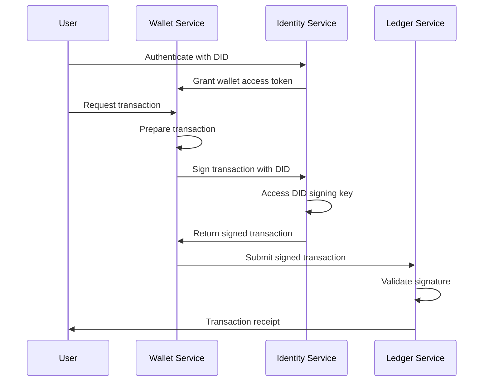
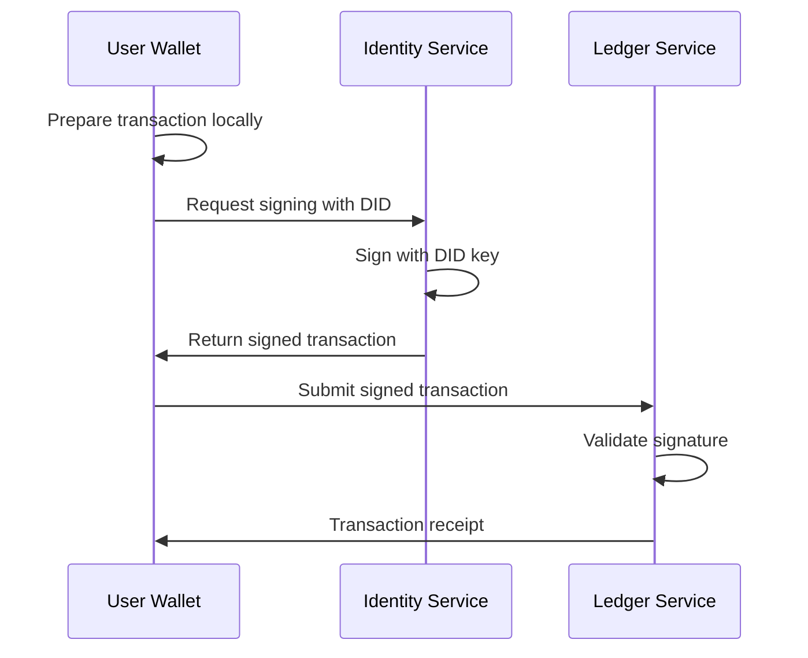
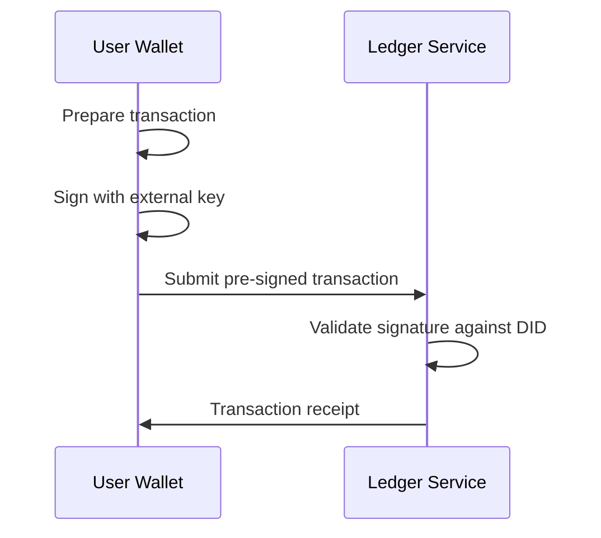

# Signing Architecture

This document describes the signing architecture for the Blackhole platform, clarifying how DIDs, wallets, and the ledger interact for transaction signing.

## Overview

The Blackhole platform uses a DID-centric signing architecture where:
- **DIDs are the primary identity** that control access to wallets
- **Identity Service handles all signing** operations
- **Wallets prepare transactions** but don't sign them
- **Ledger accepts only pre-signed transactions**

## Key Principles

1. **Single Source of Signing**: All cryptographic signing operations go through the Identity Service
2. **DID-Controlled Access**: Wallets are accessed and controlled through DID authentication
3. **Pre-Signed Transactions**: The Ledger Service never performs signing, only accepts pre-signed transactions
4. **Flexible Wallet Types**: Both embedded and self-managed wallets use the same signing flow

## Service Responsibilities

### Identity Service
- Manages DIDs and their verification methods
- Performs all transaction and message signing
- Provides wallet access tokens after DID authentication
- Validates signatures for other services

### Wallet Service
- Stores encrypted wallet data (for embedded wallets)
- Prepares transactions for signing
- Maintains transaction history
- Requires DID authentication for all operations
- Delegates all signing to Identity Service

### Ledger Service  
- Accepts pre-signed transactions only
- Validates signatures against DID documents
- Submits transactions to blockchain
- Never performs signing operations

## Signing Flows

### Embedded Wallet Transaction Flow



### Self-Managed Wallet Options

Self-managed wallets have two options for signing:

#### Option 1: DID-Based Signing (Integrated)


#### Option 2: External Signing


## DID Document Structure

DIDs contain verification methods used for signing:

```json
{
  "@context": "https://www.w3.org/ns/did/v1",
  "id": "did:blackhole:user123",
  "verificationMethod": [
    {
      "id": "did:blackhole:user123#signing-key-1",
      "type": "Ed25519VerificationKey2020",
      "controller": "did:blackhole:user123",
      "purpose": ["authentication", "assertionMethod"]
    }
  ]
}
```

## Access Control Model

1. **DID Authentication**: Users authenticate with their DID
2. **Access Token Generation**: Identity Service generates wallet access tokens
3. **Token Validation**: Wallet Service validates tokens for operations
4. **Signing Requests**: Wallet Service requests signatures from Identity Service

## Security Considerations

1. **Key Isolation**: Signing keys are managed only by Identity Service
2. **Access Control**: Wallet access requires valid DID authentication
3. **Signature Validation**: All services validate signatures against DID documents
4. **Token Expiry**: Access tokens have limited lifetime
5. **Audit Trail**: All signing operations are logged

## Implementation Notes

### For Developers

1. Never implement signing in individual services
2. Always use Identity Service for signing operations
3. Validate access tokens before wallet operations
4. Handle signature validation errors appropriately

### For Node Operators

1. Identity Service requires secure key storage
2. Configure appropriate access token lifetimes
3. Monitor signing operation logs
4. Implement rate limiting for signing requests

## Benefits of This Architecture

1. **Consistent Security**: Single point of signing control
2. **Flexibility**: Supports multiple wallet types
3. **Auditability**: All signing goes through one service
4. **Simplicity**: Clear separation of concerns
5. **Standards Compliance**: Follows W3C DID specifications