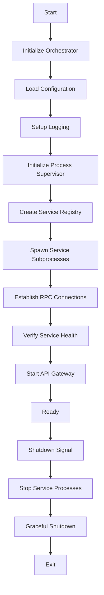

# Blackhole Bootstrap Sequence

This document details the startup sequence for the Blackhole orchestrator and service subprocesses.

## Overview

The bootstrap process involves the orchestrator starting up and spawning service subprocesses. The orchestrator initializes its runtime, loads configuration, creates process supervision infrastructure, and starts services as separate OS processes.

## Bootstrap Phases



## Detailed Bootstrap Sequence

### Phase 1: Orchestrator Initialization

```go
func main() {
    // Determine if running as orchestrator or service subprocess
    if len(os.Args) > 1 && os.Args[1] == "service" {
        // Run as service subprocess
        serviceName := os.Args[2]
        runServiceProcess(serviceName)
        return
    }
    
    // Run as orchestrator
    runOrchestrator()
}

func runOrchestrator() {
    // 1. Parse command-line flags
    flags := parseFlags()
    
    // 2. Initialize orchestrator runtime
    orchestrator := core.NewOrchestrator(core.OrchestratorConfig{
        MaxProcs:    flags.MaxProcs,
        MemoryLimit: flags.MemoryLimit,
        LogLevel:    flags.LogLevel,
    })
    
    // 3. Set up panic recovery
    defer orchestrator.Recover()
    
    // 4. Initialize signal handling
    signals := orchestrator.SignalHandler()
}
```

### Phase 2: Configuration Loading

```go
// Load configuration in order of precedence
func loadConfiguration(flags *Flags) (*Config, error) {
    config := NewDefaultConfig()
    
    // 1. Load embedded defaults
    if err := config.LoadDefaults(); err != nil {
        return nil, err
    }
    
    // 2. Load from config file
    if flags.ConfigFile != "" {
        if err := config.LoadFile(flags.ConfigFile); err != nil {
            return nil, err
        }
    }
    
    // 3. Load from environment variables
    if err := config.LoadEnv(); err != nil {
        return nil, err
    }
    
    // 4. Apply command-line overrides
    if err := config.ApplyFlags(flags); err != nil {
        return nil, err
    }
    
    // 5. Validate configuration
    if err := config.Validate(); err != nil {
        return nil, err
    }
    
    return config, nil
}
```

### Phase 3: Logging Setup

```go
func setupLogging(config *Config) (*Logger, error) {
    logger := NewLogger(LoggerConfig{
        Level:       config.Log.Level,
        Format:      config.Log.Format,
        Output:      config.Log.Output,
        Structured:  true,
        ServiceName: "blackhole",
    })
    
    // Add context enrichment
    logger.WithContext(map[string]interface{}{
        "version":    Version,
        "build_time": BuildTime,
        "node_id":    config.Node.ID,
    })
    
    return logger, nil
}
```

### Phase 4: Process Supervisor Initialization

```go
func initializeProcessSupervisor(config *Config, logger *Logger) (*ProcessSupervisor, error) {
    supervisor := NewProcessSupervisor(ProcessSupervisorConfig{
        Logger:      logger,
        MaxRestarts: config.Process.MaxRestarts,
        RestartDelay: config.Process.RestartDelay,
    })
    
    // 1. Initialize process monitor
    supervisor.Monitor = NewProcessMonitor()
    
    // 2. Set up RPC infrastructure
    supervisor.RPCManager = NewRPCManager(RPCConfig{
        UnixSocketDir: config.RPC.SocketDir,
        TCPPort:       config.RPC.BasePort,
        TLSConfig:     config.RPC.TLS,
    })
    
    // 3. Configure resource isolation
    supervisor.ResourceManager = NewResourceManager(ResourceConfig{
        CgroupPath:    config.Resources.CgroupPath,
        EnableLimits:  config.Resources.EnableLimits,
    })
    
    return supervisor, nil
}
```

### Phase 5: Service Process Registry

```go
func createServiceRegistry(supervisor *ProcessSupervisor) *ServiceRegistry {
    registry := NewServiceRegistry()
    
    // Set up process registration
    registry.OnRegister(func(service *ServiceProcess) {
        mesh.Router.RegisterService(service.ID(), service)
    })
    
    registry.OnUnregister(func(service Service) {
        mesh.Router.UnregisterService(service.ID())
    })
    
    return registry
}
```

### Phase 6: Core Services Initialization

```go
func initializeCoreServices(config *Config, mesh *ServiceMesh, logger *Logger) error {
    // Order matters - dependencies first
    
    // 1. Identity Service (foundational - handles all signing)
    identityService := identity.NewService(identity.Config{
        DIDMethod:    config.Identity.DIDMethod,
        RegistryAddr: config.Identity.RegistryAddr,
    })
    
    // 2. Storage Service
    storageService := storage.NewService(storage.Config{
        IPFSEndpoint:     config.Storage.IPFS.Endpoint,
        FilecoinEndpoint: config.Storage.Filecoin.Endpoint,
        Providers:        config.Storage.Providers,
    })
    
    // 3. Node Service (P2P networking)
    nodeService := node.NewService(node.Config{
        NodeID:         config.Node.ID,
        ListenAddrs:    config.Node.ListenAddrs,
        BootstrapPeers: config.Node.BootstrapPeers,
        Identity:       identityService,
    })
    
    // 4. Ledger Service (accepts pre-signed transactions)
    ledgerService := ledger.NewService(ledger.Config{
        ChainID:     config.Ledger.ChainID,
        RPCEndpoint: config.Ledger.RPCEndpoint,
        Identity:    identityService, // For signature validation only
    })
    
    // 5. Indexer Service
    indexerService := indexer.NewService(indexer.Config{
        Storage:  storageService,
        Ledger:   ledgerService,
        Node:     nodeService,
    })
    
    // 6. Social Service
    socialService := social.NewService(social.Config{
        Federation: config.Social.Federation,
        Storage:    storageService,
        Node:       nodeService,
        Identity:   identityService,
    })
    
    // 7. Analytics Service
    analyticsService := analytics.NewService(analytics.Config{
        Storage:    storageService,
        Indexer:    indexerService,
        Collectors: config.Analytics.Collectors,
    })
    
    // 8. Telemetry Service
    telemetryService := telemetry.NewService(telemetry.Config{
        MetricsEndpoint: config.Telemetry.MetricsEndpoint,
        TracingEndpoint: config.Telemetry.TracingEndpoint,
        LogsEndpoint:    config.Telemetry.LogsEndpoint,
    })
    
    // 9. Wallet Service (controlled by DIDs, delegates signing to Identity)
    walletService := wallet.NewService(wallet.Config{
        DefaultType:     config.Wallet.DefaultType,
        Storage:         storageService,
        Identity:        identityService, // For DID authentication and signing
        Node:            nodeService,
        SyncInterval:    config.Wallet.SyncInterval,
    })
    
    // Register services with service manager
    services := []Service{
        identityService,
        storageService,
        nodeService,
        ledgerService,
        indexerService,
        socialService,
        analyticsService,
        telemetryService,
        walletService,
    }
    
    for _, service := range services {
        if err := mesh.RegisterService(service); err != nil {
            return fmt.Errorf("failed to register %s: %w", service.ID(), err)
        }
    }
    
    return nil
}
```

### Phase 7: Plugin Loading

```go
func loadPlugins(config *Config, registry *PluginRegistry) error {
    pluginManager := NewPluginManager(registry)
    
    // 1. Load compiled-in plugins
    if err := pluginManager.LoadBuiltinPlugins(); err != nil {
        return err
    }
    
    // 2. Load dynamic plugins (development mode)
    if config.Plugins.EnableDynamic {
        if err := pluginManager.LoadDynamicPlugins(config.Plugins.Dir); err != nil {
            return err
        }
    }
    
    // 3. Initialize all plugins
    ctx := context.Background()
    if err := pluginManager.InitializeAll(ctx); err != nil {
        return err
    }
    
    return nil
}
```

### Phase 8: Service Startup

```go
func startServices(manager *ServiceManager) error {
    // Start services in dependency order
    startOrder := []string{
        "identity",
        "storage", 
        "node",
        "ledger",
        "wallet",
        "indexer",
        "social",
        "analytics",
        "telemetry",
    }
    
    for _, serviceID := range startOrder {
        service := manager.GetService(serviceID)
        if service == nil {
            continue // Optional service
        }
        
        logger.Info("Starting service", "service", serviceID)
        
        ctx, cancel := context.WithTimeout(context.Background(), 30*time.Second)
        defer cancel()
        
        if err := service.Start(ctx); err != nil {
            return fmt.Errorf("failed to start %s: %w", serviceID, err)
        }
        
        // Wait for service to be ready
        if err := service.WaitReady(ctx); err != nil {
            return fmt.Errorf("%s failed health check: %w", serviceID, err)
        }
        
        logger.Info("Service started", "service", serviceID)
    }
    
    return nil
}
```

### Phase 9: API Server Startup

```go
func startAPIServers(config *Config, mesh *ServiceMesh) error {
    g := errgroup.Group{}
    
    // Start REST API
    if config.API.REST.Enabled {
        g.Go(func() error {
            server := rest.NewServer(rest.Config{
                Addr:    config.API.REST.Addr,
                Mesh:    mesh,
                Logger:  logger,
            })
            return server.Start()
        })
    }
    
    // Start gRPC API  
    if config.API.GRPC.Enabled {
        g.Go(func() error {
            server := grpc.NewServer(grpc.Config{
                Addr:    config.API.GRPC.Addr,
                Mesh:    mesh,
                Logger:  logger,
            })
            return server.Start()
        })
    }
    
    // Start WebSocket API
    if config.API.WebSocket.Enabled {
        g.Go(func() error {
            server := websocket.NewServer(websocket.Config{
                Addr:    config.API.WebSocket.Addr,
                Mesh:    mesh,
                Logger:  logger,
            })
            return server.Start()
        })
    }
    
    return g.Wait()
}
```

### Phase 10: Ready State

```go
func enterReadyState(app *Application) {
    // 1. Update health status
    app.Health.SetReady(true)
    
    // 2. Report startup metrics
    metrics.RecordStartupTime(time.Since(app.StartTime))
    
    // 3. Log startup complete
    logger.Info("Blackhole node ready",
        "version", Version,
        "services", app.ServiceManager.ListServices(),
        "startup_time", time.Since(app.StartTime),
    )
    
    // 4. Wait for shutdown signal
    <-app.Signals
}
```

## Shutdown Sequence

```go
func gracefulShutdown(app *Application) {
    logger.Info("Initiating graceful shutdown")
    
    ctx, cancel := context.WithTimeout(context.Background(), 30*time.Second)
    defer cancel()
    
    // 1. Stop accepting new requests
    app.Health.SetReady(false)
    
    // 2. Stop API servers
    if err := app.APIManager.StopAll(ctx); err != nil {
        logger.Error("API shutdown error", "error", err)
    }
    
    // 3. Stop services in reverse order
    services := app.ServiceManager.ListServices()
    for i := len(services) - 1; i >= 0; i-- {
        service := services[i]
        logger.Info("Stopping service", "service", service.ID())
        
        if err := service.Stop(ctx); err != nil {
            logger.Error("Service shutdown error", 
                "service", service.ID(), 
                "error", err)
        }
    }
    
    // 4. Stop plugins
    if err := app.PluginManager.StopAll(ctx); err != nil {
        logger.Error("Plugin shutdown error", "error", err)
    }
    
    // 5. Close service mesh
    if err := app.ServiceMesh.Close(); err != nil {
        logger.Error("Service mesh shutdown error", "error", err)
    }
    
    // 6. Flush logs and metrics
    logger.Sync()
    metrics.Flush()
    
    logger.Info("Shutdown complete")
}
```

## Error Handling

```go
type BootstrapError struct {
    Phase   string
    Service string
    Err     error
}

func handleBootstrapError(err error) {
    var bootstrapErr *BootstrapError
    if errors.As(err, &bootstrapErr) {
        logger.Error("Bootstrap failed",
            "phase", bootstrapErr.Phase,
            "service", bootstrapErr.Service,
            "error", bootstrapErr.Err,
        )
        
        // Attempt recovery if possible
        if recoverable(bootstrapErr) {
            attemptRecovery(bootstrapErr)
        } else {
            panic(bootstrapErr)
        }
    }
}
```

## Configuration Validation

```go
func validateConfiguration(config *Config) error {
    validators := []func(*Config) error{
        validateIdentityConfig,
        validateStorageConfig,
        validateP2PConfig,
        validateLedgerConfig,
        validateAPIConfig,
    }
    
    for _, validate := range validators {
        if err := validate(config); err != nil {
            return err
        }
    }
    
    return nil
}
```

## Health Checks During Bootstrap

```go
func performHealthChecks(services []Service) error {
    for _, service := range services {
        health := service.Health()
        if health.Status != "healthy" {
            return fmt.Errorf("service %s unhealthy: %s", 
                service.ID(), health.Message)
        }
    }
    
    return nil
}
```

## Bootstrap Customization

The bootstrap sequence can be customized via:

1. **Configuration**
   ```yaml
   bootstrap:
     timeout: 60s
     parallel: false
     skip_services:
       - analytics
       - telemetry
   ```

2. **Command Flags**
   ```bash
   blackhole start --skip-service=analytics --bootstrap-timeout=120s
   ```

3. **Environment Variables**
   ```bash
   BLACKHOLE_BOOTSTRAP_TIMEOUT=120s
   BLACKHOLE_SKIP_SERVICES=analytics,telemetry
   ```

## Development Mode Bootstrap

In development mode, the bootstrap process includes:

- Hot reload support
- Mock service initialization
- Debug endpoints
- Profiling setup
- Test data loading

```go
if config.Dev.Enabled {
    // Enable hot reload
    app.EnableHotReload()
    
    // Start debug server
    go startDebugServer(config.Dev.DebugAddr)
    
    // Load test data
    if config.Dev.LoadTestData {
        loadTestData(app)
    }
}
```

This bootstrap sequence ensures that all components are initialized in the correct order with proper error handling and health checking throughout the process.