# Wallet System Workflow Diagrams

This document provides detailed workflow diagrams for key operations in the Blackhole wallet system.

## Core Wallet Workflows

### Wallet Creation Workflow

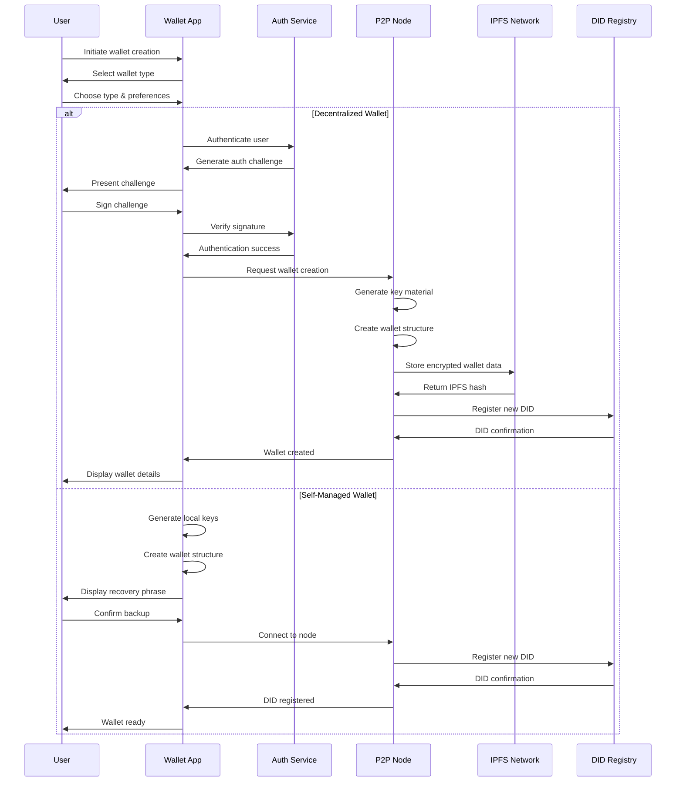
```mermaid
sequenceDiagram
    participant User
    participant App as Wallet App
    participant Auth as Auth Service
    participant Node as P2P Node
    participant IPFS as IPFS Network
    participant DID as DID Registry

    User->>App: Initiate wallet creation
    App->>User: Select wallet type
    User->>App: Choose type & preferences
    
    alt Decentralized Wallet
        App->>Auth: Authenticate user
        Auth->>App: Generate auth challenge
        App->>User: Present challenge
        User->>App: Sign challenge
        App->>Auth: Verify signature
        Auth->>App: Authentication success
        
        App->>Node: Request wallet creation
        Node->>Node: Generate key material
        Node->>Node: Create wallet structure
        Node->>IPFS: Store encrypted wallet data
        IPFS->>Node: Return IPFS hash
        Node->>DID: Register new DID
        DID->>Node: DID confirmation
        Node->>App: Wallet created
        App->>User: Display wallet details
    else Self-Managed Wallet
        App->>App: Generate local keys
        App->>App: Create wallet structure
        App->>User: Display recovery phrase
        User->>App: Confirm backup
        App->>Node: Connect to node
        Node->>DID: Register new DID
        DID->>Node: DID confirmation
        Node->>App: DID registered
        App->>User: Wallet ready
    end
```

### Credential Storage Workflow

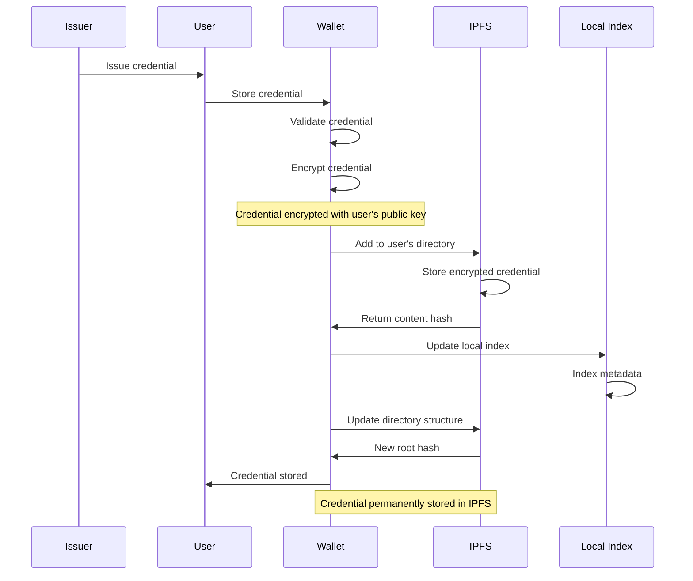
```mermaid
sequenceDiagram
    participant Issuer
    participant User
    participant Wallet
    participant IPFS
    participant Index as Local Index

    Issuer->>User: Issue credential
    User->>Wallet: Store credential
    Wallet->>Wallet: Validate credential
    Wallet->>Wallet: Encrypt credential
    
    Note over Wallet: Credential encrypted with user's public key
    
    Wallet->>IPFS: Add to user's directory
    IPFS->>IPFS: Store encrypted credential
    IPFS->>Wallet: Return content hash
    
    Wallet->>Index: Update local index
    Index->>Index: Index metadata
    
    Wallet->>IPFS: Update directory structure
    IPFS->>Wallet: New root hash
    
    Wallet->>User: Credential stored
    
    Note over Wallet,IPFS: Credential permanently stored in IPFS
```

### Multi-Device Synchronization

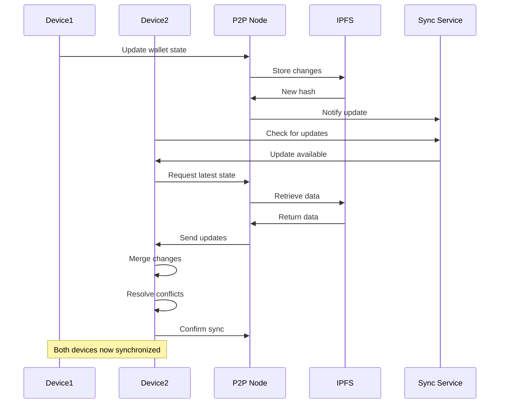
```mermaid
sequenceDiagram
    participant Device1
    participant Device2
    participant Node as P2P Node
    participant IPFS
    participant Sync as Sync Service

    Device1->>Node: Update wallet state
    Node->>IPFS: Store changes
    IPFS->>Node: New hash
    Node->>Sync: Notify update
    
    Device2->>Sync: Check for updates
    Sync->>Device2: Update available
    Device2->>Node: Request latest state
    Node->>IPFS: Retrieve data
    IPFS->>Node: Return data
    Node->>Device2: Send updates
    
    Device2->>Device2: Merge changes
    Device2->>Device2: Resolve conflicts
    Device2->>Node: Confirm sync
    
    Note over Device1,Device2: Both devices now synchronized
```

### Transaction Signing Workflow

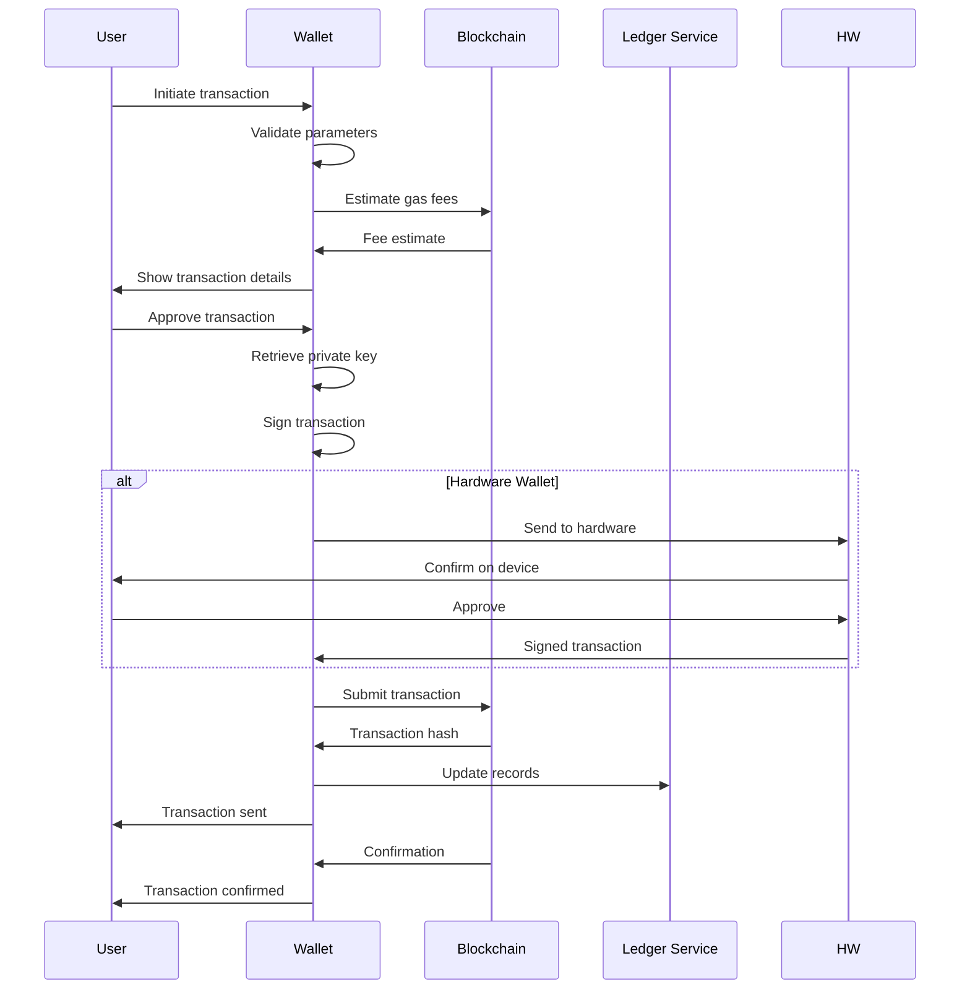
```mermaid
sequenceDiagram
    participant User
    participant Wallet
    participant Chain as Blockchain
    participant Ledger as Ledger Service

    User->>Wallet: Initiate transaction
    Wallet->>Wallet: Validate parameters
    Wallet->>Chain: Estimate gas fees
    Chain->>Wallet: Fee estimate
    
    Wallet->>User: Show transaction details
    User->>Wallet: Approve transaction
    
    Wallet->>Wallet: Retrieve private key
    Wallet->>Wallet: Sign transaction
    
    alt Hardware Wallet
        Wallet->>HW: Send to hardware
        HW->>User: Confirm on device
        User->>HW: Approve
        HW->>Wallet: Signed transaction
    end
    
    Wallet->>Chain: Submit transaction
    Chain->>Wallet: Transaction hash
    
    Wallet->>Ledger: Update records
    Wallet->>User: Transaction sent
    
    Chain->>Wallet: Confirmation
    Wallet->>User: Transaction confirmed
```

## Advanced Workflows

### Credential Presentation Workflow

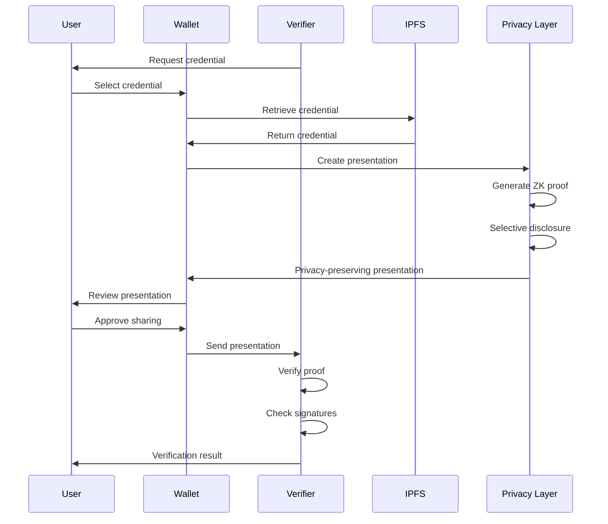
```mermaid
sequenceDiagram
    participant User
    participant Wallet
    participant Verifier
    participant IPFS
    participant Privacy as Privacy Layer

    Verifier->>User: Request credential
    User->>Wallet: Select credential
    Wallet->>IPFS: Retrieve credential
    IPFS->>Wallet: Return credential
    
    Wallet->>Privacy: Create presentation
    Privacy->>Privacy: Generate ZK proof
    Privacy->>Privacy: Selective disclosure
    Privacy->>Wallet: Privacy-preserving presentation
    
    Wallet->>User: Review presentation
    User->>Wallet: Approve sharing
    
    Wallet->>Verifier: Send presentation
    Verifier->>Verifier: Verify proof
    Verifier->>Verifier: Check signatures
    Verifier->>User: Verification result
```

### Social Recovery Workflow

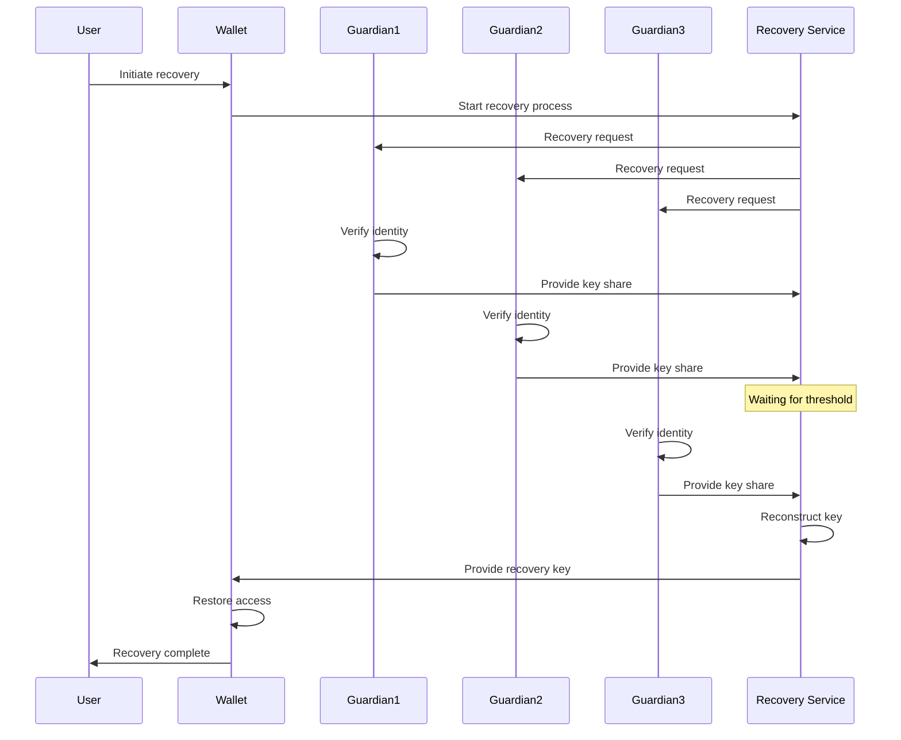
```mermaid
sequenceDiagram
    participant User
    participant Wallet
    participant Guardian1
    participant Guardian2
    participant Guardian3
    participant Recovery as Recovery Service

    User->>Wallet: Initiate recovery
    Wallet->>Recovery: Start recovery process
    
    Recovery->>Guardian1: Recovery request
    Recovery->>Guardian2: Recovery request
    Recovery->>Guardian3: Recovery request
    
    Guardian1->>Guardian1: Verify identity
    Guardian1->>Recovery: Provide key share
    
    Guardian2->>Guardian2: Verify identity
    Guardian2->>Recovery: Provide key share
    
    Note over Recovery: Waiting for threshold
    
    Guardian3->>Guardian3: Verify identity
    Guardian3->>Recovery: Provide key share
    
    Recovery->>Recovery: Reconstruct key
    Recovery->>Wallet: Provide recovery key
    
    Wallet->>Wallet: Restore access
    Wallet->>User: Recovery complete
```

### Cross-Chain Asset Transfer

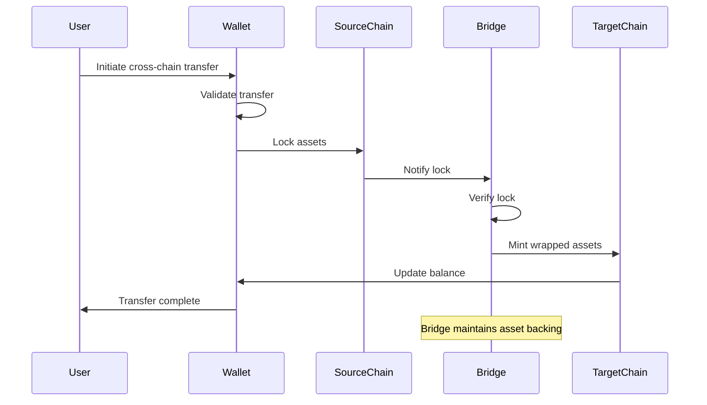
```mermaid
sequenceDiagram
    participant User
    participant Wallet
    participant SourceChain
    participant Bridge
    participant TargetChain

    User->>Wallet: Initiate cross-chain transfer
    Wallet->>Wallet: Validate transfer
    
    Wallet->>SourceChain: Lock assets
    SourceChain->>Bridge: Notify lock
    
    Bridge->>Bridge: Verify lock
    Bridge->>TargetChain: Mint wrapped assets
    
    TargetChain->>Wallet: Update balance
    Wallet->>User: Transfer complete
    
    Note over Bridge: Bridge maintains asset backing
```

### Batch Credential Operations

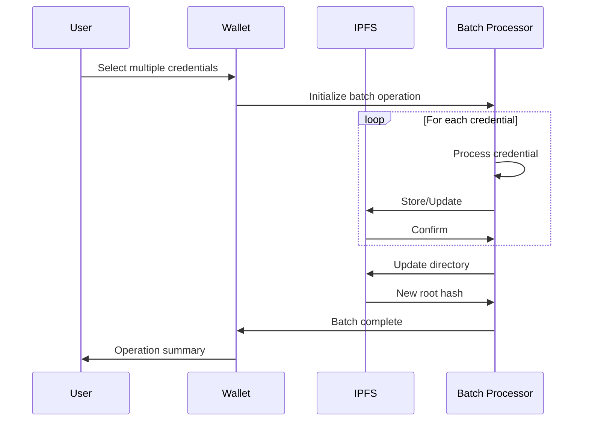
```mermaid
sequenceDiagram
    participant User
    participant Wallet
    participant IPFS
    participant Batch as Batch Processor

    User->>Wallet: Select multiple credentials
    Wallet->>Batch: Initialize batch operation
    
    loop For each credential
        Batch->>Batch: Process credential
        Batch->>IPFS: Store/Update
        IPFS->>Batch: Confirm
    end
    
    Batch->>IPFS: Update directory
    IPFS->>Batch: New root hash
    
    Batch->>Wallet: Batch complete
    Wallet->>User: Operation summary
```

## Security Workflows

### Multi-Factor Authentication

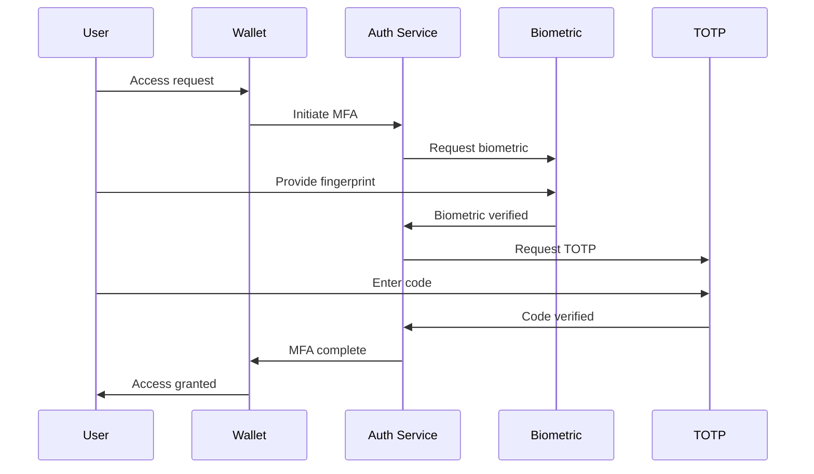
```mermaid
sequenceDiagram
    participant User
    participant Wallet
    participant Auth as Auth Service
    participant Biometric
    participant TOTP

    User->>Wallet: Access request
    Wallet->>Auth: Initiate MFA
    
    Auth->>Biometric: Request biometric
    User->>Biometric: Provide fingerprint
    Biometric->>Auth: Biometric verified
    
    Auth->>TOTP: Request TOTP
    User->>TOTP: Enter code
    TOTP->>Auth: Code verified
    
    Auth->>Wallet: MFA complete
    Wallet->>User: Access granted
```

### Emergency Access Workflow

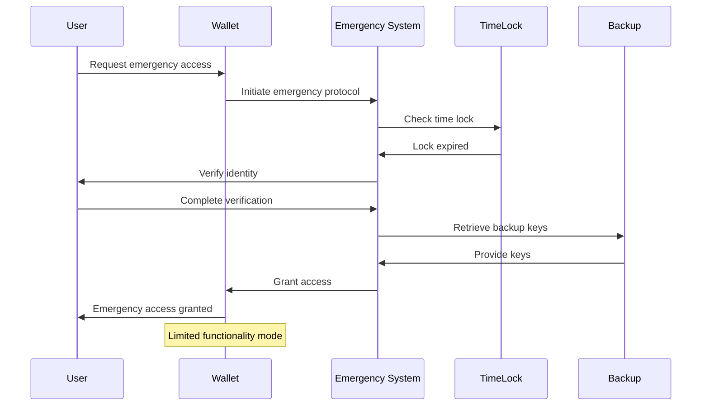
```mermaid
sequenceDiagram
    participant User
    participant Wallet
    participant Emergency as Emergency System
    participant TimeLock
    participant Backup

    User->>Wallet: Request emergency access
    Wallet->>Emergency: Initiate emergency protocol
    
    Emergency->>TimeLock: Check time lock
    TimeLock->>Emergency: Lock expired
    
    Emergency->>User: Verify identity
    User->>Emergency: Complete verification
    
    Emergency->>Backup: Retrieve backup keys
    Backup->>Emergency: Provide keys
    
    Emergency->>Wallet: Grant access
    Wallet->>User: Emergency access granted
    
    Note over Wallet: Limited functionality mode
```

## Performance Optimization Workflows

### Caching Strategy

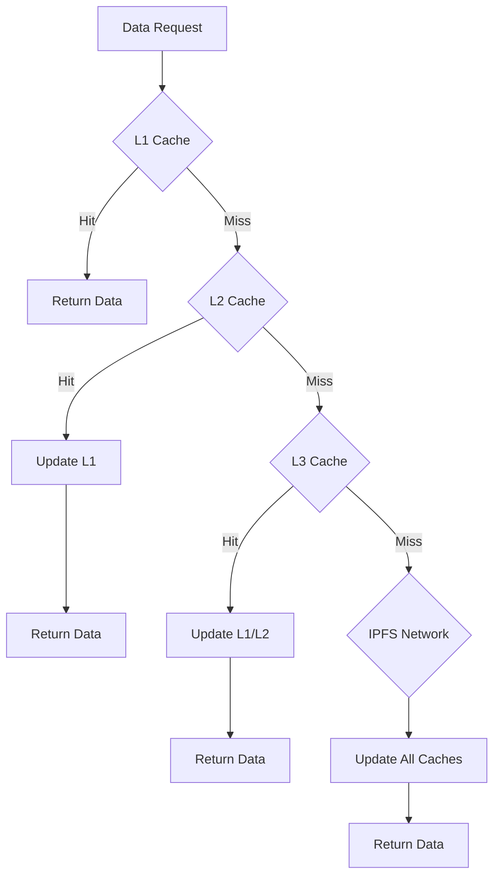
```mermaid
flowchart TD
    Request[Data Request] --> L1{L1 Cache}
    L1 -->|Hit| Return1[Return Data]
    L1 -->|Miss| L2{L2 Cache}
    L2 -->|Hit| Update1[Update L1]
    Update1 --> Return2[Return Data]
    L2 -->|Miss| L3{L3 Cache}
    L3 -->|Hit| Update2[Update L1/L2]
    Update2 --> Return3[Return Data]
    L3 -->|Miss| IPFS{IPFS Network}
    IPFS --> Update3[Update All Caches]
    Update3 --> Return4[Return Data]
```

### Load Balancing

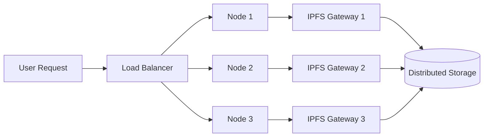
```mermaid
flowchart LR
    User[User Request] --> LB[Load Balancer]
    LB --> Node1[Node 1]
    LB --> Node2[Node 2]
    LB --> Node3[Node 3]
    
    Node1 --> IPFS1[IPFS Gateway 1]
    Node2 --> IPFS2[IPFS Gateway 2]
    Node3 --> IPFS3[IPFS Gateway 3]
    
    IPFS1 --> Storage[(Distributed Storage)]
    IPFS2 --> Storage
    IPFS3 --> Storage
```

## Error Handling Workflows

### Transaction Failure Recovery

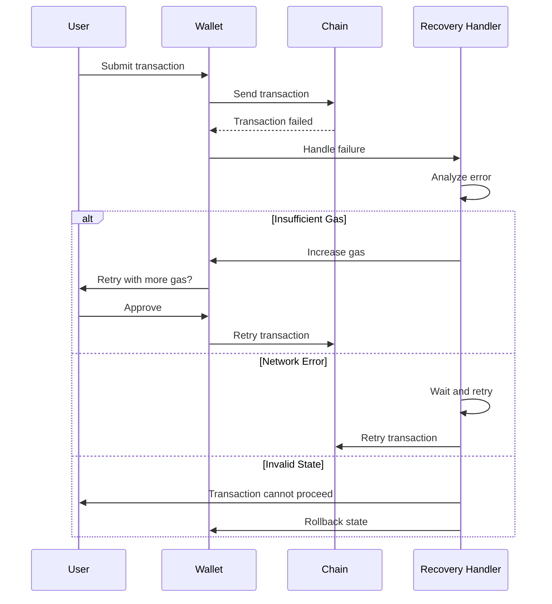
```mermaid
sequenceDiagram
    participant User
    participant Wallet
    participant Chain
    participant Recovery as Recovery Handler

    User->>Wallet: Submit transaction
    Wallet->>Chain: Send transaction
    Chain-->>Wallet: Transaction failed
    
    Wallet->>Recovery: Handle failure
    Recovery->>Recovery: Analyze error
    
    alt Insufficient Gas
        Recovery->>Wallet: Increase gas
        Wallet->>User: Retry with more gas?
        User->>Wallet: Approve
        Wallet->>Chain: Retry transaction
    else Network Error
        Recovery->>Recovery: Wait and retry
        Recovery->>Chain: Retry transaction
    else Invalid State
        Recovery->>User: Transaction cannot proceed
        Recovery->>Wallet: Rollback state
    end
```

### Sync Conflict Resolution

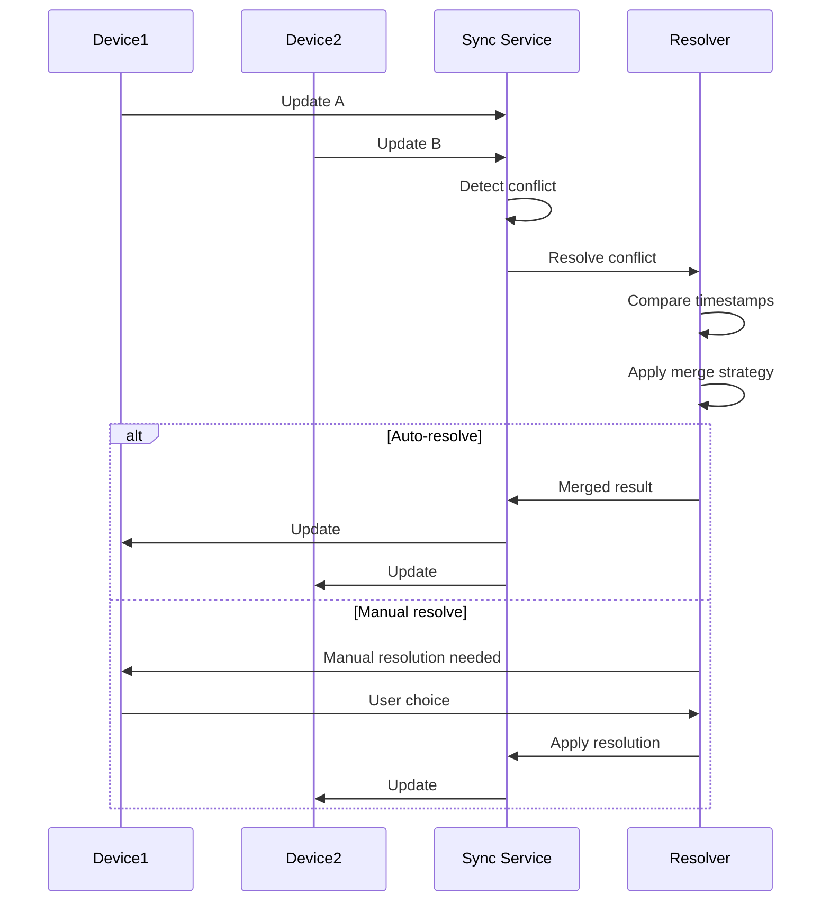
```mermaid
sequenceDiagram
    participant Device1
    participant Device2
    participant Sync as Sync Service
    participant Resolver

    Device1->>Sync: Update A
    Device2->>Sync: Update B
    
    Sync->>Sync: Detect conflict
    Sync->>Resolver: Resolve conflict
    
    Resolver->>Resolver: Compare timestamps
    Resolver->>Resolver: Apply merge strategy
    
    alt Auto-resolve
        Resolver->>Sync: Merged result
        Sync->>Device1: Update
        Sync->>Device2: Update
    else Manual resolve
        Resolver->>Device1: Manual resolution needed
        Device1->>Resolver: User choice
        Resolver->>Sync: Apply resolution
        Sync->>Device2: Update
    end
```

## Compliance Workflows

### KYC Verification

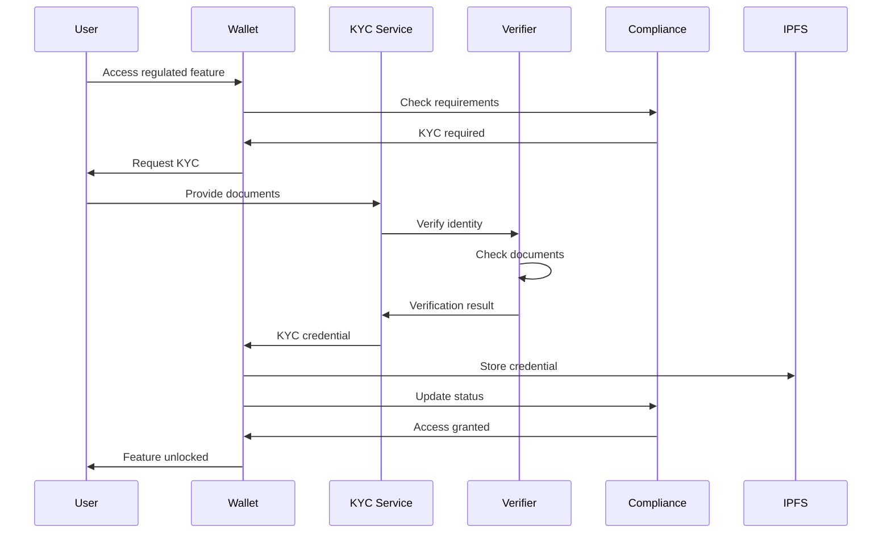
```mermaid
sequenceDiagram
    participant User
    participant Wallet
    participant KYC as KYC Service
    participant Verifier
    participant Compliance

    User->>Wallet: Access regulated feature
    Wallet->>Compliance: Check requirements
    Compliance->>Wallet: KYC required
    
    Wallet->>User: Request KYC
    User->>KYC: Provide documents
    
    KYC->>Verifier: Verify identity
    Verifier->>Verifier: Check documents
    Verifier->>KYC: Verification result
    
    KYC->>Wallet: KYC credential
    Wallet->>IPFS: Store credential
    Wallet->>Compliance: Update status
    
    Compliance->>Wallet: Access granted
    Wallet->>User: Feature unlocked
```

## Conclusion

These workflow diagrams illustrate the complex interactions within the Blackhole wallet system. They demonstrate:

- Clear separation of concerns
- Security-first design
- Efficient data flow
- Error handling strategies
- Performance optimization
- Compliance integration

Each workflow maintains the core principles of user sovereignty, decentralization, and privacy while providing a seamless user experience.

---

*This document provides visual representations of key wallet system workflows and will be updated as the system evolves.*