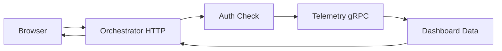

# Telemetry Service Architecture Audit

## Executive Summary

This audit identifies critical architectural uncertainties and inconsistencies in the Blackhole telemetry service design. The most significant issues involve missing gRPC definitions, conflicting time-series database choices, overly complex privacy mechanisms for a subprocess model, and inadequate resource specifications. While the documentation provides comprehensive coverage of telemetry concepts, it requires significant alignment with the subprocess architecture constraints.

## Critical Issues

### 1. Missing gRPC Service Definitions

**Severity**: CRITICAL

The telemetry architecture lacks complete protobuf/gRPC service definitions despite being a subprocess that must communicate via gRPC:

```go
// MISSING: Protobuf service definition
service TelemetryService {
    rpc CollectMetrics(stream Metric) returns (CollectResponse);
    rpc QueryMetrics(QueryRequest) returns (MetricData);
    rpc ConfigureAlert(AlertRequest) returns (AlertResponse);
    rpc GetDashboard(DashboardRequest) returns (DashboardResponse);
}
```

- PROJECT.md mandates gRPC for all inter-service communication
- telemetry_architecture.md shows TypeScript interfaces but no protobuf definitions
- The streaming API for real-time metrics requires gRPC streaming interfaces

### 2. Inconsistent Database Selection

**Severity**: CRITICAL

The documentation presents conflicting time-series database choices:

- data_storage_retention.md: "Primary: InfluxDB or TimescaleDB"
- telemetry_architecture.md: Refers to TimeScaleDB in code examples
- performance_metrics.md: Uses generic TSDB references
- subprocess_architecture.md: Mentions BoltDB/BadgerDB for embedded storage

This ambiguity affects:
- Resource allocation planning
- Performance characteristics
- Query language compatibility
- Data retention strategies

### 3. Process Boundary Violations

**Severity**: CRITICAL

The telemetry service violates subprocess boundaries by suggesting direct connections:

```typescript
// From telemetry_architecture.md - VIOLATION
const ws = new WebSocket(config.url);
const connection = new WebSocketConnection(ws, config);
```

Issues:
- WebSocket servers require external ports (violates subprocess model)
- Direct dashboard HTTP server implied in telemetry_architecture.md
- visualization_dashboards.md assumes browser-based rendering within the subprocess

All external communication must route through the orchestrator.

### 4. Resource Allocation Mismatch

**Severity**: CRITICAL

Significant inconsistencies in resource specifications:

```go
// telemetry_architecture.md:
ProcessLimits ProcessResourceLimits {
    CPUQuota    "100%"         // 1 CPU core
    MemoryLimit "512MB"        // 512MB memory limit
    IOWeight    100            // Standard IO priority
    Nice        10             // Lower priority
}

// PROJECT.md:
telemetry:
  cpu: "100%"      # 1 CPU core
  memory: "256MB"  # Memory limit
  io_weight: 500   # Medium I/O priority
```

The discrepancy in memory (256MB vs 512MB) and IO weight (500 vs 100) affects capacity planning.

## Important Issues

### 5. Privacy Architecture Complexity

**Severity**: IMPORTANT

The privacy-preserving mechanisms are overly complex for a subprocess:

- privacy_preserving_telemetry.md describes homomorphic encryption
- Differential privacy with Laplace noise
- K-anonymity implementations
- Secure multi-party computation

These features seem excessive for internal telemetry and add significant complexity to what should be a lightweight monitoring subprocess.

### 6. Real-Time Processing Architecture

**Severity**: IMPORTANT

The streaming architecture lacks clarity on process boundaries:

- telemetry_architecture.md implies direct WebSocket connections
- distributed_monitoring.md describes hierarchical monitoring across regions
- performance_metrics.md suggests real-time dashboards

All real-time communication must be clarified to work within subprocess constraints.

### 7. Alert System Integration

**Severity**: IMPORTANT

The alerting system shows external delivery mechanisms:

```typescript
// From alerting_system.md
class SlackHandler implements ChannelHandler {
    async send(alert: Alert, config: SlackConfig): Promise<void> {
        const response = await fetch(config.webhookUrl, ...);
    }
}
```

Direct external HTTP calls violate subprocess isolation - must proxy through orchestrator.

### 8. Distributed Monitoring Scope

**Severity**: IMPORTANT

distributed_monitoring.md describes global/regional aggregators that seem beyond a single subprocess scope:

```
Global Monitor
├── Regional Monitors
│   ├── Zone Monitors
│   │   ├── Node Monitors
```

This hierarchical structure implies multiple telemetry instances or external coordination.

### 9. Visualization Architecture

**Severity**: IMPORTANT

visualization_dashboards.md assumes browser-based rendering:

```typescript
// Client-side JavaScript implied
const ws = new WebSocket(config.url);
const d3 = require('d3');
```

The subprocess cannot directly serve web content - dashboard access must be clarified.

## Deferrable Issues

### 10. Data Retention Strategy

**Severity**: DEFERRABLE

data_storage_retention.md describes complex multi-tier storage:

```
Hot Storage (SSD) → Warm Storage (HDD) → Cold Storage (Object)
```

This may be overengineered for telemetry data lifecycle within a subprocess.

### 11. Export Functionality

**Severity**: DEFERRABLE

visualization_dashboards.md includes extensive export capabilities:

```typescript
exportToPDF(dashboard: Dashboard): Promise<Buffer>;
exportToPNG(widget: Widget): Promise<Buffer>;
```

While useful, these features add complexity that could be deferred.

### 12. Theme Engine

**Severity**: DEFERRABLE

The theme system in visualization_dashboards.md is comprehensive but non-essential:

```typescript
interface ThemeEngine {
    loadTheme(theme: Theme): void;
    createTheme(config: ThemeConfig): Theme;
}
```

## Architectural Recommendations

### 1. Define Clear gRPC Interface

Create comprehensive protobuf definitions:

```proto
syntax = "proto3";

package blackhole.telemetry.v1;

service TelemetryService {
    // Metric collection
    rpc PushMetrics(stream MetricData) returns (PushResponse);
    rpc PullMetrics(PullRequest) returns (stream MetricData);
    
    // Querying
    rpc Query(QueryRequest) returns (QueryResponse);
    rpc Subscribe(SubscriptionRequest) returns (stream MetricUpdate);
    
    // Alerting
    rpc CreateAlert(CreateAlertRequest) returns (CreateAlertResponse);
    rpc GetAlerts(GetAlertsRequest) returns (GetAlertsResponse);
    
    // Dashboard access - returns data only
    rpc GetDashboardData(DashboardRequest) returns (DashboardData);
}

message MetricData {
    int64 timestamp = 1;
    string name = 2;
    double value = 3;
    map<string, string> tags = 4;
}
```

### 2. Clarify Database Choice

Standardize on an embedded time-series database appropriate for subprocess:

```go
type TelemetryStorage struct {
    db       *bolt.DB           // Embedded KV store
    tsdb     *influxdb.Client   // Embedded time-series
    cache    *bigcache.BigCache // In-memory cache
}
```

### 3. Fix Process Boundaries

All external communication through orchestrator:

```go
// Dashboard access via orchestrator's HTTP proxy
type DashboardProxy struct {
    orchestrator *rpc.Client
}

func (d *DashboardProxy) ServeDashboard(data DashboardData) error {
    return d.orchestrator.ProxyHTTP("/telemetry/dashboard", data)
}
```

### 4. Simplify Privacy Features

Focus on essential privacy for internal metrics:

```go
type PrivacyConfig struct {
    AnonymizeIPs    bool
    HashUserIDs     bool
    SamplingRate    float64
    // Remove complex cryptographic features
}
```

### 5. Resource Optimization

Adjust for lightweight monitoring:

```yaml
telemetry:
  cpu: "50%"       # 0.5 CPU core
  memory: "256MB"  # Conservative memory
  io_weight: 100   # Low I/O priority
  
  storage:
    retention: "7d"  # Short retention for metrics
    max_size: "1GB" # Bounded storage
```

## Integration Considerations

### With Other Services

1. **Identity Service**: Authentication for dashboard access
2. **Storage Service**: Metrics about storage operations
3. **Node Service**: Network topology visualization
4. **Orchestrator**: All external communication proxy

### Dashboard Access Pattern



## Risk Assessment

1. **High Risk**: Missing gRPC definitions block implementation
2. **High Risk**: Direct external connections violate security model
3. **Medium Risk**: Database choice affects performance and resources
4. **Low Risk**: Complex privacy features can be simplified
5. **Low Risk**: Theme/export features can be deferred

## Implementation Priority

1. Define complete protobuf service interface
2. Select and configure embedded time-series database
3. Implement core metric collection via gRPC
4. Create simple alert evaluation engine
5. Build dashboard data API (not web server)
6. Add basic privacy controls
7. Implement retention policies
8. Enhance with export/theme features later

## Summary

The telemetry service architecture contains significant uncertainties around subprocess boundaries, database selection, and external communication patterns. The core monitoring capabilities are well-designed but need alignment with the subprocess constraints. Privacy features and visualization capabilities are overly complex for a subprocess and should be simplified. Clear gRPC definitions and process boundary enforcement are critical for successful implementation.