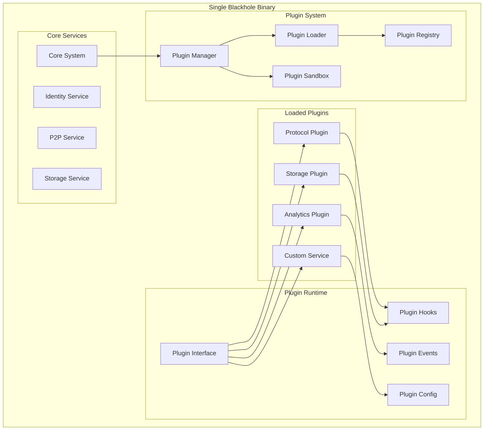

# Plugin Architecture

## Overview

The Blackhole platform supports a flexible plugin architecture that allows extending functionality without modifying core code. Plugins run as separate subprocesses, similar to core services, maintaining isolation while enabling custom functionality.

## Core Design Principles

### Subprocess Plugin Model

Plugins run as isolated subprocesses, managed by the orchestrator:

```go
// Plugins run as separate processes like services
type BlackholeOrchestrator struct {
    coreServices    map[string]*ServiceProcess
    pluginServices  map[string]*PluginProcess
    pluginManager   *PluginManager
}

// Plugin process similar to service process
type PluginProcess struct {
    Name       string
    Binary     string
    Process    *exec.Cmd
    UnixSocket string
    Resources  ResourceLimits
}
```

This approach provides:
- **Process Isolation**: Plugins can't crash core services
- **Resource Control**: Per-plugin resource limits
- **Security Boundaries**: OS-level isolation
- **Hot Reload**: Restart plugins without affecting core

## Architecture Overview



## Plugin Types

### 1. Service Plugins

Extend core functionality with new services:

```go
// Service plugin interface
type ServicePlugin interface {
    Plugin
    
    // Service lifecycle
    Start(ctx context.Context) error
    Stop(ctx context.Context) error
    
    // Service metadata
    ServiceName() string
    ServiceVersion() string
    Dependencies() []string
    
    // Health check
    Health() HealthStatus
}

// Example: Custom analytics service
type AnalyticsPlugin struct {
    config *AnalyticsConfig
    mesh   InternalMesh
    logger Logger
}

func (p *AnalyticsPlugin) Start(ctx context.Context) error {
    p.logger.Info("Starting analytics plugin")
    
    // Register with internal service mesh
    if err := p.mesh.Register(p.ServiceName(), p); err != nil {
        return fmt.Errorf("failed to register: %w", err)
    }
    
    // Start event processing
    go p.processEvents(ctx)
    
    return nil
}
```

### 2. Protocol Plugins

Add support for new network protocols:

```go
// Protocol plugin interface
type ProtocolPlugin interface {
    Plugin
    
    // Protocol information
    ProtocolName() string
    ProtocolVersion() string
    
    // Message handling
    HandleMessage(ctx context.Context, msg Message) error
    SendMessage(ctx context.Context, peer PeerID, msg Message) error
    
    // Connection management
    OnPeerConnected(peer PeerID)
    OnPeerDisconnected(peer PeerID)
}

// Example: Custom sync protocol
type SyncProtocol struct {
    p2pNode  P2PService
    storage  StorageService
    handlers map[string]MessageHandler
}

func (p *SyncProtocol) Initialize(ctx PluginContext) error {
    // Access core services through plugin context
    p.p2pNode = ctx.GetService("p2p").(P2PService)
    p.storage = ctx.GetService("storage").(StorageService)
    
    // Register protocol handlers
    p.RegisterHandlers()
    
    return nil
}
```

### 3. Storage Plugins

Integrate additional storage backends:

```go
// Storage plugin interface
type StoragePlugin interface {
    Plugin
    
    // Storage operations
    Store(ctx context.Context, key string, data []byte) error
    Retrieve(ctx context.Context, key string) ([]byte, error)
    Delete(ctx context.Context, key string) error
    List(ctx context.Context, prefix string) ([]string, error)
    
    // Storage metadata
    StorageType() string
    Capacity() (used, total int64, err error)
}

// Example: S3 storage plugin
type S3StoragePlugin struct {
    client *s3.Client
    bucket string
    cache  Cache
}

func (p *S3StoragePlugin) Configure(config map[string]interface{}) error {
    // Parse S3 configuration
    p.bucket = config["bucket"].(string)
    region := config["region"].(string)
    
    // Initialize S3 client
    p.client = s3.NewClient(region)
    
    return nil
}
```

### 4. Integration Plugins

Connect to external services:

```go
// Integration plugin interface
type IntegrationPlugin interface {
    Plugin
    
    // Integration lifecycle
    Connect(ctx context.Context) error
    Disconnect(ctx context.Context) error
    
    // Integration info
    IntegrationName() string
    IntegrationType() string
    
    // Data synchronization
    Sync(ctx context.Context) error
}

// Example: Blockchain integration
type EthereumIntegration struct {
    client  *ethclient.Client
    events  EventBus
    config  *EthereumConfig
}

func (p *EthereumIntegration) RegisterHooks(registry HookRegistry) {
    // Listen for platform events to sync to blockchain
    registry.RegisterEventHandler("content.created", p.syncToBlockchain)
    
    // Listen for blockchain events to sync to platform
    go p.watchBlockchainEvents()
}
```

## Plugin System Core

### Plugin Manager

```go
// Plugin manager handles plugin lifecycle
type PluginManager struct {
    registry   *PluginRegistry
    loader     *PluginLoader
    sandbox    *PluginSandbox
    plugins    map[string]Plugin
    config     *PluginConfig
    eventBus   *EventBus
    mu         sync.RWMutex
}

func (m *PluginManager) LoadPlugin(path string) error {
    m.mu.Lock()
    defer m.mu.Unlock()
    
    // Load plugin metadata
    metadata, err := m.loader.LoadMetadata(path)
    if err != nil {
        return fmt.Errorf("failed to load metadata: %w", err)
    }
    
    // Check compatibility
    if !m.isCompatible(metadata) {
        return fmt.Errorf("plugin %s not compatible", metadata.ID)
    }
    
    // Create sandboxed environment
    sandbox := m.sandbox.CreateEnvironment(metadata)
    
    // Load plugin
    plugin, err := m.loader.Load(path, sandbox)
    if err != nil {
        return fmt.Errorf("failed to load plugin: %w", err)
    }
    
    // Initialize plugin
    ctx := m.createPluginContext(metadata)
    if err := plugin.Initialize(ctx); err != nil {
        return fmt.Errorf("initialization failed: %w", err)
    }
    
    // Register plugin
    m.plugins[metadata.ID] = plugin
    m.registry.Register(plugin)
    
    return nil
}

// Plugin discovery for development
func (m *PluginManager) DiscoverPlugins(dir string) error {
    return filepath.Walk(dir, func(path string, info os.FileInfo, err error) error {
        if err != nil {
            return err
        }
        
        if strings.HasSuffix(path, "/plugin.json") {
            return m.LoadPlugin(filepath.Dir(path))
        }
        
        return nil
    })
}
```

### Plugin Loader

```go
// Plugin loader with multiple loading strategies
type PluginLoader struct {
    strategies map[PluginType]LoadStrategy
}

type LoadStrategy interface {
    CanLoad(path string) bool
    Load(path string, sandbox *Sandbox) (Plugin, error)
}

// Compiled-in plugin (default for production)
type CompiledPluginLoader struct {
    registry map[string]func() Plugin
}

func (l *CompiledPluginLoader) Load(name string, sandbox *Sandbox) (Plugin, error) {
    factory, exists := l.registry[name]
    if !exists {
        return nil, fmt.Errorf("plugin not found: %s", name)
    }
    
    plugin := factory()
    return &SandboxedPlugin{
        Plugin:  plugin,
        Sandbox: sandbox,
    }, nil
}

// Dynamic plugin loader (for development)
type DynamicPluginLoader struct{}

func (l *DynamicPluginLoader) Load(path string, sandbox *Sandbox) (Plugin, error) {
    // Load .so file for Go plugins
    p, err := plugin.Open(path)
    if err != nil {
        return nil, err
    }
    
    // Get plugin symbol
    symbol, err := p.Lookup("Plugin")
    if err != nil {
        return nil, err
    }
    
    return symbol.(Plugin), nil
}

// WASM plugin loader (for sandboxed execution)
type WASMPluginLoader struct {
    runtime *WASMRuntime
}

func (l *WASMPluginLoader) Load(path string, sandbox *Sandbox) (Plugin, error) {
    module, err := l.runtime.LoadModule(path)
    if err != nil {
        return nil, err
    }
    
    return &WASMPlugin{
        Module:  module,
        Sandbox: sandbox,
    }, nil
}
```

### Plugin Sandboxing

```go
// Lightweight sandboxing for internal plugins
type PluginSandbox struct {
    resources  *ResourceLimiter
    eventBus   *FilteredEventBus
    services   *ServiceProxy
}

// Create sandboxed environment
func (s *PluginSandbox) CreateEnvironment(metadata *PluginMetadata) *Sandbox {
    return &Sandbox{
        ID:          generateID(),
        PluginID:    metadata.ID,
        Permissions: metadata.Permissions,
        Resources:   s.resources.CreateQuota(metadata.Resources),
        EventBus:    s.eventBus.CreateFiltered(metadata.ID),
        Services:    s.services.CreateProxy(metadata.Permissions),
    }
}

// Resource enforcement
type ResourceLimiter struct {
    quotas map[string]*ResourceQuota
}

type ResourceQuota struct {
    MaxMemory     int64
    MaxGoroutines int
    MaxSockets    int
    RateLimit     rate.Limiter
}

func (q *ResourceQuota) CheckMemory(size int64) error {
    if q.used.Add(size) > q.MaxMemory {
        q.used.Add(-size)
        return ErrMemoryQuotaExceeded
    }
    return nil
}
```

## Plugin Interface

### Core Plugin Interface

```go
// Base plugin interface
type Plugin interface {
    // Metadata
    ID() string
    Name() string
    Version() string
    Type() PluginType
    
    // Lifecycle
    Initialize(ctx PluginContext) error
    Start(ctx context.Context) error
    Stop(ctx context.Context) error
    
    // Configuration
    Configure(config map[string]interface{}) error
    ValidateConfig(config map[string]interface{}) error
    
    // Hooks and events
    RegisterHooks(registry HookRegistry)
}

// Plugin context provides controlled access to core services
type PluginContext interface {
    // Core service access
    GetService(name string) Service
    
    // Plugin utilities
    Logger() Logger
    Config() ConfigReader
    Events() EventPublisher
    Storage() PluginStorage
    
    // Runtime information
    NodeID() string
    Version() string
    Environment() string
}

// Controlled service access
type ServiceProxy struct {
    service     Service
    permissions []Permission
}

func (p *ServiceProxy) Call(method string, args ...interface{}) (interface{}, error) {
    // Check permission for method
    if !p.hasPermission(method) {
        return nil, ErrPermissionDenied
    }
    
    // Call underlying service
    return p.service.Call(method, args...)
}
```

### Event System

```go
// Plugin event system with filtering
type FilteredEventBus struct {
    bus       EventBus
    pluginID  string
    whitelist []string
}

func (f *FilteredEventBus) Publish(event Event) error {
    // Add plugin ID to event metadata
    event.Source = f.pluginID
    
    // Check if plugin can publish this event type
    if !f.canPublish(event.Type) {
        return ErrEventTypeNotAllowed
    }
    
    return f.bus.Publish(event)
}

func (f *FilteredEventBus) Subscribe(pattern string, handler EventHandler) error {
    // Check if plugin can subscribe to this pattern
    if !f.canSubscribe(pattern) {
        return ErrSubscriptionNotAllowed
    }
    
    // Wrap handler with plugin context
    wrappedHandler := func(event Event) error {
        // Add plugin context to event processing
        ctx := context.WithValue(event.Context, "plugin_id", f.pluginID)
        event.Context = ctx
        
        return handler(event)
    }
    
    return f.bus.Subscribe(pattern, wrappedHandler)
}
```

### Hook System

```go
// Hook registry for plugin integration points
type HookRegistry interface {
    // Service hooks
    RegisterServiceHook(service string, hook ServiceHook)
    
    // Protocol hooks
    RegisterProtocolHook(protocol string, hook ProtocolHook)
    
    // Storage hooks
    RegisterStorageHook(operation string, hook StorageHook)
    
    // Custom hooks
    RegisterHook(name string, hook Hook)
}

// Hook types
type ServiceHook func(ctx context.Context, req ServiceRequest) (ServiceResponse, error)
type ProtocolHook func(ctx context.Context, msg Message) error
type StorageHook func(ctx context.Context, op StorageOperation) error

// Hook execution with error handling
func (r *HookRegistry) ExecuteHook(name string, args ...interface{}) error {
    hooks, exists := r.hooks[name]
    if !exists {
        return nil // No hooks registered
    }
    
    for _, hook := range hooks {
        if err := r.executeWithRecover(hook, args...); err != nil {
            r.logger.Error("Hook execution failed", 
                "hook", name,
                "error", err,
            )
            // Continue with other hooks
        }
    }
    
    return nil
}
```

## Plugin Development

### Plugin Structure

```
my-plugin/
├── plugin.json         # Plugin metadata
├── config.schema.json  # Configuration schema
├── main.go            # Go plugin entry point
├── internal/          # Internal packages
├── assets/            # Static resources
├── docs/              # Documentation
└── tests/             # Plugin tests
```

### Plugin Metadata

```json
{
  "id": "com.example.myplugin",
  "name": "My Plugin",
  "version": "1.0.0",
  "type": "service",
  "author": "Example Corp",
  "description": "Adds custom functionality",
  "license": "MIT",
  
  "compatibility": {
    "minVersion": "1.0.0",
    "maxVersion": "2.0.0"
  },
  
  "permissions": [
    "storage:read",
    "storage:write",
    "events:publish",
    "service:identity:read"
  ],
  
  "resources": {
    "maxMemory": "100MB",
    "maxGoroutines": 50,
    "rateLimit": "1000/min"
  },
  
  "configuration": {
    "$schema": "./config.schema.json"
  }
}
```

### Plugin Implementation

```go
package main

import (
    "context"
    "github.com/blackhole/plugin-sdk/go"
)

// MyPlugin implements the Plugin interface
type MyPlugin struct {
    sdk.BasePlugin
    config   *Config
    storage  StorageService
    events   EventPublisher
    logger   Logger
}

// Factory function for compiled-in plugins
func NewMyPlugin() sdk.Plugin {
    return &MyPlugin{}
}

// Initialize plugin
func (p *MyPlugin) Initialize(ctx sdk.PluginContext) error {
    p.logger = ctx.Logger().With("plugin", p.ID())
    p.storage = ctx.GetService("storage").(StorageService)
    p.events = ctx.Events()
    
    // Load configuration
    if err := ctx.Config().Unmarshal(&p.config); err != nil {
        return fmt.Errorf("failed to load config: %w", err)
    }
    
    return nil
}

// Start plugin service
func (p *MyPlugin) Start(ctx context.Context) error {
    p.logger.Info("Starting plugin")
    
    // Start background processing
    go p.processLoop(ctx)
    
    return nil
}

// Register plugin hooks
func (p *MyPlugin) RegisterHooks(registry sdk.HookRegistry) {
    // Listen for events
    registry.RegisterEventHandler("content.created", p.onContentCreated)
    
    // Add service endpoints
    registry.RegisterServiceEndpoint("/api/v1/myplugin", p.handleAPI)
    
    // Hook into storage operations
    registry.RegisterStorageHook("before.write", p.beforeWrite)
}

// Event handler
func (p *MyPlugin) onContentCreated(event sdk.Event) error {
    var content ContentCreatedEvent
    if err := event.UnmarshalPayload(&content); err != nil {
        return err
    }
    
    // Process the event
    return p.processContent(content)
}
```

### Plugin Configuration

```go
// Configuration schema
type Config struct {
    APIKey     string   `json:"apiKey" validate:"required"`
    Endpoint   string   `json:"endpoint" validate:"url"`
    MaxRetries int      `json:"maxRetries" default:"3"`
    Features   Features `json:"features"`
}

type Features struct {
    Analytics   bool `json:"analytics" default:"true"`
    Caching     bool `json:"caching" default:"true"`
    Compression bool `json:"compression" default:"false"`
}

// Configuration validation
func (c *Config) Validate() error {
    if c.APIKey == "" {
        return fmt.Errorf("apiKey is required")
    }
    
    if c.MaxRetries < 0 {
        return fmt.Errorf("maxRetries must be non-negative")
    }
    
    return nil
}
```

## Plugin Security

### Permission System

```go
// Permission checker
type PermissionChecker struct {
    grants map[string][]Permission
}

// Check permission
func (c *PermissionChecker) Check(pluginID string, required Permission) bool {
    grants, exists := c.grants[pluginID]
    if !exists {
        return false
    }
    
    for _, grant := range grants {
        if grant.Matches(required) {
            return true
        }
    }
    
    return false
}

// Permission types
type Permission struct {
    Resource string
    Action   string
}

func (p Permission) Matches(required Permission) bool {
    // Check exact match
    if p.Resource == required.Resource && p.Action == required.Action {
        return true
    }
    
    // Check wildcard match
    if p.Resource == "*" || p.Action == "*" {
        return true
    }
    
    // Check prefix match (e.g., "storage:*" matches "storage:read")
    return strings.HasPrefix(required.String(), p.Resource+":")
}
```

### Resource Isolation

```go
// Resource tracking
type ResourceTracker struct {
    usage map[string]*ResourceUsage
    mu    sync.RWMutex
}

type ResourceUsage struct {
    Memory      atomic.Int64
    Goroutines  atomic.Int32
    Connections atomic.Int32
}

// Track resource allocation
func (t *ResourceTracker) AllocateMemory(pluginID string, size int64) error {
    usage := t.getUsage(pluginID)
    
    current := usage.Memory.Add(size)
    quota := t.getQuota(pluginID)
    
    if current > quota.MaxMemory {
        usage.Memory.Add(-size)
        return ErrMemoryQuotaExceeded
    }
    
    return nil
}

// Monitor goroutines
func (t *ResourceTracker) MonitorGoroutines(pluginID string) {
    ticker := time.NewTicker(1 * time.Second)
    defer ticker.Stop()
    
    for range ticker.C {
        count := runtime.NumGoroutine()
        usage := t.getUsage(pluginID)
        usage.Goroutines.Store(int32(count))
        
        quota := t.getQuota(pluginID)
        if count > quota.MaxGoroutines {
            t.enforceGoroutineLimit(pluginID)
        }
    }
}
```

## Plugin Deployment

### Development Mode

```yaml
# Development configuration
plugins:
  discovery:
    enabled: true
    directories:
      - ./plugins
      - ~/.blackhole/plugins
  
  development:
    hot_reload: true
    debug_mode: true
    plugin_logs: verbose
```

### Production Mode

```go
// Compiled-in plugins for production
package main

import (
    "github.com/blackhole/node"
    analytics "github.com/example/analytics-plugin"
    backup "github.com/example/backup-plugin"
)

func main() {
    node := node.New()
    
    // Register compiled-in plugins
    node.RegisterPlugin("analytics", analytics.New)
    node.RegisterPlugin("backup", backup.New)
    
    // Start node with plugins
    node.Start()
}
```

### Plugin Distribution

```go
// Plugin package for distribution
type PluginPackage struct {
    Metadata  PluginMetadata
    Binary    []byte  // Compiled plugin
    Assets    map[string][]byte
    Signature []byte  // Digital signature
}

// Plugin installer
func (i *PluginInstaller) Install(pkg PluginPackage) error {
    // Verify signature
    if err := i.verifySignature(pkg); err != nil {
        return fmt.Errorf("invalid signature: %w", err)
    }
    
    // Check compatibility
    if err := i.checkCompatibility(pkg.Metadata); err != nil {
        return fmt.Errorf("incompatible plugin: %w", err)
    }
    
    // Install to plugin directory
    pluginDir := filepath.Join(i.pluginsDir, pkg.Metadata.ID)
    if err := i.extractPackage(pkg, pluginDir); err != nil {
        return fmt.Errorf("failed to extract: %w", err)
    }
    
    // Register plugin
    return i.manager.LoadPlugin(pluginDir)
}
```

## Plugin Examples

### Analytics Plugin

```go
type AnalyticsPlugin struct {
    sdk.BasePlugin
    metrics   *MetricsCollector
    dashboard *DashboardServer
}

func (p *AnalyticsPlugin) Start(ctx context.Context) error {
    // Start metrics collection
    go p.metrics.Start(ctx)
    
    // Start dashboard on internal port
    go p.dashboard.Serve(ctx, "localhost:8080")
    
    return nil
}

func (p *AnalyticsPlugin) RegisterHooks(registry sdk.HookRegistry) {
    // Track all events
    registry.RegisterEventHandler("*", p.trackEvent)
    
    // Add dashboard endpoint
    registry.RegisterHTTPHandler("/dashboard", p.serveDashboard)
}

func (p *AnalyticsPlugin) trackEvent(event sdk.Event) error {
    metric := p.convertEventToMetric(event)
    return p.metrics.Record(metric)
}
```

### Backup Plugin

```go
type BackupPlugin struct {
    sdk.BasePlugin
    scheduler *Scheduler
    storage   RemoteStorage
}

func (p *BackupPlugin) Configure(config map[string]interface{}) error {
    // Configure backup schedule
    schedule := config["schedule"].(string)
    p.scheduler.SetSchedule(schedule)
    
    // Configure remote storage
    p.storage.Configure(config["storage"].(map[string]interface{}))
    
    return nil
}

func (p *BackupPlugin) Start(ctx context.Context) error {
    // Schedule regular backups
    return p.scheduler.Start(ctx, p.performBackup)
}

func (p *BackupPlugin) performBackup(ctx context.Context) error {
    // Get data to backup
    data, err := p.collectBackupData(ctx)
    if err != nil {
        return fmt.Errorf("failed to collect data: %w", err)
    }
    
    // Upload to remote storage
    return p.storage.Upload(ctx, data)
}
```

## Best Practices

### Plugin Development

1. **Use the SDK**
   ```go
   import "github.com/blackhole/plugin-sdk/go"
   
   type MyPlugin struct {
       sdk.BasePlugin  // Provides common functionality
   }
   ```

2. **Handle Context Properly**
   ```go
   func (p *MyPlugin) ProcessData(ctx context.Context) error {
       select {
       case <-ctx.Done():
           return ctx.Err()
       case data := <-p.dataChan:
           return p.process(data)
       }
   }
   ```

3. **Resource Cleanup**
   ```go
   func (p *MyPlugin) Stop(ctx context.Context) error {
       // Stop workers
       close(p.stopChan)
       
       // Wait for cleanup
       p.wg.Wait()
       
       // Close resources
       return p.closeResources()
   }
   ```

### Security

1. **Validate Input**
   ```go
   func (p *MyPlugin) HandleRequest(req Request) error {
       if err := p.validateRequest(req); err != nil {
           return fmt.Errorf("invalid request: %w", err)
       }
       
       return p.processRequest(req)
   }
   ```

2. **Use Minimal Permissions**
   ```json
   {
     "permissions": [
       "storage:read",
       "events:subscribe:content.*"
     ]
   }
   ```

3. **Secure Communication**
   ```go
   func (p *MyPlugin) CallExternalAPI(data []byte) error {
       // Always use HTTPS
       client := &http.Client{
           Transport: &http.Transport{
               TLSClientConfig: &tls.Config{
                   MinVersion: tls.VersionTLS12,
               },
           },
       }
       
       return p.makeRequest(client, data)
   }
   ```

### Performance

1. **Efficient Resource Usage**
   ```go
   // Use sync.Pool for frequent allocations
   var bufferPool = sync.Pool{
       New: func() interface{} {
           return make([]byte, 0, 4096)
       },
   }
   
   func (p *MyPlugin) ProcessData(data []byte) error {
       buf := bufferPool.Get().([]byte)
       defer bufferPool.Put(buf[:0])
       
       // Use pooled buffer
       return p.process(append(buf, data...))
   }
   ```

2. **Batching Operations**
   ```go
   func (p *MyPlugin) BatchProcessor(ctx context.Context) {
       ticker := time.NewTicker(100 * time.Millisecond)
       defer ticker.Stop()
       
       batch := make([]Event, 0, 100)
       
       for {
           select {
           case event := <-p.events:
               batch = append(batch, event)
               
               if len(batch) >= 100 {
                   p.processBatch(batch)
                   batch = batch[:0]
               }
               
           case <-ticker.C:
               if len(batch) > 0 {
                   p.processBatch(batch)
                   batch = batch[:0]
               }
               
           case <-ctx.Done():
               return
           }
       }
   }
   ```

## Plugin Testing

### Unit Testing

```go
func TestPlugin(t *testing.T) {
    // Create mock context
    ctx := sdk.NewMockContext()
    ctx.SetConfig(map[string]interface{}{
        "apiKey": "test-key",
    })
    
    // Create plugin
    plugin := NewMyPlugin()
    
    // Initialize
    err := plugin.Initialize(ctx)
    assert.NoError(t, err)
    
    // Test functionality
    testCtx := context.Background()
    err = plugin.Start(testCtx)
    assert.NoError(t, err)
    
    // Verify behavior
    assert.Equal(t, "running", plugin.Status())
}
```

### Integration Testing

```go
func TestPluginIntegration(t *testing.T) {
    // Create test node
    node := test.NewTestNode()
    
    // Load plugin
    err := node.LoadPlugin("testdata/my-plugin")
    assert.NoError(t, err)
    
    // Start node
    err = node.Start()
    assert.NoError(t, err)
    defer node.Stop()
    
    // Test plugin integration
    resp, err := node.CallPlugin("my-plugin", "process", testData)
    assert.NoError(t, err)
    assert.NotNil(t, resp)
}
```

## Monitoring & Debugging

### Plugin Metrics

```go
// Automatic metrics collection
func (p *PluginManager) WrapWithMetrics(plugin Plugin) Plugin {
    return &MetricsPlugin{
        Plugin: plugin,
        metrics: prometheus.NewCounterVec(
            prometheus.CounterOpts{
                Name: "plugin_operations_total",
                Help: "Total plugin operations",
            },
            []string{"plugin", "operation", "status"},
        ),
    }
}
```

### Debug Mode

```go
// Enable debug mode for development
func (p *PluginManager) EnableDebug(pluginID string) {
    plugin := p.plugins[pluginID]
    
    // Enable verbose logging
    plugin.SetLogLevel(LogLevelDebug)
    
    // Enable profiling
    plugin.EnableProfiling()
    
    // Start debug server
    go p.startDebugServer(plugin)
}
```

## Conclusion

The Blackhole plugin architecture provides a powerful yet operator-friendly system for extending node functionality:

- **Single Binary Simplicity**: Plugins run within the orchestrator
- **Flexible Development**: Multiple plugin types and loading strategies
- **Secure Execution**: Sandboxing and permission system
- **Rich Integration**: Access to core services and events
- **Production Ready**: Compiled-in plugins for reliability

This design ensures that operators can run feature-rich nodes with minimal complexity while developers can create powerful extensions using familiar tools and patterns.